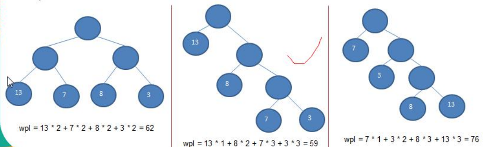
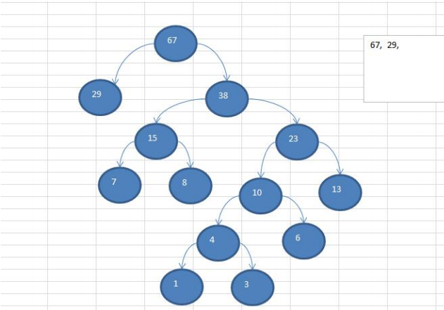

### 赫夫曼树

基本介绍 

1) 给定 n 个权值作为 n 个叶子结点，构造一棵二叉树，**若该树的带权路径长度(wpl)达到最小**，称这样的二叉树为最优二叉树，也称为哈夫曼树(Huffman Tree), 还有的书翻译为霍夫曼树。 

2) 赫夫曼树是带权路径长度最短的树，权值较大的结点离根较近

#### 赫夫曼树几个重要概念和举例说明

1) **路径和路径长度**：在一棵树中，从一个结点往下可以达到的孩子或孙子结点之间的通路，称为路径。**通路中分支的数目称为路径长度**。若规定根结点的层数为 1，则从根结点到第 L 层结点的路径长度为 L-1 

2) **结点的权及带权路径长度**：若将树中结点赋给一个有着某种含义的数值，则这个数值称为该结点的权。**结点的带权路径长度为**：从根结点到该结点之间的路径长度与该结点的权的乘积 

3) 树的带权路径长度：树的带权路径长度规定为**所有叶子结点的带权路径长度之和**，记为 WPL(weighted path length) ,权值越大的结点离根结点越近的二叉树才是最优二叉树

4) WPL 最小的就是赫夫曼树




#### 赫夫曼树创建思路图解

给你一个数列 {13, 7, 8, 3, 29, 6, 1}，要求转成一颗赫夫曼树.

**构成赫夫曼树的步骤**： 

1)  将每一个数据从小到大进行排序，每个数据都是一个节点 ， 每个节点可以看成是一颗最简单的二叉树 

2) 取出根节点权值最小的两颗二叉树 

3) 组成一颗新的二叉树, 该新的二叉树的根节点的权值是前面两颗二叉树根节点权值的和

4) 再将这颗新的二叉树，以根节点的权值大小 再次排序， 不断重复 1-2-3-4 的步骤，直到数列中，所有的数据都被处理，就得到一颗赫夫曼树 

5) 图解:




代码实现

```java
package com.romanticlei.huffmantree;

import java.util.ArrayList;
import java.util.Collections;
import java.util.List;

public class HuffmanTree {

    public static void main(String[] args) {
        int arr[] = {13, 7, 8, 3, 29, 6, 1};
        Node root = createHuffmanTree(arr);
        preOrder(root);
    }

    public static Node createHuffmanTree(int[] arr) {
        // 1.遍历 arr 数组
        // 2.将 arr 的每个元素构成一个Node
        // 3.将 Node 放入到 ArrayList 中
        List<Node> nodes = new ArrayList<Node>();
        for (int value : arr) {
            nodes.add(new Node(value));
        }

        while (nodes.size() > 1) {
            // 排序 从小到大
            Collections.sort(nodes);
            System.out.println("排序后的数据为 ：" + nodes);

            // 取出根节点权值最小的两颗二叉树
            Node leftNode = nodes.get(0);
            Node rightNode = nodes.get(1);
            // 构建一个新的二叉树
            Node parent = new Node(leftNode.value + rightNode.value);
            // 连接左节点
            parent.left = leftNode;
            // 连接右结点
            parent.right = rightNode;

            // 从ArrayList删除处理过的二叉树
            nodes.remove(leftNode);
            nodes.remove(rightNode);
            nodes.add(parent);
        }

        // 返回赫夫曼树的头
        return nodes.get(0);
    }

    // 编写一个前序遍历的方法
    public static void preOrder(Node root) {
        if (root != null) {
            root.preOrder();
        } else {
            System.out.println("是空树，不能遍历");
        }
    }
}

// 创建结点类
// 为了让Node 对象持续排序 Collections集合排序
// 让 Node 实现 Comparable 接口
class Node implements Comparable<Node> {
    int value; // 结点权值
    Node left;  // 指向左子节点
    Node right; // 指向右子节点

    public Node(int value) {
        this.value = value;
    }

    // 前序遍历
    public void preOrder() {
        System.out.println(this);
        if (this.left != null) {
            this.left.preOrder();
        }

        if (this.right != null) {
            this.right.preOrder();
        }
    }

    @Override
    public String toString() {
        return "Node{" +
                "value=" + value +
                '}';
    }

    @Override
    public int compareTo(Node o) {
        // 从小到大排序
        return this.value - o.value;
    }
}
```


