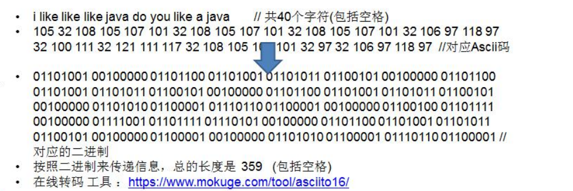
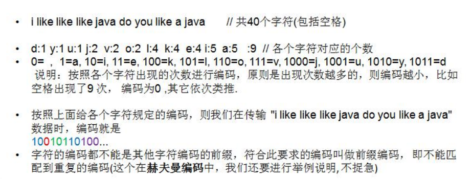
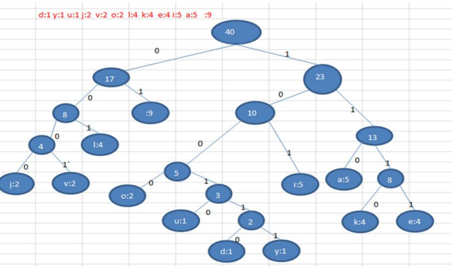

### 赫夫曼编码

#### 基本介绍

1) 赫夫曼编码也翻译为 哈夫曼编码(Huffman Coding)，又称霍夫曼编码，是一种编码方式, 属于一种程序算法 

2) 赫夫曼编码是赫哈夫曼树在电讯通信中的经典的应用之一。 

3) 赫夫曼编码广泛地用于数据文件压缩。其压缩率通常在 20%～90%之间 

4) 赫夫曼码是可变字长编码(VLC)的一种。Huffman 于 1952 年提出一种编码方法，称之为最佳编码

#### 原理剖析

**通信领域中信息的处理方式 1-定长编码**

**通信领域中信息的处理方式 2-变长编码**

**通信领域中信息的处理方式 3-赫夫曼编码**

步骤如下：

传输的 字符串 

1) i like like like java do you like a java 

2) d:1 y:1 u:1 j:2 v:2 o:2 l:4 k:4 e:4 i:5 a:5 :9 // 各个字符对应的个数 

3) 按照上面字符出现的次数构建一颗赫夫曼树, 

次数作为权值 

步骤： 

构成赫夫曼树的步骤： 

1) 从小到大进行排序, 将每一个数据，每个数据都是一个节点 ， 每个节点可以看成是一颗最简单的二叉树 

2) 取出根节点权值最小的两颗二叉树 

3) 组成一颗新的二叉树, 该新的二叉树的根节点的权值是前面两颗二叉树根节点权值的和 

4) 再将这颗新的二叉树，以根节点的权值大小 再次排序， 不断重复 1-2-3-4 的步骤，直到数列中，所有的数据都被处理，就得到一颗赫夫曼树

4) 根据赫夫曼树，给各个字符,规定编码 (前缀编码)， 向左的路径为 0 向右的路径为 1 ， 编码如下: 

o: 1000 

u: 10010 

d: 100110 

y: 100111 

i: 101 

a : 110 

k: 1110 

e: 1111 

j: 0000 

v: 0001 

l: 001 

 : 01 

5) 按照上面的赫夫曼编码，我们的"i like like like java do you like a java" 字符串对应的编码为 (注 意这里我们使用的无损压缩)**10101001**10111101111010011011110111101001101111011110100001100001110011001111000011001111000100100100110111101111011100100001100001110 通过赫夫曼编码处理 长度为 133 

6） 长度为 ： 133 说明: 原来长度是 359 , 压缩了 (359-133) / 359 = 62.9%

此编码满足前缀编码, 即字符的编码都不能是其他字符编码的前缀。不会造成匹配的多义性赫夫曼编码是无损处理方案

**注意事项** 

注意, 这个赫夫曼树根据**排序方法不同**，也可能不太一样，这样对应的**赫夫曼编码也不完全一样**，但是 **wpl** 是一样的，都是最小的, 最后生成的赫夫曼编码的长度是一样，比如: 如果我们让每次生成的新的二叉树总是排在权值相同的二叉树的最后一个，则生成的二叉树为: 

.jpg)

