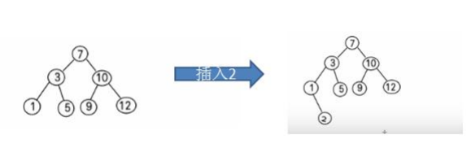
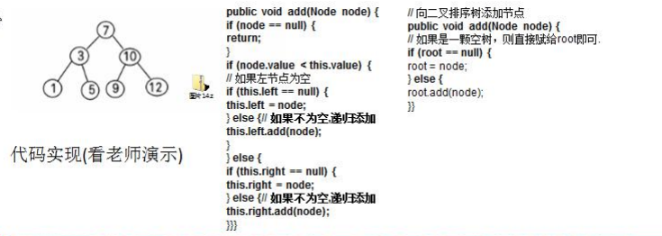
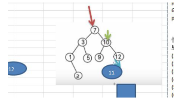

### 二叉排序树

**二叉排序树**：BST: (Binary Sort(Search) Tree), 对于二叉排序树的**任何一个非叶子节点**，要求**左子节点的值比当前节点的值小**，**右子节点的值比当前节点的值大**。 

**特别说明**：如果有相同的值，可以将该节点放在左子节点或右子节点比如针对前面的数据 (7, 3, 10, 12, 5, 1, 9) ，对应的二叉排序树为：



#### 二叉排序树创建和遍历

一个数组创建成对应的二叉排序树，并使用中序遍历二叉排序树，比如: 数组为Array(7, 3, 10, 12, 5, 1, 9) ， 创建成对应的二叉排序树为 :



#### 二叉排序树的删除 

二叉排序树的删除情况比较复杂，有下面三种情况需要考虑 

1) **删除叶子节点** (比如：2, 5, 9, 12) 

2) 删除**只有一颗子树的节点** (比如：1) 

3) 删除**有两颗子树的节点**. (比如：7, 3，10 ) 

4) 操作的思路分析



//对删除结点的各种情况的思路分析: 

第一种情况: 删除叶子节点 (比如：2, 5, 9, 12) 

思路

(1) 需求先去找到要删除的结点 targetNode 

(2) 找到 targetNode 的 父结点 parent 

(3) 确定 targetNode 是 parent 的左子结点 还是右子结点 

(4) 根据前面的情况来对应删除 左子结点 parent.left = null 右子结点 parent.right = null; 

第二种情况: 删除只有一颗子树的节点 比如 1 

思路

(1) 需求先去找到要删除的结点 targetNode 

(2) 找到 targetNode 的 父结点 parent 

(3) 确定 targetNode 的子结点是左子结点还是右子结点 

(4) targetNode 是 parent 的左子结点还是右子结点 

(5) 如果 targetNode 有左子结点 

5. 1 如果 targetNode 是 parent 的左子结点parent.left = targetNode.left; 

   5.2 如果 targetNode 是 parent 的右子结点 parent.right = targetNode.left; 

(6) 如果 targetNode 有右子结点 

6.1 如果 targetNode 是 parent 的左子结点 parent.left = targetNode.right; 

6.2 如果 targetNode 是 parent 的右子结点 parent.right = targetNode.right

第三种情况 ： 删除有两颗子树的节点. (比如：7, 3，10 ) 

思路

(1) 需求先去找到要删除的结点 targetNode 

(2) 找到 targetNode 的 父结点 parent 

(3) 从 targetNode 的右子树找到最小的结点 

(4) 用一个临时变量，将 最小结点的值保存 temp = 11 

(5) 删除该最小结点 

(6) targetNode.value = temp 


二叉树增删操作

```java
package com.romanticlei.binarysorttree;

public class BinarySortTreeDemo {
    public static void main(String[] args) {
        int[] arr = {7, 3, 10, 12, 5, 1, 9, 2};
        BinarySortTree binarySortTree = new BinarySortTree();
        for (int i = 0; i < arr.length; i++) {
            binarySortTree.addNode(new Node(arr[i]));
        }

        System.out.println("中序遍历二叉排序树~~~");
        // 1, 2, 3, 5, 7, 9, 10, 12
        binarySortTree.infixOrder();

        System.out.println("删除叶子结点后的二叉排序树~~~");
        // binarySortTree.delNode(2);
        // 1, 3, 5, 7, 9, 10, 12
        binarySortTree.infixOrder();

        System.out.println("删除单叶子结点的父结点后的二叉排序树~~~");
        // binarySortTree.delNode(1);
        // 2, 3, 5, 7, 9, 10, 12
        binarySortTree.infixOrder();

        System.out.println("删除有左右叶子结点的父结点后的二叉排序树~~~");
        binarySortTree.delNode(10);
        // 1, 2, 3, 5, 7, 9, 12
        binarySortTree.infixOrder();

        // binarySortTree.delNode(2);
        // binarySortTree.delNode(5);
        // binarySortTree.delNode(9);
        // binarySortTree.delNode(12);
        // binarySortTree.delNode(7);
        // binarySortTree.delNode(3);
        // binarySortTree.delNode(1);
        // binarySortTree.delNode(10);

        System.out.println("root = " + binarySortTree.getRoot());
    }
}

class BinarySortTree {
    private Node root;

    public Node getRoot() {
        return root;
    }

    // 添加节点的方法
    public void addNode(Node node) {
        if (root == null) {
            // 如果root 为空，则直接让root指向node(即第一个结点进来的时候初始化)
            root = node;
        } else {
            root.addNode(node);
        }
    }

    // 查找结点
    public Node search(int value) {
        if (root == null) {
            return null;
        } else {
            return root.search(value);
        }
    }

    // 查找父结点
    public Node searchParent(int value) {
        if (root == null) {
            return null;
        } else {
            return root.searchParent(value);
        }
    }

    public void delNode(int value) {
        if (root == null) {
            return;
        } else {
            // 需求先去找到要删除的结点
            Node targetNode = search(value);
            // 如果没有找到要删除的结点，直接返回
            if (targetNode == null) {
                return;
            }

            // 能走下来说明找到了需要删除的结点
            // 如果我们发现当前这颗二叉树只有一个结点，则直接删除
            if (root.left == null && root.right == null) {
                root = null;
                return;
            }
            
            // 去找 targetNode 的父结点
            Node parent = searchParent(value);
            // 处理当前需要删除的结点是叶子结点的情况
            if (targetNode.left == null && targetNode.right == null) {
                // 判断 targetNode 是父节点的左子节点还是右子节点
                if (parent.left != null && parent.left.value == value) {
                    // 是左子节点
                    parent.left = null;
                } else if (parent.right != null && parent.right.value == value) {
                    // 是右子节点
                    parent.right = null;
                }
            } else if (targetNode.left != null && targetNode.right != null) {
                // 删除两颗子树的结点
                int minVal = delRightTreeMin(targetNode.right);
                targetNode.value = minVal;
            } else {
                // 删除只有一颗子树的结点
                // 如果要删除的结点有左子节点
                if (targetNode.left != null) {
                    // 判断只有一颗子树删除节点时，是否直接删除根节点的情况
                    if (parent == null) {
                        root = targetNode.left;
                        return;
                    }

                    // 如果 targetNode 是parent 的左子节点
                    if (parent.left != null && parent.left.value == value) {
                        parent.left = targetNode.left;
                    } else {
                        // 如果 targetNode 是parent 的右子节点
                        parent.right = targetNode.left;
                    }

                } else {
                    if (parent != null) {
                        root = targetNode.right;
                        return;
                    }

                    // 如果 targetNode 是parent 的左子节点
                    if (parent.left != null && parent.left.value == value) {
                        parent.left = targetNode.right;
                    } else {
                        // 如果 targetNode 是parent 的右子节点
                        parent.right = targetNode.right;
                    }
                }
            }
        }
    }

    /**
     * 删除以node为根节点的二叉排序树的右结点最小结点，并将其保存在一个temp临时变量中，
     * 然后删除，然后将node的值替换成temp的值，
     * 这样这颗二叉排序树的左子树所有值全比temp值小，右子树所有值比temp值大
     *
     * @param node 传入的结点
     * @return 返回以node为根节点的二叉排序树的最小结点的值
     */
    public int delRightTreeMin(Node node) {
        Node target = node;
        while (target.left != null) {
            target = target.left;
        }

        // 找到 target 就指向了右子树的最小结点
        delNode(target.value);
        // 返回最小结点的值
        return target.value;
    }

    // 中序遍历
    public void infixOrder() {
        if (root != null) {
            root.infixOrder();
        } else {
            System.out.println("遍历结点无数据！");
        }
    }
}

class Node {
    int value;
    Node left;
    Node right;

    public Node(int value) {
        this.value = value;
    }

    @Override
    public String toString() {
        return "Node{" +
                "value=" + value +
                '}';
    }

    public void addNode(Node node){
        if (node == null) {
            return;
        }

        // 判断传入的节点，和当前子树结点的大小关系
        if (node.value < this.value) {
            if (this.left == null) {
                // 左子结点为空直接添加
                this.left = node;
            } else {
                // 递归向左子树添加新结点
                this.left.addNode(node);
            }
        } else {
            if (this.right == null) {
                this.right = node;
            } else {
                // 递归向右子节点添加新数据
                this.right.addNode(node);
            }
        }
    }

    /**
     * 查找结点
     * @param value 需要查找结点的值
     * @return
     */
    public Node search(int value) {
        if (value == this.value) {
            // 结点找到，返回
            return this;
        } else if (value < this.value) {
            if (this.left == null) {
                // 如果无左子结点，返回 null
                return null;
            }
            // 向左递归查找
            return this.left.search(value);
        } else {
            if (this.right == null) {
                return null;
            }
            return this.right.search(value);
        }
    }

    /**
     * 查找要删除结点的父节点
     * @param value
     * @return
     */
    public Node searchParent(int value) {
        // 如果当前结点就是要删除的结点，就返回
        if ((this.left != null && this.left.value == value)
                || (this.right != null && this.right.value == value)) {
            return this;
        }

        // 如果查找的值小于当前结点的值，并且当前结点的左子节点不为空
        if (value < this.value && this.left != null) {
            // 如果查找的值小于当前结点的值，并且当前结点的左子结点不为空，递归
            return this.left.searchParent(value);
        } else if (value >= this.value && this.right != null) {
            return this.right.searchParent(value);
        } else {
            // 没有找到符合条件的数据，返回null
            return null;
        }
    }

    // 中序遍历
    public void infixOrder() {
        if (this.left != null) {
            this.left.infixOrder();
        }

        System.out.println(this);

        if (this.right != null) {
            this.right.infixOrder();
        }
    }
}
```


