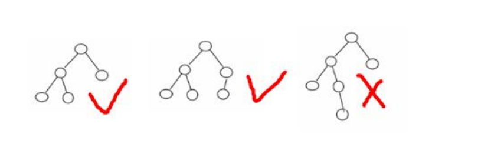

### 平衡二叉树(AVL 树) 

给你一个数列{1,2,3,4,5,6}，要求创建一颗二叉排序树(BST), 并分析问题所在. 

左边 BST 存在的问题分析: 

1) 左子树全部为空，从形式上看，更像一个单链表. 

2) 插入速度没有影响 

3) 查询速度明显降低(因为需要依次比较), 不能发挥 BST的优势，因为每次还需要比较左子树，其查询速度比单链表还慢 

4) 解决方案-平衡二叉树(AVL)

#### 基本介绍

1) 平衡二叉树也叫平衡**二叉搜索树**（Self-balancing binary search tree）又被称为 AVL 树， 可以保证查询效率较高。 

2) 具有以下特点：它是**一 棵空树**或**它的左右两个子树的高度差的绝对值不超过** **1**，并且**左右两个子树都是一棵平衡二叉树**。平衡二叉树的常用实现方法有红黑树、AVL、替罪羊树、Treap、伸展树等。 

3) 举例说明, 看看下面哪些 AVL 树, 为什么?

#### 应用案例-单旋转(左旋转)

