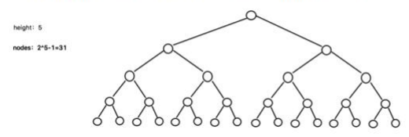
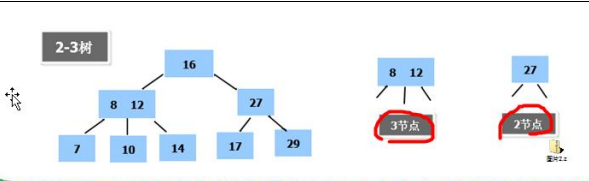
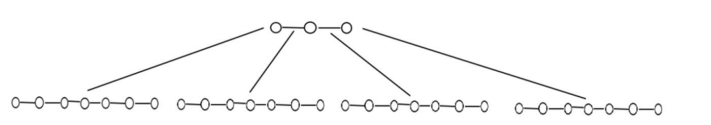
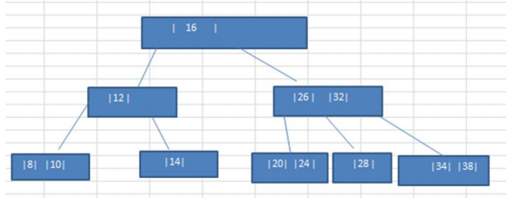
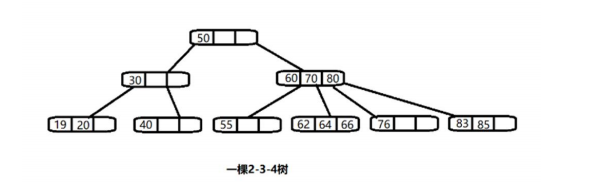

### 二叉树与 B 树

### 二叉树的问题分析

二叉树的操作效率较高，但是也存在问题, 请看下面的二叉树

1) 二叉树需要加载到内存的，如果二叉树的节点少，没有什么问题，但是如果二叉树的节点很多(比如 1 亿)， 就 存在如下问题: 

2) 问题 1：在构建二叉树时，需要多次进行 i/o 操作(海量数据存在数据库或文件中)，节点海量，构建二叉树时， 速度有影响 

3) 问题 2：节点海量，也会造成二叉树的高度很大，会降低操作速度.

#### 多叉树

1) 在二叉树中，每个节点有数据项，最多有两个子节点。如果允许每个节点可以有更多的数据项和更多的子节点，就是多叉树（multiway tree） 

2) 后面我们讲解的 2-3 树，2-3-4 树就是多叉树，多叉树通过重新组织节点，减少树的高度，能对二叉树进行优化。 

3) 举例说明(下面 2-3 树就是一颗多叉树)

#### B 树的基本介绍 

B 树通过重新组织节点，降低树的高度，并且减少 i/o 读写次数来提升效率。

1) 如图 B 树通过重新组织节点， 降低了树的高度. 

2) 文件系统及数据库系统的设计者利用了磁盘预读原理，将一个节点的大小设为等于一个页(页得大小通常为 4k)，这样每个节点只需要一次 I/O 就可以完全载入 

3) 将树的度 M 设置为 1024，在 600 亿个元素中最多只需要 4 次 I/O 操作就可以读取到想要的元素, B 树(B+)广泛应用于文件存储系统以及数据库系统中

#### 2-3 树

##### 2-3 树是最简单的 B 树结构, 具有如下特点:

1) 2-3 树的所有叶子节点都在同一层.(只要是 B 树都满足这个条件) 

2) 有两个子节点的节点叫二节点，二节点要么没有子节点，要么有两个子节点.

3) 有三个子节点的节点叫三节点，三节点要么没有子节点，要么有三个子节点. 

4) 2-3 树是由二节点和三节点构成的树。

#### 2-3 树应用案例 

将数列{16, 24, 12, 32, 14, 26, 34, 10, 8, 28, 38, 20} 构建成 2-3 树，并保证数据插入的大小顺序。(演示一下构建 2-3树的过程.) 

插入规则: 

1) 2-3 树的所有叶子节点都在同一层.(只要是 B 树都满足这个条件) 

2) 有两个子节点的节点叫二节点，二节点要么没有子节点，要么有两个子节点. 

3) 有三个子节点的节点叫三节点，三节点要么没有子节点，要么有三个子节点 

4) 当按照规则插入一个数到某个节点时，不能满足上面三个要求，就需要拆，先向上拆，如果上层满，则拆本层，拆后仍然需要满足上面 3 个条件。 

5) 对于三节点的子树的值大小仍然遵守(BST 二叉排序树)的规则

#### 其它说明 

除了 23 树，还有 234 树等，概念和 23 树类似，也是一种 B 树。 如图:

