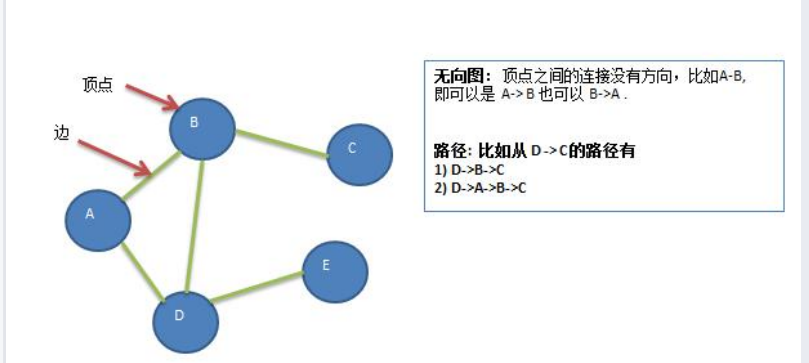
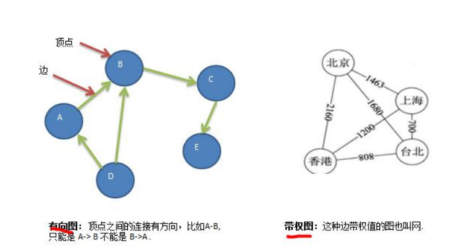
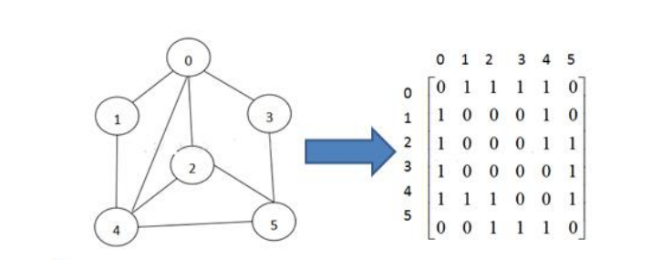
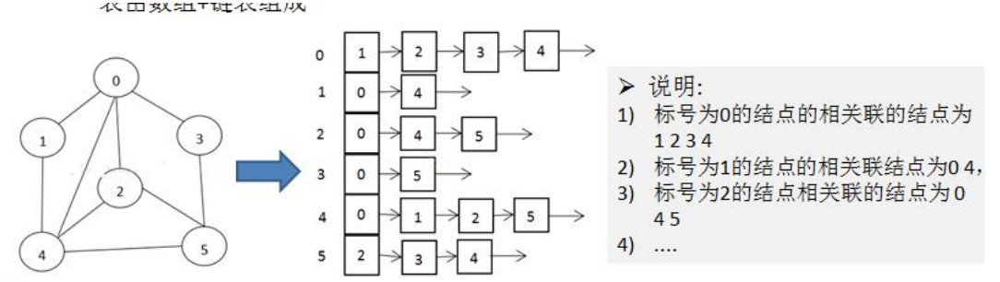

### 图基本介绍

#### 为什么要有图

1) 前面我们学了线性表和树 

2) 线性表局限于一个直接前驱和一个直接后继的关系 

3) 树也只能有一个直接前驱也就是父节点 

4) 当我们需要**表示多对多**的关系时， 这里我们就用到了**图**。

#### 图的举例说明

图是一种**数据结构**，其中结点可以具有零个或多个相邻元素。两个结点之间的连接称为边。结点也可以称为顶点。如图： 

#### 图的常用概念

1) 顶点(vertex) 

2) 边(edge) 

3) 路径 

4) 无向图

5) 有向图 

6) 带权图

#### 图的表示方式

图的表示方式有两种：二维数组表示（邻接矩阵）；链表表示（邻接表）。 

#### 邻接矩阵 

邻接矩阵是表示图形中顶点之间相邻关系的矩阵，对于 n 个顶点的图而言，矩阵是的 row 和 col 表示的是 1....n个点。

邻接表 

1) 邻接矩阵需要为每个顶点都分配 n 个边的空间，其实有很多边都是不存在,会造成空间的一定损失. 

2) 邻接表的实现只关心存在的边，不关心不存在的边。因此没有空间浪费，邻接表由数组+链表组成 

3) 举例说明

