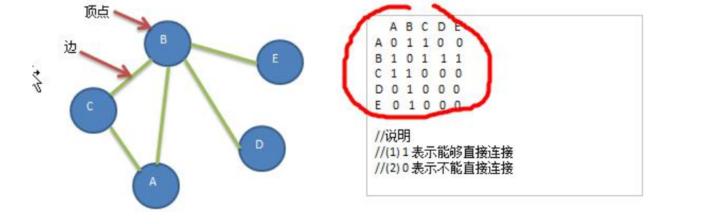

### 图的快速入门案例

1) 要求: 代码实现如下图结构.



2. 思路分析 

   (1) 存储顶点 String 使用 ArrayList 

   (2) 保存矩阵 int[][] edges 

3. 代码实现

```java
package com.romanticlei.graph;

import java.util.ArrayList;
import java.util.Arrays;
import java.util.List;
import java.util.stream.Collectors;
import java.util.stream.Stream;

public class Graph {

    // 存储顶点集合
    private ArrayList<String> vertexList;
    // 存储图对应的邻接矩阵(两个结点是否有边相连)
    private int[][] edges;
    // 表示边的数目
    private int numOfEdges;
    // 定义个数组 boolean[], 记录某个结点是否被访问

    public static void main(String[] args) {
        int n = 5;
        Graph graph = new Graph(n);
        String[] Vertex = {"A", "B", "C", "D", "E"};
        for (String vertex : Vertex) {
            graph.insertVertex(vertex);
        }

        // 添加边
        graph.insertEdge(0, 1, 1);
        graph.insertEdge(0, 2, 1);
        graph.insertEdge(1, 2, 1);
        graph.insertEdge(1, 3, 1);
        graph.insertEdge(1, 4, 1);

        // 显示邻接矩阵
        graph.showGraph();
    }

    public Graph(int n) {
        // 初始化矩阵和 vertexList
        edges = new int[n][n];
        vertexList = new ArrayList<>(n);
        numOfEdges = 0;
    }

    // 插入结点
    public void insertVertex(String vertex) {
        vertexList.add(vertex);
    }

    /**
     * 添加边
     * @param v1 表示点的下标即第一个顶点
     * @param v2 表示第二个顶点的下标
     * @param weight 表示权重
     */
    public void insertEdge(int v1, int v2, int weight) {
        edges[v1][v2] = weight;
        edges[v2][v1] = weight;
        numOfEdges++;
    }

    // 显示图对应的矩阵
    public void showGraph() {
        System.out.println("二维数据遍历方法一：");
        for (int[] link : edges) {
            System.out.println(Arrays.toString(link));
        }

        System.out.println("二维数据遍历方法二：");
        Arrays.stream(edges).forEach(a -> {
            System.out.println(Arrays.toString(a));
        });

        System.out.println("二维数据遍历方法三：");
        Stream.of(edges).forEach(a -> {
            System.out.println(Arrays.toString(a));
        });
    }

    // 返回结点的个数
    public int getNumOfVertex(){
        return vertexList.size();
    }

    // 得到边的数目
    public int getNumOfEdges(){
        return numOfEdges;
    }

    // 返回结点i(下标)对应的数据 0->"A", 1->"B", 2->"C"
    public String getValueByIndex(int i){
        return vertexList.get(i);
    }

    // 返回v1和v2的权值
    public int getWeight(int v1, int v2) {
        return edges[v1][v2];
    }
}
```


