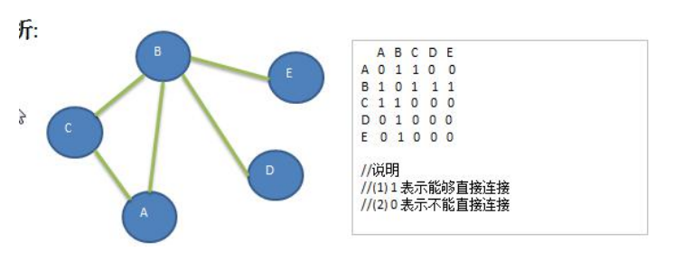

### 图的深度优先遍历介绍

#### 图遍历介绍 

所谓图的遍历，即是对结点的访问。一个图有那么多个结点，如何遍历这些结点，需要特定策略，一般有两种访问策略: (1)深度优先遍历 (2)广度优先遍历

#### 深度优先遍历基本思想 

图的深度优先搜索(**Depth First Search**) 。 

1) 深度优先遍历，从初始访问结点出发，初始访问结点可能有多个邻接结点，深度优先遍历的策略就是首先访问第一个邻接结点，然后再以这个被访问的邻接结点作为初始结点，访问它的第一个邻接结点， 可以这样理解：每次都在访问完当前结点后首先访问当前结点的第一个邻接结点。 

2) 我们可以看到，这样的访问策略是优先往纵向挖掘深入，而不是对一个结点的所有邻接结点进行横向访问。 

3) 显然，深度优先搜索是一个递归的过程

#### 深度优先遍历算法步骤 

1) 访问初始结点 v，并标记结点 v 为已访问。 

2) 查找结点 v 的第一个邻接结点 w。 

3) 若 w 存在，则继续执行 4，如果 w 不存在，则回到第 1 步，将从 v 的下一个结点继续。 

4) 若 w 未被访问，对 w 进行深度优先遍历递归（即把 w 当做另一个 v，然后进行步骤 123）。 

5) 查找结点 v 的 w 邻接结点的下一个邻接结点，转到步骤 3。 

6) 分析图



深度优先算法的代码实现

```java
package com.romanticlei.graph;

import java.util.ArrayList;
import java.util.Arrays;
import java.util.List;
import java.util.stream.Collectors;
import java.util.stream.Stream;

public class Graph {

    // 存储顶点集合
    private ArrayList<String> vertexList;
    // 存储图对应的邻接矩阵(两个结点是否有边相连)
    private int[][] edges;
    // 表示边的数目
    private int numOfEdges;
    // 定义个数组 boolean[], 记录某个结点是否被访问
    private boolean[] isVisited;

    public static void main(String[] args) {
        int n = 5;
        Graph graph = new Graph(n);
        String[] Vertex = {"A", "B", "C", "D", "E"};
        for (String vertex : Vertex) {
            graph.insertVertex(vertex);
        }

        // 添加边
        graph.insertEdge(0, 1, 1);
        graph.insertEdge(0, 2, 1);
        graph.insertEdge(1, 2, 1);
        graph.insertEdge(1, 3, 1);
        graph.insertEdge(1, 4, 1);

        // 显示邻接矩阵
        graph.showGraph();

        graph.dfs();

    }

    public Graph(int n) {
        // 初始化矩阵和 vertexList
        edges = new int[n][n];
        vertexList = new ArrayList<>(n);
        numOfEdges = 0;
        isVisited = new boolean[n];
    }

    // 插入结点
    public void insertVertex(String vertex) {
        vertexList.add(vertex);
    }

    /**
     * 添加边
     * @param v1 表示点的下标即第一个顶点
     * @param v2 表示第二个顶点的下标
     * @param weight 表示权重
     */
    public void insertEdge(int v1, int v2, int weight) {
        edges[v1][v2] = weight;
        edges[v2][v1] = weight;
        numOfEdges++;
    }

    // 显示图对应的矩阵
    public void showGraph() {
        System.out.println("二维数据遍历方法一：");
        for (int[] link : edges) {
            System.out.println(Arrays.toString(link));
        }

        System.out.println("二维数据遍历方法二：");
        Arrays.stream(edges).forEach(a -> {
            System.out.println(Arrays.toString(a));
        });

        System.out.println("二维数据遍历方法三：");
        Stream.of(edges).forEach(a -> {
            System.out.println(Arrays.toString(a));
        });
    }

    /**
     * 得到第一个邻接结点的下标 w
     * @param index
     * @return 如果存在返回对应的下标，否则返回-1
     */
    public int getFirstNeighbor(int index) {
        for (int i = 0; i < vertexList.size(); i++) {
            if (edges[index][i] > 0) {
                return i;
            }
        }
        return -1;
    }

    /**
     * 根据前一个邻接结点的下标来获取下一个邻接结点
     * @param v1 当前结点下标
     * @param v2 相邻结点下标
     * @return
     */
    public int getNextNeighbor(int v1, int v2) {
        for (int i = v2 + 1; i < vertexList.size(); i++) {
            if (edges[v1][i] > 0) {
                return i;
            }
        }
        return -1;
    }

    // 深度优先遍历算法
    public void dfs(boolean[] isVisited, int i) {
        // 首先我们访问该结点，输出
        System.out.print(getValueByIndex(i) + "->");
        // 将该结点设置为已访问
        isVisited[i] = true;
        // 查找结点i的第一个邻接结点w
        int w = getFirstNeighbor(i);
        while (w != -1) {
            if (!isVisited[w]) {
                dfs(isVisited, w);
            }

            // 如果w节点已经被访问过
            w = getNextNeighbor(i, w);
        }
    }

    public void dfs() {
        // 遍历所有的节点，进行dfs[回溯]
        for (int i = 0; i < getNumOfVertex(); i++) {
            if (!isVisited[i]){
                dfs(isVisited, i);
            }
        }
    }

    // 返回结点的个数
    public int getNumOfVertex(){
        return vertexList.size();
    }

    // 得到边的数目
    public int getNumOfEdges(){
        return numOfEdges;
    }

    // 返回结点i(下标)对应的数据 0->"A", 1->"B", 2->"C"
    public String getValueByIndex(int i){
        return vertexList.get(i);
    }

    // 返回v1和v2的权值
    public int getWeight(int v1, int v2) {
        return edges[v1][v2];
    }
}
```


