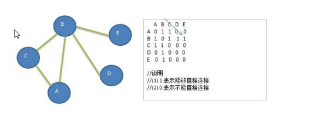

### 图的广度优先遍历

#### 广度优先遍历基本思想

1) 图的广度优先搜索(Broad First Search) 。 

2) 类似于一个**分层搜索**的过程，广度优先遍历需要使用一个队列以保持访问过的结点的顺序，以便按这个顺序来访问这些结点的邻接结点 

##### 广度优先遍历算法步骤 

1) 访问初始结点 v 并标记结点 v 为已访问。 

2) 结点 v 入队列。

3) 当队列非空时，继续执行，否则算法结束。 

4) 出队列，取得队头结点 u。 

5) 查找结点 u 的第一个邻接结点 w。 

6) 若结点 u 的邻接结点 w 不存在，则转到步骤 3；否则循环执行以下三个步骤： 
   6.1 若结点 w 尚未被访问，则访问结点 w 并标记为已访问。 

   6.2 结点 w 入队列 

   6.3 查找结点 u 的继 w 邻接结点后的下一个邻接结点 w，转到步骤 6。

#### 广度优先算法的图示



代码实现

```java
public void bfs(boolean[] isVisited, int i) {
    int queueFirstNode; // 表示队列的头结点对应的下标
    int w; // 邻接结点w
    // 队列，记录结点访问顺序
    LinkedList queue = new LinkedList<>();
    // 访问结点，输出结点信息
    System.out.print(getValueByIndex(i) + "=>");
    // 标记结点为已访问
    isVisited[i] = true;
    // 将结点加入队列
    queue.addLast(i);

    while (!queue.isEmpty()) {
        queueFirstNode = (Integer) queue.removeFirst();
        w = getFirstNeighbor(queueFirstNode);
        while (w != -1) {
            // 找到邻接结点
            if (!isVisited[w]) {
                // 没有被访问过
                System.out.print(getValueByIndex(w) + "=>");
                // 标记已经访问过
                isVisited[w] = true;
                queue.addLast(w);
            }

            // 以queueFirstNode 为前驱，找w后面的下一个邻接结点
            w = getNextNeighbor(queueFirstNode, w);
        }
    }
}

// 遍历所有结点，进行广度优先搜索
public void bfs() {
    for (int i = 0; i < getNumOfVertex(); i++) {
        if (!isVisited[i]) {
            bfs(isVisited, i);
        }
    }
}
```


