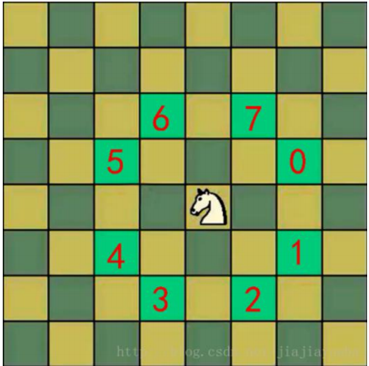
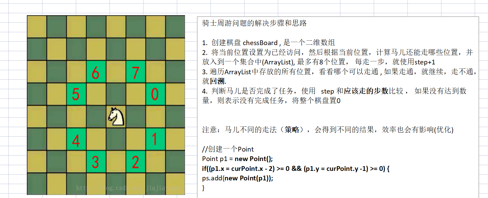

### 马踏棋盘算法

1) 马踏棋盘算法也被称为骑士周游问题 

2) 将马随机放在国际象棋的 8×8 棋盘 Board[0～7][0～7]的某个方格中，马按走棋规则(马走日字)进行移动。要求每个方格只进入一次，走遍棋盘上全部 64 个方格 



#### 马踏棋盘游戏代码实现

1) 马踏棋盘问题(骑士周游问题)实际上是图的深度优先搜索(DFS)的应用。 

2) 如果使用回溯（就是深度优先搜索）来解决，假如马儿踏了 53 个点，如图：走到了第 53 个，坐标（1,0），发现已经走到尽头，没办法，那就只能回退了，查看其他的路径，就在棋盘上不停的回溯…… ，**思路分析**+代码实现 

对第一种实现方式的思路图解



3) 分析第一种方式的问题，并使用贪心算法（greedyalgorithm）进行优化。解决马踏棋盘问题.


4) 使用前面的游戏来验证算法是否正确。 

5) 代码实现

```java
package com.romanticlei.horse;

import java.awt.*;
import java.util.ArrayList;
import java.util.Arrays;
import java.util.Comparator;

public class HorseChessboard {

    private static int X;   // 棋盘的列数(从 0 开始)
    private static int Y;   // 棋盘的行数(从 0 开始)
    // 创建一个数组，标记棋盘的各个位置是否被访问量过
    private static boolean isVisited[];
    // 标记是否棋盘的所有位置都被访问，如果为 true，表示成功
    private static boolean finished;

    public static void main(String[] args) {
        System.out.println("骑士周游算法，开始运行~~");
        //测试骑士周游算法是否正确
        X = 8;
        Y = 8;
        int row = 2; //马儿初始位置的行，从 1 开始编号
        int column = 2; //马儿初始位置的列，从 1 开始编号
        // 创建棋盘
        int[][] chessboard = new int[X][Y];
        isVisited = new boolean[X * Y];//初始值都是 false
        // 测试一下耗时
        long start = System.currentTimeMillis();
        // 棋盘的行和列时从下标 0 开始的
        traversalChessboard(chessboard, row - 1, column - 1, 1);
        Long end = System.currentTimeMillis();
        System.out.println("共耗时: " + (end - start) + " 毫秒");

        for (int[] rows : chessboard) {
            System.out.println(Arrays.toString(rows));
        }
    }

    /**
     * 完成骑士周游列国的算法
     * @param chessboard    棋盘
     * @param row           马儿当前位置的行 从0开始
     * @param column        马儿当前位置的列 从0开始
     * @param step          是第几步，初始位置就是第1步
     */
    public static void traversalChessboard(int[][] chessboard, int row, int column, int step) {
        // 标记当前位置是第几步
        chessboard[row][column] = step;
        // 标记该点已访问
        isVisited[row * X + column] = true;
        // 获取当前位置的下一个位置的集合
        ArrayList<Point> ps = next(new Point(column, row));
        // 对 ps 进行排序,排序的规则就是对 ps 的所有的 Point 对象的下一步的位置的数目，进行非递减排序
        sort(ps);
        // 遍历 ps
        while (!ps.isEmpty()) {
            // 取出下一个可以走的位置
            Point p = ps.remove(0);
            if (!isVisited[p.y * X + p.x]) {
                traversalChessboard(chessboard, p.y, p.x, step + 1);
            }
        }

        // 判断马儿是否完成了任务，使用 step 和应该走的步数比较
        //
        if (step < X * Y && !finished){
            chessboard[row][column] = 0;
            isVisited[row * X + column] = false;
        } else {
            finished = true;
        }
    }

    /**
     * 根据当前位置（Point对象），计算马儿还能走那些位置（Point），
     * 并放入到一个集合中（ArrayList），最多能有8个位置能走
     * @param curPoint
     * @return
     */
    public static ArrayList<Point> next(Point curPoint) {
        // 创建一个 ArrayList
        ArrayList<Point> ps = new ArrayList<Point>();
        // 创建一个 Point
        Point p1 = new Point();

        // 表示当前结点 左左上这个位置
        if ((p1.x = curPoint.x - 2) >= 0 && (p1.y = curPoint.y - 1) >= 0) {
            ps.add(new Point(p1));
        }
        // 表示当前结点 左上上这个位置
        if ((p1.x = curPoint.x - 1) >= 0 && (p1.y = curPoint.y - 2) >= 0) {
            ps.add(new Point(p1));
        }
        // 表示当前结点 右上上这个位置
        if ((p1.x = curPoint.x + 1) < X && (p1.y = curPoint.y - 2) >= 0) {
            ps.add(new Point(p1));
        }
        // 表示当前结点 右右上这个位置
        if ((p1.x = curPoint.x + 2) < X && (p1.y = curPoint.y - 1) >= 0) {
            ps.add(new Point(p1));
        }

        // 表示当前结点 右右下这个位置
        if ((p1.x = curPoint.x + 2) < X && (p1.y = curPoint.y + 1) < Y) {
            ps.add(new Point(p1));
        }
        // 表示当前结点 右下下这个位置
        if ((p1.x = curPoint.x + 1) < X && (p1.y = curPoint.y + 2) < Y) {
            ps.add(new Point(p1));
        }
        // 表示当前结点 左下下这个位置
        if ((p1.x = curPoint.x - 1) >= 0 && (p1.y = curPoint.y + 2) < Y) {
            ps.add(new Point(p1));
        }
        // 表示当前结点 左左下这个位置
        if ((p1.x = curPoint.x - 2) >= 0 && (p1.y = curPoint.y + 1) < Y) {
            ps.add(new Point(p1));
        }

        return ps;
    }

    public static void sort(ArrayList<Point> ps) {
        ps.sort(new Comparator<Point>() {
            @Override
            public int compare(Point o1, Point o2) {
                // 获取到 o1 的下一步的所有位置个数
                int count1 = next(o1).size();
                // 获取到 o2 的下一步的所有位置个数
                int count2 = next(o2).size();
                if (count1 < count2) {
                    return -1;
                } else if(count1 == count2) {
                    return 0;
                }else {
                    return 1;
                }
            }
        });
    }
}
```

