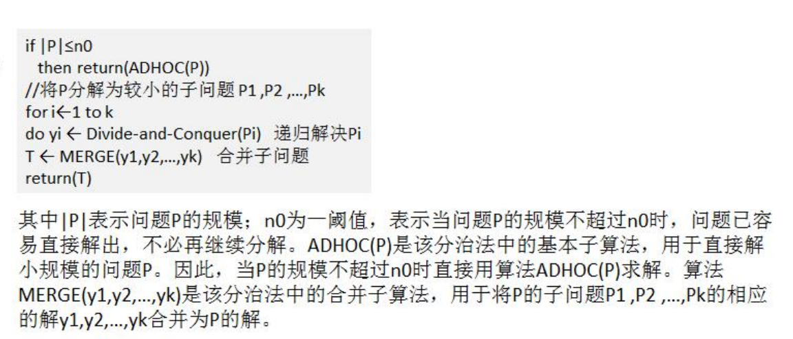

### 分治算法

分治算法介绍 

1) 分治法是一种很重要的算法。字面上的解释是“分而治之”，就是把一个复杂的问题分成两个或更多的相同或相似的子问题，再把子问题分成更小的子问题……直到最后子问题可以简单的直接求解，原问题的解即子问题的解的合并。这个技巧是很多高效算法的基础，如排序算法(快速排序，归并排序)，傅立叶变换(快速傅立叶变换)…… 

2) 分治算法可以求解的一些经典问题 

二分搜索 

大整数乘法 

棋盘覆盖 

合并排序 

快速排序 

线性时间选择 

最接近点对问题 

循环赛日程表 

**汉诺塔** 

#### 分治算法的基本步骤

**分治法在每一层递归上都有三个步骤：** 

**1)分解：将原问题分解为若干个规模较小，相互独立，与原问题形式相同的子问题** 

**2)解决：若子问题规模较小而容易被解决则直接解，否则递归地解各个子问题**

**3) 合并：将各个子问题的解合并为原问题的解。**


#### 分治(Divide-and-Conquer(P))算法设计模式如下：




汉诺塔游戏的演示和思路分析:

1) 如果是有一个盘， A->C 如果我们有 n >= 2 情况，我们总是可以看做是两个盘 1.最下边的盘 2. 上面的盘 

2) 先把 最上面的盘 A->B 

3) 把最下边的盘 A->C 

4) 把 B 塔的所有盘 从 B->C


代码演示

```java
package com.romanticlei.dac;

public class Hanoitower {

    public static void main(String[] args) {
        hanoiTower(5, 'A', 'B', 'C');
    }

    /**
     * 汉诺塔的移动方法，使用分治算法
     * @param num
     * @param a 起始位置
     * @param b 辅助位置
     * @param c 目标位置
     */
    public static void hanoiTower(int num, char a, char b, char c) {
        // 如果只有一个盘
        if (num == 1) {
            System.out.println("第一个盘从" + a + "->" + c);
        } else {
            // 如果我们有 n >= 2 的情况，我们总是可以看做是两个盘。1.最下面的一个盘；2.上面的所有盘
            // 1. 先把最上面的所有盘 A -> B, 移动过程中使用到C
            hanoiTower(num - 1, a, c, b);
            // 2.把最下边的盘 A -> C
            System.out.println("第" + num + "个盘从" + a + "->" + c);
            // 3. 把B塔的所有盘从 B -> C，移动过程中使用到 A塔
            hanoiTower(num - 1, b, a, c);
        }
    }
}
```


