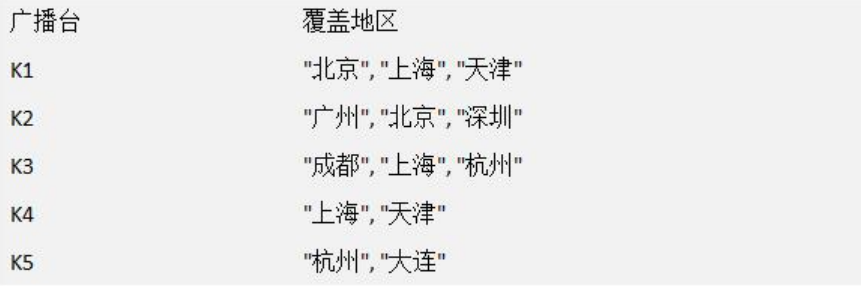
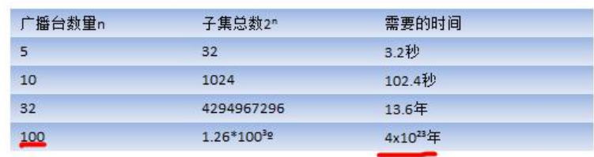
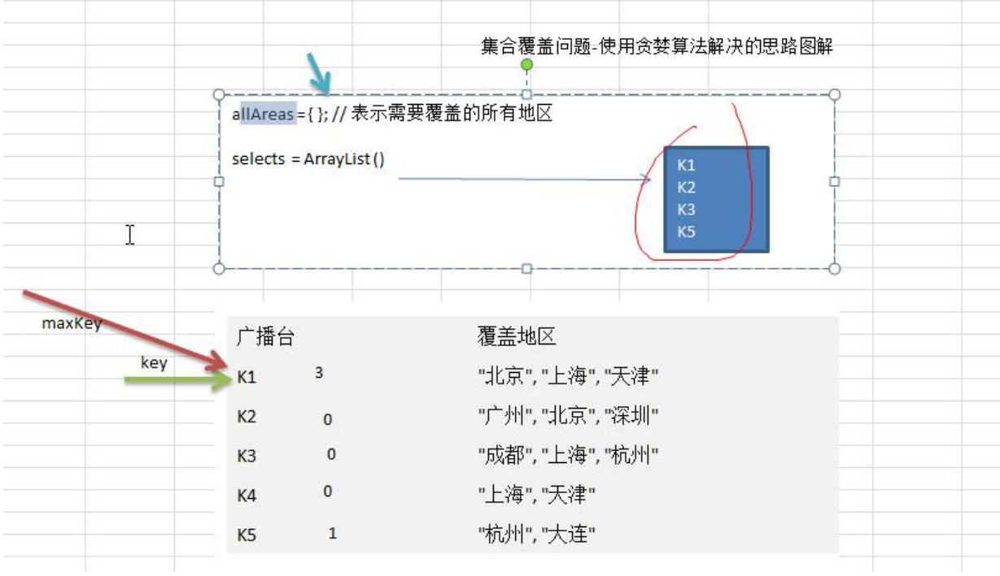

### 贪心算法

#### 应用场景-集合覆盖问题

假设存在下面需要付费的广播台，以及广播台信号可以覆盖的地区。 如何选择最少的广播台，让所有的地区都可以接收到信号



#### 贪心算法介绍

1.贪婪算法(贪心算法)是指在对问题进行求解时，**在每一步选择中都采取最好或者最优(即最有利)的选择**，从而希望能够导致结果是最好或者最优的算法

2.贪婪算法所得到的结果不一定是最优的结果(有时候会是最优解)，但是都是相对近似(接近)最优解的结果 

#### 贪心算法最佳应用-集合覆盖

1.假设存在如下表的需要付费的广播台，以及广播台信号可以覆盖的地区。 如何选择最少的广播台，让所有的地区都可以接收到信号


2.思路分析: 

如何找出覆盖所有地区的广播台的集合呢，使用穷举法实现,列出每个可能的广播台的集合，这被称为幂集。假设总的有 n 个广播台，则广播台的组合总共有2ⁿ -1个,假设每秒可以计算 10 个子集， 如图:



使用贪婪算法，效率高: 

1. 目前并没有算法可以快速计算得到准备的值， 使用贪婪算法，则可以得到非常接近的解，并且效率高。选择策略上，因为需要覆盖全部地区的最小集合: 

2) 遍历所有的广播电台, 找到一个覆盖了最多未覆盖的地区的电台(此电台可能包含一些已覆盖的地区，但没有关系） 

3) 将这个电台加入到一个集合中(比如 ArrayList), 想办法把该电台覆盖的地区在下次比较时去掉。 

4) 重复第 1 步**直到覆盖了全部的**地区 

分析的图解:



代码分析

```java
package com.romanticlei.greedy;

import java.util.ArrayList;
import java.util.HashMap;
import java.util.HashSet;

public class GreedyAlgorithm {

    public static void main(String[] args) {
        //创建广播电台,放入到 Map
        HashMap<String, HashSet<String>> broadcasts = new HashMap<String, HashSet<String>>();
        // 将各个电台放入到 broadcasts
        HashSet<String> hashSet1 = new HashSet<String>();
        hashSet1.add("北京");
        hashSet1.add("上海");
        hashSet1.add("天津");

        HashSet<String> hashSet2 = new HashSet<String>();
        hashSet2.add("广州");
        hashSet2.add("北京");
        hashSet2.add("深圳");

        HashSet<String> hashSet3 = new HashSet<String>();
        hashSet3.add("成都");
        hashSet3.add("上海");
        hashSet3.add("杭州");

        HashSet<String> hashSet4 = new HashSet<String>();
        hashSet4.add("上海");
        hashSet4.add("天津");

        HashSet<String> hashSet5 = new HashSet<String>();
        hashSet5.add("杭州");
        hashSet5.add("大连");

        // 加入到 map
        broadcasts.put("K1", hashSet1);
        broadcasts.put("K2", hashSet2);
        broadcasts.put("K3", hashSet3);
        broadcasts.put("K4", hashSet4);
        broadcasts.put("K5", hashSet5);

        //allAreas 存放所有的地区
        HashSet<String> allAreas = new HashSet<String>();
        allAreas.add("北京");
        allAreas.add("上海");
        allAreas.add("天津");
        allAreas.add("广州");
        allAreas.add("深圳");
        allAreas.add("成都");
        allAreas.add("杭州");
        allAreas.add("大连");

        //创建 ArrayList, 存放选择的电台集合
        ArrayList<String> selects = new ArrayList<String>();
        // 定义一个临时的集合， 在遍历的过程中，
        // 存放遍历过程中的电台覆盖的地区和当前还没有覆盖的地区的交集
        HashSet<String> tempSet = new HashSet<String>();

        // 定义个 maxKey， 保存在一次遍历过程中，能够覆盖最大未覆盖地区对应的电台key
        // 如果 maxKey 不为null，则会加入到 selects
        String maxKey = null;
        while (allAreas.size() != 0) {
            // 每次循环前需要清空
            maxKey = null;
            int maxTempSize = 0;
            // 遍历 broadcasts， 取出 key
            for (String key : broadcasts.keySet()) {
                tempSet.clear();
                HashSet<String> areas = broadcasts.get(key);
                tempSet.addAll(areas);
                // 求出 tempSet 和 allAreas 集合的交集，交集会重新赋值给 tempSet
                tempSet.retainAll(allAreas);
                // 如果当前这个集合包含的未覆盖地区的数量， 比maxKey指向的集合地区还多
                if (tempSet.size() > 0 && (maxKey == null || tempSet.size() > maxTempSize)){
                    maxKey = key;
                    maxTempSize = tempSet.size();
                }
            }

            // maxKey != null
            if (maxKey != null) {
                selects.add(maxKey);
                // 将maxKey指向的广播电视台覆盖的地区，从 allAreas 去掉
                allAreas.removeAll(broadcasts.get(maxKey));
            }
        }

        System.out.println("得到的选择结果是：" + selects);
    }
}
```


#### 贪心算法注意事项和细节 

1) 贪婪算法所得到的结果不一定是最优的结果(有时候会是最优解)，但是都是相对近似(接近)最优解的结果 

2) 比如上题的算法选出的是 K1, K2, K3, K5，符合覆盖了全部的地区 

3) 但是我们发现 K2, K3,K4,K5 也可以覆盖全部地区，如果 K2 的使用成本低于 K1,那么我们上题的 K1, K2, K3, K5 虽然是满足条件，但是并不是最优的.

