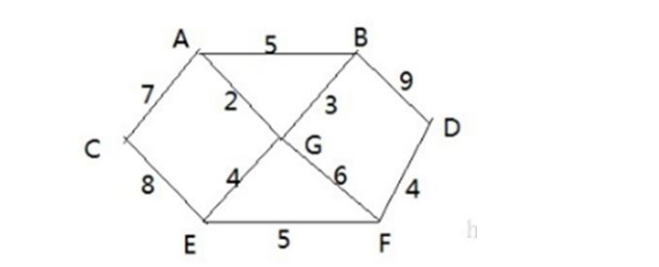
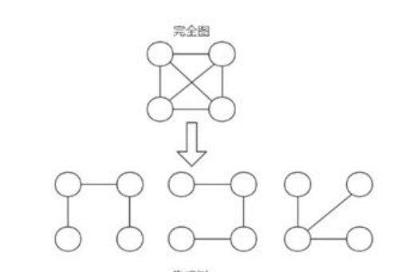
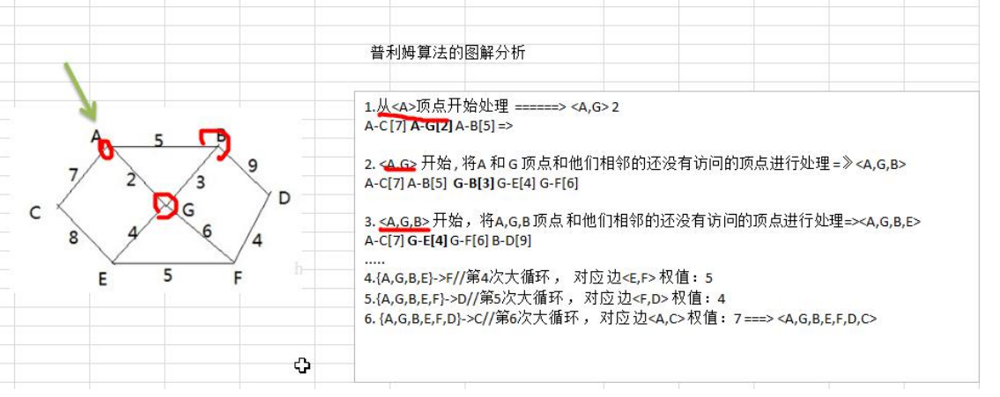

#### 普里姆算法

应用场景-修路问题

**看一个应用场景和问题：** 

**1)** **有胜利乡有** **7** **个村庄(A, B, C, D, E, F, G) ，现在需要修路把7个村庄连通** 

**2)** **各个村庄的距离用边线表示(权) ，比如 A– B 距离 5公里** 

**3)问：如何修路保证各个村庄都能连通，并且总的修建公路总里程最短?** 

**思路: 将 10 条边，连接即可，但是总的里程数不是最小**.

**正确的思路，就是尽可能的选择少的路线，并且每条路线最小，保证总里程数最少.**

---

#### 最小生成树

修路问题本质就是就是**最小生成树问题**， 先介绍一下最小生成树(Minimum Cost Spanning Tree)，简称MST。

**给定一个带权的无向连通图**,如何选取一棵生成树,使树上所有边上权的总和为最小,这叫最小生成树 

1) N 个顶点，一定有N-1条边

2) 包含全部顶点

3) N-1条边都在图中
4) 举例说明(如图:)
5) 求最小生成树的算法主要是普里姆算法和克鲁斯卡尔算法

---

#### 普里姆算法介绍

普利姆(Prim)算法求最小生成树，也就是在包含 n 个顶点的连通图中，找出只有(n-1)条边包含所有 n 个顶点的连通子图，也就是所谓的极小连通子图普利姆的算法如下: 

1	设 G=(V,E)是连通网，T=(U,D)是最小生成树，V,U 是顶点集合，E,D 是边的集合 

2	若从顶点 u 开始构造最小生成树，则从集合 V 中取出顶点 u 放入集合 U 中，标记顶点 v 的 visited[u]=1 

3	若集合 U 中顶点 ui 与集合 V-U 中的顶点 vj 之间存在边，则寻找这些边中权值最小的边，但不能构成回路，将顶点 vj 加入集合 U 中，将边（ui,vj）加入集合 D 中，标记 visited[vj]=1 

4	重复步骤②，直到 U 与 V 相等，即所有顶点都被标记为访问过，此时 D 中有 n-1 条边 

5	提示: 单独看步骤很难理解，我们通过代码来讲解，比较好理解. 

6	图解普利姆算法

#### 普里姆算法最佳实践(修路问题)

有胜利乡有 7 个村庄(A, B, C, D, E, F, G)，现在需要修路把 7 个村庄连通 

各个村庄的距离用边线表示(权) ，比如A – B 距离 5 公里 

问：如何修路保证各个村庄都能连通，并且总的修建公路总里程最短? 

分析+代码演示:
