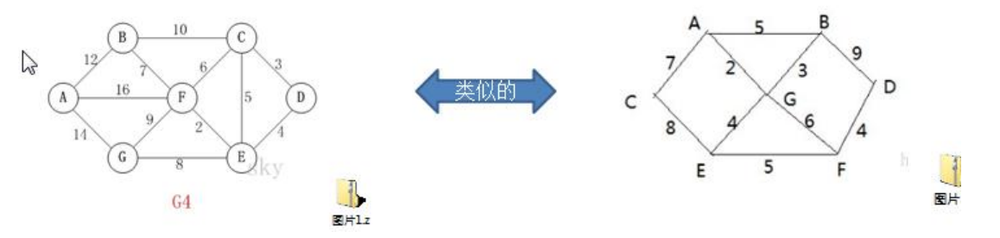
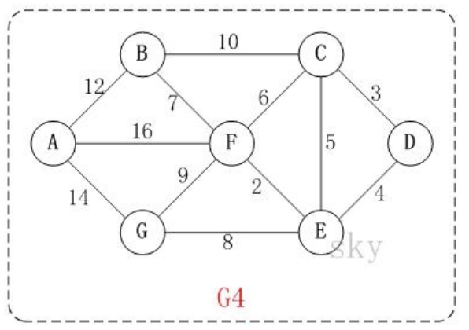
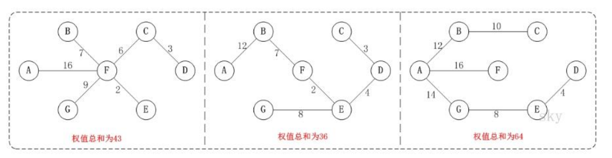
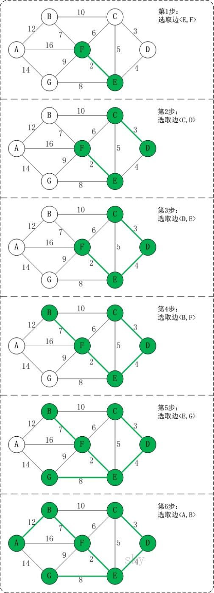
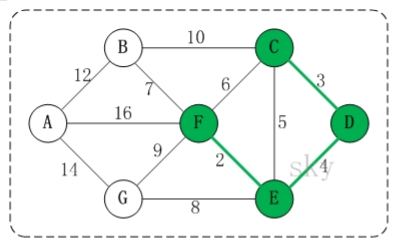

### 克鲁斯卡尔算法

#### 应用场景-公交站问题 

看一个应用场景和问题：



1) 某城市新增 7 个站点(A, B, C, D, E, F, G)，现在需要修路把 7 个站点连通 

2) 各个站点的距离用边线表示(权) ，比如A – B 距离 12 公里 

3) 问：如何修路保证各个站点都能连通，并且总的修建公路总里程最短?

#### 克鲁斯卡尔算法介绍

1)克鲁斯卡尔(Kruskal)算法，是用来求加权连通图的最小生成树的算法。 

2)基本思想：按照权值从小到大的顺序选择 n-1 条边，并保证这 n-1 条边不构成回路 

3)具体做法：首先构造一个只含 n 个顶点的森林，然后依权值从小到大从连通网中选择边加入到森林中，并使森林中不产生回路，直至森林变成一棵树为止

#### 克鲁斯卡尔算法图解说明

以城市公交站问题来图解说明 克鲁斯卡尔算法的原理和步骤：

在含有 n 个顶点的连通图中选择 n-1 条边，构成一棵极小连通子图，并使该连通子图中 n-1 条边上权值之和达到最小，则称其为连通网的最小生成树。



例如，对于如上图 G4 所示的连通网可以有多棵权值总和不相同的生成树。



---

#### 克 鲁 斯 卡 尔 算 法 图 解

以上图 G4 为例，来对克鲁斯卡尔进行演示(假设，用数组 R 保存最小生成树结果)。



**第1步**：将边<E,F>加入R中。 
  边<E,F>的权值最小，因此将它加入到最小生成树结果R中。 
**第2步**：将边<C,D>加入R中。 
  上一步操作之后，边<C,D>的权值最小，因此将它加入到最小生成树结果R中。 
**第3步**：将边<D,E>加入R中。 
  上一步操作之后，边<D,E>的权值最小，因此将它加入到最小生成树结果R中。 
**第4步**：将边<B,F>加入R中。 
  上一步操作之后，边<C,E>的权值最小，但<C,E>会和已有的边构成回路；因此，跳过边<C,E>。同理，跳过边<C,F>。将边<B,F>加入到最小生成树结果R中。 
**第5步**：将边<E,G>加入R中。 
  上一步操作之后，边<E,G>的权值最小，因此将它加入到最小生成树结果R中。 
**第6步**：将边<A,B>加入R中。 
  上一步操作之后，边<F,G>的权值最小，但<F,G>会和已有的边构成回路；因此，跳过边<F,G>。同理，跳过边<B,C>。将边<A,B>加入到最小生成树结果R中。

此时，最小生成树构造完成！它包括的边依次是：**<E,F> <C,D> <D,E> <B,F> <E,G> <A,B>**。

---

#### 克 鲁 斯 卡 尔 算 法 分 析

根据前面介绍的克鲁斯卡尔算法的基本思想和做法，我们能够了解到，克鲁斯卡尔算法重点需要解决的以下两个问题： 
**问题一** 对图的所有边按照权值大小进行排序。 
**问题二** 将边添加到最小生成树中时，怎么样判断是否形成了回路。

问题一很好解决，采用排序算法进行排序即可。

问题二，处理方式是：记录顶点在"最小生成树"中的终点，顶点的终点是"在最小生成树中与它连通的最大顶点"。然后每次需要将一条边添加到最小生存树时，判断该边的两个顶点的终点是否重合，重合的话则会构成回路。

---

#### 如何判断是否构成回路-举例说明(如图)



在将<E,F> <C,D> <D,E>加入到最小生成树R中之后，这几条边的顶点就都有了终点：

**(01)** C的终点是F。 
**(02)** D的终点是F。 
**(03)** E的终点是F。 
**(04)** F的终点是F。

关于终点的说明：

1) 就是将所有顶点按照从小到大的顺序排列好之后；某个顶点的终点就是"与它连通的最大顶点"。 

2) 因此，接下来，虽然<C,E>是权值最小的边。但是C和E的终点都是F，即它们的终点相同，因此，将<C,E>加入最小生成树的话，会形成回路。这就是判断回路的方式。也就是说，**我们加入的边的两个顶点不能都指向同一个终点，否则将构成回路**。【后面有代码说明】

---

#### 克鲁斯卡尔最佳实践-公交站问题

1) 有北京有新增 7 个站点(A, B, C, D, E, F, G)，现在需要修路把 7 个站点连通 

2) 各个站点的距离用边线表示(权) ，比如 A – B 距离 12 公里 

3) 问：如何修路保证各个站点都能连通，并且总的修建公路总里程最短? 

4) 代码实现和注解

```java
package com.romanticlei.kruskal;

import java.util.Arrays;

public class KruskalCase {

    private int edgeNum;    // 边的个数
    private char[] vertexs; // 顶点数组
    private int[][] matrix; // 邻接矩阵
    // 使用 INF 表示两个顶点不能连通
    private static final int INF = Integer.MAX_VALUE;

    public static void main(String[] args) {
        char[] vertexs = {'A', 'B', 'C', 'D', 'E', 'F', 'G'};
        //克鲁斯卡尔算法的邻接矩阵
        int matrix[][] = {
                /*A*//*B*//*C*//*D*//*E*//*F*//*G*/
                /*A*/ { 0,   12, INF, INF, INF, 16,  14},
                /*B*/ { 12,  0,   10, INF, INF,  7, INF},
                /*C*/ { INF, 10,   0,   3,   5,  6, INF},
                /*D*/ { INF, INF,  3,   0,   4,INF, INF},
                /*E*/ { INF, INF,  5,   4,   0,  2,   8},
                /*F*/ { 16,    7,  6, INF,   2,  0,   9},
                /*G*/ { 14, INF,  INF, INF,  8,  9,   0}};

        // 创建 KruskalCase 对象实例
        KruskalCase kruskalCase = new KruskalCase(vertexs, matrix);
        kruskalCase.print();

        EData[] edges = kruskalCase.getEdges();
        System.out.println("排序前 = " + Arrays.toString(edges));
        kruskalCase.sortEdges(edges);
        System.out.println("排序后 = " + Arrays.toString(edges));

        kruskalCase.kruskal();

    }

    public KruskalCase(char[] vertexs, int[][] matrix) {
        // 初始化顶点数和个数
        int vlen = vertexs.length;

        // 初始化顶点，复制拷贝的方式
        this.vertexs = new char[vlen];
        for (int i = 0; i < vlen; i++) {
            this.vertexs[i] = vertexs[i];
        }

        //初始化边, 使用的是复制拷贝的方式
        this.matrix = new int[vlen][vlen];
        for (int i = 0; i < vlen; i++) {
            for (int j = 0; j < vlen; j++) {
                this.matrix[i][j] = matrix[i][j];

                // 二维数组右三角部分统计边的条数
                if (j > i && this.matrix[i][j] != INF) {
                    edgeNum++;
                }
            }
        }
    }

    public void kruskal() {
        int index = 0;  // 表示最后结果数组的索引
        // 用于保存 "已有最小生成树" 中的每个顶点在最小生成树中的终点
        int[] ends = new int[edgeNum];
        // 创建结果数组，保存最后的最小生成树
        EData[] rets = new EData[edgeNum];

        // 获取图中所有边的集合，一共有 12 条边
        EData[] edges = getEdges();
        System.out.println("图的边的集合 = " + Arrays.toString(edges) + "共" + edges.length);

        // 按照边的权值大小进行排序
        sortEdges(edges);

        // 遍历 edges 数组，将边添加到最小生成树中时，判断准备加入的边是否形成回路，如果没有加入 rets，否则不加入
        for (int i = 0; i < edgeNum; i++) {
            // 获取到第 i 条边的第一个顶点（起点）
            int p1 = getPosition(edges[i].start);
            // 获取到第 i 条边的第二个顶点
            int p2 = getPosition(edges[i].end);

            // 获取p1这个顶点在已有最小生成树中的终点
            int m = getEnd(ends, p1);
            int n = getEnd(ends, p2);

            // 例如现在是A->B->C，现在来了一条边C->A,通过getEnd方法获取C顶点的终点，由于C 顶点没有被放入过数组，获取到为0
            // 接着继续通过getEnd方法获取A顶点的终点，获取到B下标，继续循环获取到C下标，由于C 顶点没有被放入过数组，获取到为0
            // 所以判定构成了回路，不会加入到 最小生成树中
            // 未构成回路
            if (m != n) {
                // 设置 m 在已有最小生成树中的终点
                ends[m] = n;
                // 有一条边加入到 rets 数组
                rets[index++] = edges[i];
            }
        }

        // 统计并打印 最小生成树，输出 rets
        System.out.println("最小生成树");
        for (int i = 0; i < index; i++) {
            System.out.println(rets[i]);
        }
    }

    // 打印邻接矩阵
    public void print() {
        System.out.println("邻接矩阵为：" );
        for (int[] temp : this.matrix) {
            System.out.println(Arrays.toString(temp));
        }
    }

    /**
     * 对边进行排序处理，冒泡排序
     * @param edges 边的集合
     */
    private void sortEdges(EData[] edges) {
        for (int i = 0; i < edges.length - 1; i++) {
            for (int j = 0; j < edges.length - 1 - i; j++) {
                if (edges[j].weight > edges[j + 1].weight) {
                    EData temp = edges[j];
                    edges[j] = edges[j + 1];
                    edges[j + 1] = temp;
                }
            }
        }
    }

    /**
     *
     * @param ch 顶点的值，比如 'A', 'B'
     * @return   返回ch顶点对应的下标，如果找不到，返回-1
     */
    public int getPosition(char ch) {
        for (int i = 0; i < this.vertexs.length; i++) {
            if (vertexs[i] == ch) {
                return i;
            }
        }
        // 找不到返回 -1
        return -1;
    }

    /**
     * 获取图中的边， 放到 EData[] 数组中，后面我们需要遍历该数组
     * 是通过 matrix 邻接矩阵来获取
     * EData[] 形式[['A', 'B', 12], ['B', 'F', 7], ...]
     *
     * @return
     */
    public EData[] getEdges() {
        int index = 0;
        EData[] edges = new EData[edgeNum];
        for (int i = 0; i < vertexs.length; i++) {
            // 取二维数组右三角
            for (int j = i + 1; j < vertexs.length; j++) {
                if (matrix[i][j] != INF) {
                    edges[index++] = new EData(vertexs[i], vertexs[j], matrix[i][j]);
                }
            }
        }

        return edges;
    }

    /**
     * 例如现在是A->B->C，现在来了一条边C->A,通过getEnd方法获取C顶点的终点，由于C 顶点没有被放入过数组，获取到为0
     * 接着继续通过getEnd方法获取A顶点的终点，获取到B下标，继续循环获取到C下标，由于C 顶点没有被放入过数组，获取到为0
     *
     * 获取下标为 i 的顶点的终点(), 用于后面判断两个顶点的终点是否相同
     * @param ends: 数组就是记录了各个顶点对应的终点是哪个,ends 数组是在遍历过程中，逐步形成
     * @param i: 表示传入的顶点对应的下标
     * @return 返回的就是 下标为 i 的这个顶点对应的终点的下标, 一会回头还有来理解
     */
    public int getEnd(int[] ends, int i) {
        while (ends[i] != 0) {
            i = ends[i];
        }
        return i;
    }
}

// 创建一个类EData，它的对象实例就表示一条边
class EData{
    char start; // 边的一个点
    char end;   // 边的另一个点
    int weight; // 边的权值

    public EData(char start, char end, int weight) {
        this.start = start;
        this.end = end;
        this.weight = weight;
    }

    @Override
    public String toString() {
        return "EData{" +
                "start=" + start +
                ", end=" + end +
                ", weight=" + weight +
                '}';
    }
}
```

#### 小总结：

普利姆算法和克鲁斯卡尔算法得出的结果是一样的，普利姆算法是按照权重数组的起点开始，每次都选择最短路径，克鲁斯卡尔是将所有路径进行排序，每次都选择最短不构成回路的路径
