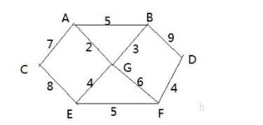
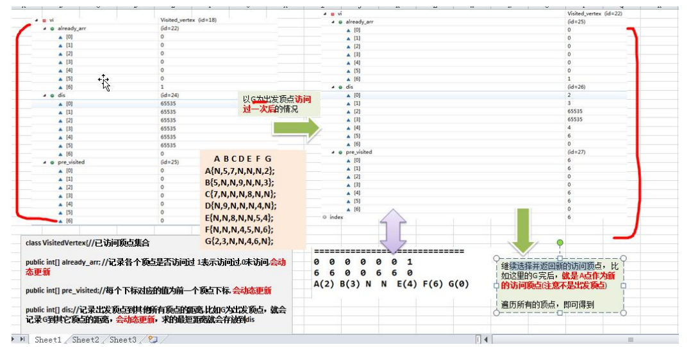

### 迪杰斯特拉算法

#### 应用场景-最短路径问题

看一个应用场景和问题：

1) 战争时期，胜利乡有 7 个村庄(A, B, C, D, E, F, G) ，现在有六个邮差，从 G 点出发，需要分别把邮件分别送到A, B, C , D, E, F 六个村庄 

2) 各个村庄的距离用边线表示(权) ，比如 A – B 距离 5 公里 

3) 问：如何计算出 G 村庄到 其它各个村庄的最短距离? 

4) 如果从其它点出发到各个点的最短距离又是多少? 

#### 迪杰斯特拉(Dijkstra)算法介绍

迪杰斯特拉(Dijkstra)算法是**典型最短路径算法**，用于计算一个结点到其他结点的最短路径。它的主要特点是以起始点为中心向外层层扩展(**广度优先搜索思想**)，直到扩展到终点为止。

#### 迪杰斯特拉(Dijkstra)算法过程

1) 设置出发顶点为 v，顶点集合 V{v1,v2,vi...}，v 到 V 中各顶点的距离构成距离集合 Dis，Dis{d1,d2,di...}，Dis集合记录着 v 到图中各顶点的距离(到自身可以看作 0，v 到 vi 距离对应为 di) 

2) 从 Dis 中选择值最小的 di 并移出 Dis 集合，同时移出 V 集合中对应的顶点 vi，此时的 v 到 vi 即为最短路径

3) 更新 Dis 集合，更新规则为：比较 v 到 V 集合中顶点的距离值，与 v 通过 vi 到 V 集合中顶点的距离值，保留值较小的一个(同时也应该更新顶点的前驱节点为 vi，表明是通过 vi 到达的) 

4) 重复执行两步骤，直到最短路径顶点为目标顶点即可结束

#### 迪杰斯特拉(Dijkstra)算法最佳应用-最短路径

