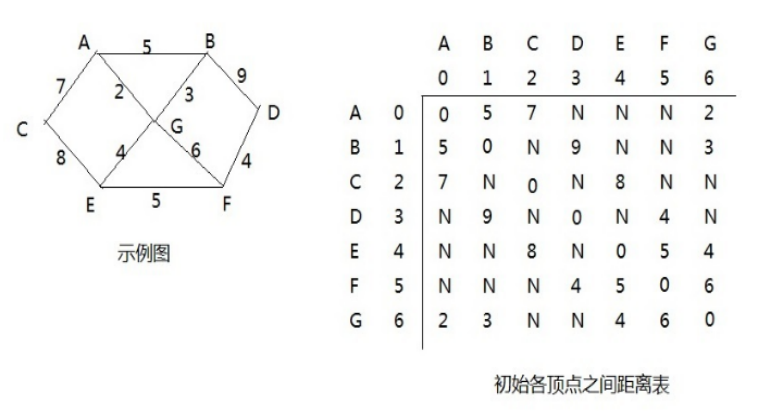
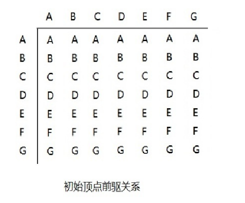
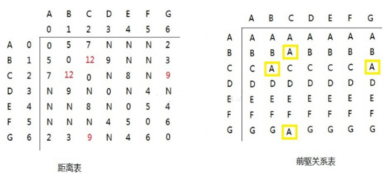
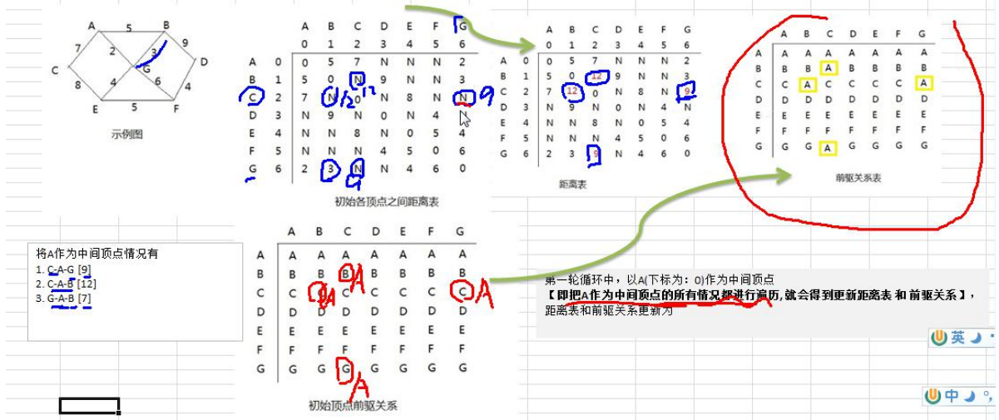

### 弗洛伊德算法

弗洛伊德(Floyd)算法介绍

1) 和 Dijkstra 算法一样，弗洛伊德(Floyd)算法也是一种用于寻找给定的加权图中顶点间最短路径的算法。该算法名称以创始人之一、1978 年图灵奖获得者、斯坦福大学计算机科学系教授罗伯特·弗洛伊德命名 

2) 弗洛伊德算法(Floyd)计算图中各个顶点之间的最短路径 

3) 迪杰斯特拉算法用于计算图中某一个顶点到其他顶点的最短路径。 

4) 弗洛伊德算法 VS 迪杰斯特拉算法：迪杰斯特拉算法通过选定的被访问顶点，求出从出发访问顶点到其他顶点的最短路径；弗洛伊德算法中每一个顶点都是出发访问点，所以需要将每一个顶点看做被访问顶点，求出从每一个顶点到其他顶点的最短路径。

#### 弗洛伊德(Floyd)算法图解分析

1) 设置顶点 vi 到顶点 vk 的最短路径已知为 Lik，顶点 vk 到 vj 的最短路径已知为 Lkj，顶点 vi 到 vj 的路径为 Lij，则 vi 到 vj 的最短路径为：min((Lik+Lkj),Lij)，vk 的取值为图中所有顶点，则可获得 vi 到 vj 的最短路径 

2) 至于 vi 到 vk 的最短路径 Lik 或者 vk 到 vj 的最短路径 Lkj，是以同样的方式获得

3) 弗洛伊德(Floyd)算法图解分析-举例说明

#### 弗洛伊德算法的步骤： 

第一轮循环中，以 A(下标为：0)作为中间顶点【即把 A 作为中间顶点的所有情况都进行遍历, 就会得到更新距离表 和 前驱关系】，距离表和前驱关系更新为：

分析如下： 

1) 以 A 顶点作为中间顶点是，B->A->C 的距离由 N->9，同理 C 到 B；C->A->G 的距离由 N->12，同理 G 到 C

2) 更换中间顶点，循环执行操作，直到所有顶点都作为中间顶点更新后，计算结束

#### 弗洛伊德(Floyd)算法最佳应用-最短路径

1) 胜利乡有 7 个村庄(A, B, C, D, E, F, G) 

2) 各个村庄的距离用边线表示(权) ，比如 A – B 距离 5 公里 

3) 问：如何计算出各村庄到 其它各村庄的最短距离? 

4) 代码实现

