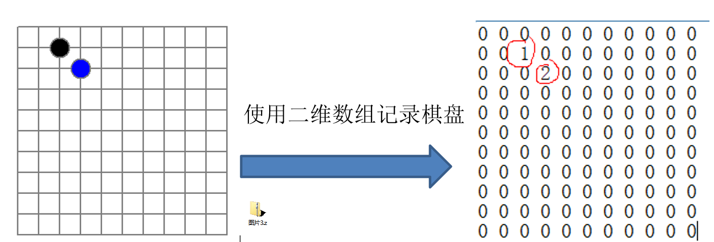
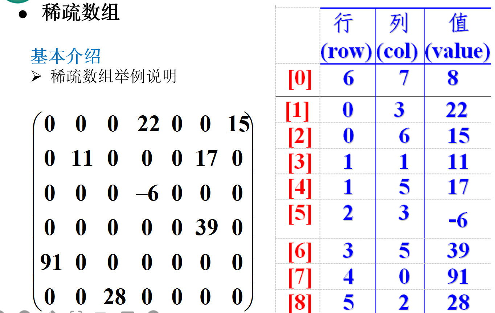
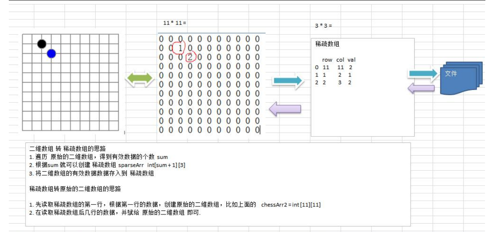

### 稀疏 sparsearray 数组

实际需求

编写的五子棋程序中，有存盘退出和续上盘的功能。



分析问题

因为该二维数组的很多值都是0，因此记录了很多没有意义的数据

基本介绍

当一个数组中大部分元素为０，或者为同一个值的数组时，可以使用稀疏数组来保存该数组。

稀疏数组的处理方法是:
记录数组一共有几行几列，有多少个不同的值
把具有不同值的元素的行列及值记录在一个小规模的数组中，从而缩小程序的规模



[0]：原始数组一共6行7列，8个不同的数据

[1]：原始数组0行3列上数值为22

应用实例：

1) 使用稀疏数组，来保留类似前面的二维数组(棋盘、地图等等) 

2) 把稀疏数组存盘，并且可以从新恢复原来的二维数组数 

3) 整体思路分析



4) 代码实现

```java
package com.romanticlei.sparsearray;

public class SparseArray {

    public static void main(String[] args) {
        // 创建一个原始的二维数组  11 * 11
        // 0：表示没有旗子，1：表示黑子，2：表示蓝子
        int chessArr1[][] = new int[11][11];
        chessArr1[1][2] = 1;
        chessArr1[2][3] = 2;
        chessArr1[2][4] = 2;
        System.out.println("原始的二维数组~~");
        for (int[] row : chessArr1) {
            for (int data : row) {
                System.out.print(data + "\t");
            }
            System.out.println();
        }

        // 将二维数组转稀疏数组的思想
        // 1.先遍历二维数组，得到非0数据的个数
        int sum = 0;
        for (int[] row : chessArr1) {
            for (int data : row) {
                if (data != 0)
                    sum++;
            }
        }

        // 2.创建相应的稀疏数组
        // 创建一个比数据个数多一个的行(第一行是原数组是几行几列几个数据)，列固定为3(行列值)
        int sparseArr[][] = new int[sum + 1][3];
        // 给稀疏数组赋值
        sparseArr[0][0] = chessArr1.length;
        sparseArr[0][1] = chessArr1[0].length;
        sparseArr[0][2] = sum;

        // 遍历二维数组，将非0的数据存放到sparseArr中
        // 声明一个变量 count，表示这是第几个非0的数据
        int count = 0;
        for (int i = 0; i < chessArr1.length; i++) {
            for (int j = 0; j < chessArr1[i].length; j++) {
                if (chessArr1[i][j] != 0){
                    count++;
                    sparseArr[count][0] = i;
                    sparseArr[count][1] = j;
                    sparseArr[count][2] = chessArr1[i][j];
                }
            }
        }

        // 开始输出压缩之后的稀疏数组
        System.out.println("压缩后的稀疏数组为~~");
        for (int[] rows: sparseArr) {
            System.out.println(rows[0] + "\t" + rows[1] + "\t" + rows[2]);
        }

        // 将稀疏数组 --》 恢复成原始的二维数组
        /**
         * 1.先读取稀疏数组的第一行，根据第一行的数据，创建原始的二维数组
         * 2.在读取稀疏数组的后几行，并赋值给二维数组即可
         */
        int chessArr2[][] = new int[sparseArr[0][0]][sparseArr[0][1]];
        // 从稀疏数组的第二行开始遍历
        for (int i = 1; i < sparseArr.length; i++) {
            chessArr2[sparseArr[i][0]][sparseArr[i][1]] = sparseArr[i][2];
        }
        System.out.println("解压稀疏数组后的数据为~~");
        for (int[] row: chessArr2) {
            for (int data : row) {
                System.out.print(data + "\t");
            }
            System.out.println();
        }

    }
}
```


