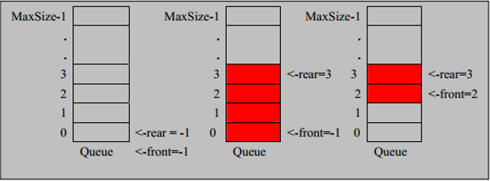

### 队列

队列的一个使用场景：银行排队被叫号

#### 队列介绍

1. 队列是一个有序列表，可以用数组或是链表来实现
2. 遵循先进先出，即：先入队列的数据，要先取出来，后入队的要后取出
3. 示意图如下


#### 数组模拟队列思路

- 队列本身是有序列表，若使用数组的结构来存储队列的数据，则队列数组的声明如下图，其中 maxSize 是该队列的最大容量
- 因为队列的输出、输入是分别从前后端来处理，因此需要两个变量 front 及 rear 分别记录队列前后端的下标， front 会随着数据输出而改变，而rear则是随着数据输入而改变，如下图：
  

- 当我们将数据存入队列时成为 “addQueue”，addQueue 的处理需要有两个步骤：
  1. 将尾指针往后移；rear+1，当 front == rear，表示队列为空
  2. 若尾指针 rear 小于队列的最大下标 maxSize-1，则将数据存入 rear 所指的数组元素中，否则无法存入。rear == maxSize-1，表示队列已满


```java
package com.romanticlei.queue;

import java.util.Arrays;
import java.util.Scanner;

public class ArrayQueueDemo {

    public static void main(String[] args) {
        ArrayQueue queue = new ArrayQueue(3);
        char key = ' ';// 获取从控制台输入的字符串
        Scanner scanner = new Scanner(System.in);

        while (true) {
            System.out.println("s(show) 展示队列所有数据");
            System.out.println("e(show) 退出程序");
            System.out.println("a(add) 添加数据到队列");
            System.out.println("p(pop) 从队列中弹出第一个数据");
            System.out.println("H(get) 获取队列中的头数据");


            key = scanner.next().charAt(0);

            switch (key) {
                case 's':
                    queue.showQueue();
                    break;
                case 'a':
                    System.out.println("请输入一个数据：");
                    Scanner tem = new Scanner(System.in);
                    int val = tem.nextInt();
                    queue.addQueue(val);
                    break;
                case 'p':
                    int data = queue.popQueue();
                    System.out.println("弹出的数据为：" + data);
                    break;
                case 'g':
                    int temp = queue.getHeadQueue();
                    System.out.println("队头数据为" + temp);
                    break;
                case 'e':
                    System.exit(-1);
                    break;
                default:
                    System.out.println("输入有误");
                    break;
            }
        }
    }
}

// 使用数组模拟队列-编写一个ArrayQueue类
class ArrayQueue {
    // 表示数组的最大容量
    private int maxSize;
    // 队列头
    private int front;
    // 队列尾
    private int rear;
    // 该数组用于存储数据，模拟队列
    private int[] arr;

    public ArrayQueue(int maxSize) {
        this.maxSize = maxSize;
        arr = new int[maxSize];
        front = -1; // 指向队列头部；分析出front 是指向队列头的前一个位置
        rear = -1; // 指向队列尾，指向队列尾的数据（即时队列最后一个数据）
    }

    // 判断队列是否已满
    public boolean isFull() {
        return rear == maxSize - 1;
    }

    // 判断队列是否为空
    public boolean isEmpty() {
        return rear == front;
    }

    // 数据入队列
    public void addQueue(int n) {
        // 判断队列是否已满
        if (isFull()) {
            System.out.println("队列已满，无法入队");
            return;
        }
        rear++;
        arr[rear] = n;
    }

    // 数据出队列
    public int popQueue() {
        // 判断队列是否为空
        if (isEmpty()) {
            System.out.println("队列为空，无法取数据");
            return -1;
        }
        front++;
        return arr[front];
    }

    // 显示队列的所有数据
    public void showQueue() {
        if (isEmpty()) {
            System.out.println("队列为空，无任何数据");
            return;
        }

        for (int i = front + 1; i <= rear; i++) {
            System.out.println(arr[i]);
        }
    }

    // 显示队列的头数据
    public int getHeadQueue() {
        if (isEmpty()) {
            System.out.println("队列为空，无任何数据");
            return -1;
        }

        return arr[front + 1];
    }
}
```

此版本存在一些问题：

- 就是目前数组只能使用一次就不能使用了，没有达到复用的效果；

- 我们需要利用算法将这个数组改造成一个环形队列，取模：%


