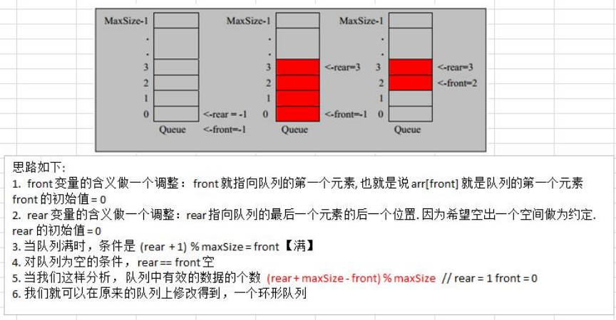

### 环形队列

数组模拟环形队列 

对前面的数组模拟队列的优化，充分利用数组. 因此将数组看做是一个环形的。(通过**取模的方式来实现**即可) 

分析说明：

1. 尾索引的下一个为头索引时表示队列已满，即将队列容量空出一个来作为约定，这个在做判断队列满的时候需要注意(rear + 1) % maxSize == front --> 队列已满
2. rear == front[空]
3. 分析示意图



```java
package com.romanticlei.queue;

import java.util.Scanner;

public class CircleArrayQueueDemo {

    public static void main(String[] args) {
        System.out.println("测试数组模拟环形队列算法~~");
        // 创建一个空间为4的唤醒队列，实际只有3个空间能使用
        CircleArrayQueue queue = new CircleArrayQueue(4);
        char key = ' ';// 获取从控制台输入的字符串
        Scanner scanner = new Scanner(System.in);

        while (true) {
            System.out.println("s(show) 展示队列所有数据");
            System.out.println("e(show) 退出程序");
            System.out.println("a(add) 添加数据到队列");
            System.out.println("p(pop) 从队列中弹出第一个数据");
            System.out.println("H(get) 获取队列中的头数据");


            key = scanner.next().charAt(0);

            switch (key) {
                case 's':
                    queue.showQueue();
                    break;
                case 'a':
                    System.out.println("请输入一个数据：");
                    Scanner tem = new Scanner(System.in);
                    int val = tem.nextInt();
                    queue.addQueue(val);
                    break;
                case 'p':
                    int data = queue.popQueue();
                    System.out.println("弹出的数据为：" + data);
                    break;
                case 'g':
                    int temp = queue.getHeadQueue();
                    System.out.println("队头数据为" + temp);
                    break;
                case 'e':
                    System.exit(-1);
                    break;
                default:
                    System.out.println("输入有误");
                    break;
            }
        }
    }
}

class CircleArrayQueue {
    // 表示数组的最大容量
    private int maxSize;
    // 队列头，初始值0
    private int front;
    // 队列尾，初始值0
    private int rear;
    // 该数组用于存储数据，模拟队列
    private int[] arr;

    public CircleArrayQueue(int maxSize) {
        this.maxSize = maxSize;
        arr = new int[maxSize];
        front = 0;
        rear = 0;
    }

    // 判断队列是否已满
    public boolean isFull() {
        return (rear + 1) % maxSize == front;
    }

    // 判断队列是否为空
    public boolean isEmpty() {
        return rear == front;
    }

    // 数据入队列
    public void addQueue(int n) {
        // 判断队列是否已满
        if (isFull()) {
            System.out.println("队列已满，无法入队");
            return;
        }

        // 直接将数据加入
        arr[rear] = n;
        // 将rear 后移
        rear = (rear + 1) % maxSize;
    }

    // 数据出队列
    public int popQueue() {
        // 判断队列是否为空
        if (isEmpty()) {
            System.out.println("队列为空，无法取数据");
            return -1;
        }

        // 先将 front 对应的值保留到一个临时变量中
        int value = arr[front];
        // 讲 front 后移
        front = (front + 1) % maxSize;
        return value;
    }

    // 显示队列的所有数据
    public void showQueue() {
        if (isEmpty()) {
            System.out.println("队列为空，无任何数据");
            return;
        }

        for (int i = front; i < front + size(); i++) {
            System.out.println("arr[" + i % maxSize + "] = " + arr[i % maxSize]);
        }

    }

    // 求出当前队列有效数据的个数
    public int size(){
        return (rear + maxSize -front) % maxSize;
    }

    // 显示队列的头数据
    public int getHeadQueue() {
        if (isEmpty()) {
            System.out.println("队列为空，无任何数据");
            return -1;
        }

        return arr[front];
    }
}
```


