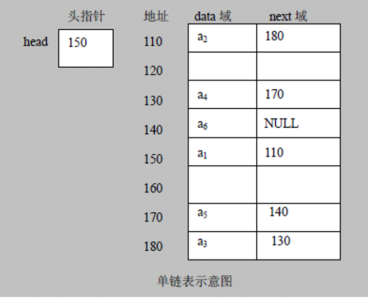
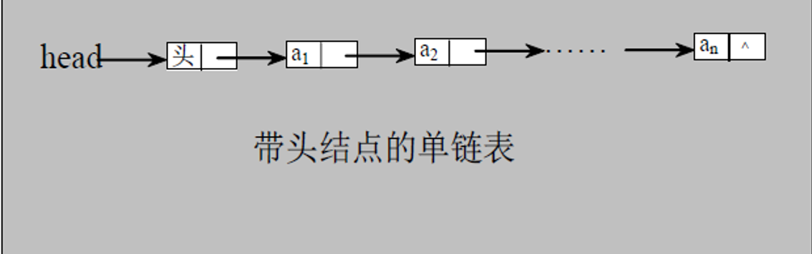
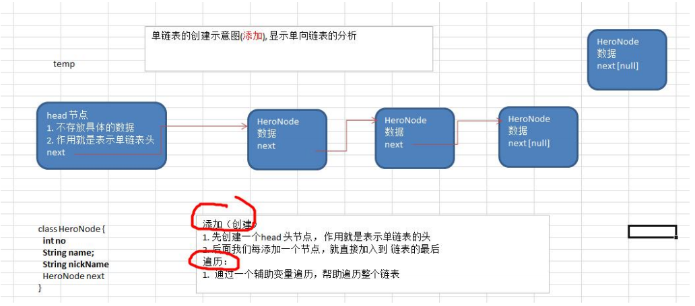
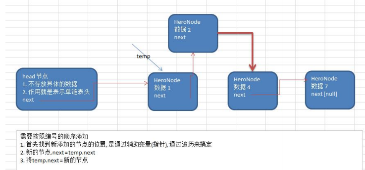
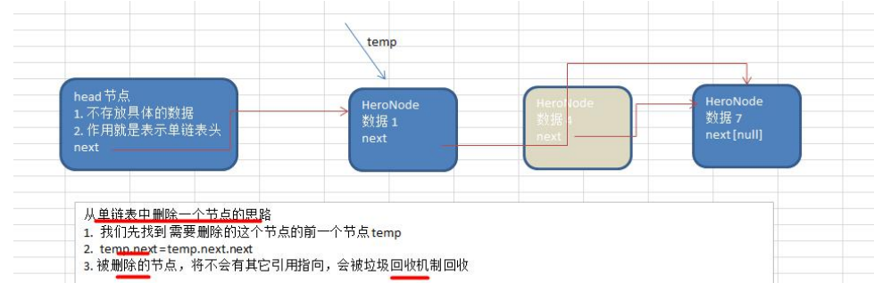

### 单链表

链表是有序的列表，但是它在内存中是存储如下



上图小结：

1. 链表是以节点的方式来存储，是链式存储
2. 每个节点都有一个 data 域，next 域：指向下一个节点
3. 如上图，发现每个链表的各个节点不一定是连续存储的
4. 链表分带头节点的链表和没有头节点的链表，根据实际的情况来确定
5. 单链表（带头节点）逻辑结构示意图如下



#### 单链表的实际应用

使用带头节点数据完成单链表的实现

- 第一种方法，直接添加到链表的尾部



- 第二种方式，根据编号排名将数据插入到指定的位置



- 修改节点功能

  先找到该节点，然后在覆盖原来的数据

- 删除节点



代码

```java
package com.romanticlei.linkedlist;

public class SingleLinkedList {

    public static void main(String[] args) {
        HeroNode hero1 = new HeroNode(1, "宋江", "及时雨");
        HeroNode hero2 = new HeroNode(2, "卢俊义", "玉麒麟");
        HeroNode hero3 = new HeroNode(3, "吴用", "智多星");
        HeroNode hero4 = new HeroNode(4, "林冲", "豹子头");
        SingleLinkedListDemo linkedListDemo = new SingleLinkedListDemo();
        // linkedListDemo.add(hero1);
        // linkedListDemo.add(hero4);
        // linkedListDemo.add(hero3);
        // linkedListDemo.add(hero2);

        HeroNode hero3_1 = new HeroNode(3, "小吴", "智多星");
        linkedListDemo.addByOrder(hero1);
        linkedListDemo.addByOrder(hero4);
        linkedListDemo.addByOrder(hero3);
        linkedListDemo.addByOrder(hero2);
        linkedListDemo.addByOrder(hero3_1);
        linkedListDemo.list();

        linkedListDemo.delete(1);
        linkedListDemo.delete(4);
        linkedListDemo.delete(5);
        linkedListDemo.list();

    }
}

// 定义 SingleLinkedList 管理我们的英雄
class SingleLinkedListDemo {
    // 先初始化一个头节点，头节点不要懂，不存储任何具体的数据
    HeroNode head = new HeroNode(0, "", "");

    // 添加节点到单向链表
    // 思路，当不考虑编号顺序时
    // 1.找到当前链表的最后一个结点
    // 2.将最后这个结点的next 指向新的节点
    public void add(HeroNode heroNode) {
        // 头节点不能动，我们需要一个临时变量来存储头节点
        HeroNode temp = head;
        while (true) {
            if (null == temp.next) {
                break;
            }

            // 存在后一个节点，临时节点后移
            temp = temp.next;
        }

        // 当退出while循环时，temp就指向了链表的最后
        // 并将最后这个节点的 next 指向新的节点
        temp.next = heroNode;
    }

    // 对插入的数据进行排序插入到链表
    public void addByOrder(HeroNode heroNode) {
        HeroNode temp = head;
        boolean flag = false;
        while (true) {
            if (temp.next == null) {
                break;
            }

            if (temp.next.no > heroNode.no) {
                break;
            }

            if (temp.next.no == heroNode.no) {
                flag = true;
                break;
            }

            temp = temp.next;
        }

        // 如果排序编号相同，那么我们就覆盖原来的值
        if (flag) {
            heroNode.next = temp.next.next;
            temp.next.next = null;
        } else {
            // 如果编号不相同，那么我们直接插入到链表
            heroNode.next = temp.next;
        }

        temp.next = heroNode;
    }

    public void delete(int no){
        HeroNode temp = head;
        while (true){
            if (temp.next == null){
                System.out.println("删除数据不存在，删除失败");
                break;
            }
            if (temp.next.no == no){
                temp.next = temp.next.next;
                break;
            }
            temp = temp.next;
        }
    }

    // 显示链表
    public void list() {
        // 判断链表是否为空
        if (head.next == null) {
            System.out.println("链表为空");
            return;
        }

        // 因为头节点不能动，所以仍旧需要一个临时节点
        HeroNode temp = head;
        while (true) {
            if (temp.next == null) {
                System.out.println("遍历完毕");
                break;
            }

            System.out.println(temp.next + "->");
            temp = temp.next;
        }
    }
}

// 定义 HeroNode，每个 HeroNode 对象就是一个节点
class HeroNode {
    public int no;
    public String name;
    public String nickName;
    public HeroNode next;

    public HeroNode(int no, String name, String nickName) {
        this.no = no;
        this.name = name;
        this.nickName = nickName;
    }

    //为了显示方便，重写toString方法
    @Override
    public String toString() {
        return "HeroNode{" +
                "no=" + no +
                ", name='" + name + '\'' +
                ", nickName='" + nickName + '\'' +
                '}';
    }

}
```

```console
HeroNode{no=1, name='宋江', nickName='及时雨'}->
HeroNode{no=2, name='卢俊义', nickName='玉麒麟'}->
HeroNode{no=3, name='小吴', nickName='智多星'}->
HeroNode{no=4, name='林冲', nickName='豹子头'}->
遍历完毕
删除数据不存在，删除失败
HeroNode{no=2, name='卢俊义', nickName='玉麒麟'}->
HeroNode{no=3, name='小吴', nickName='智多星'}->
遍历完毕
```


