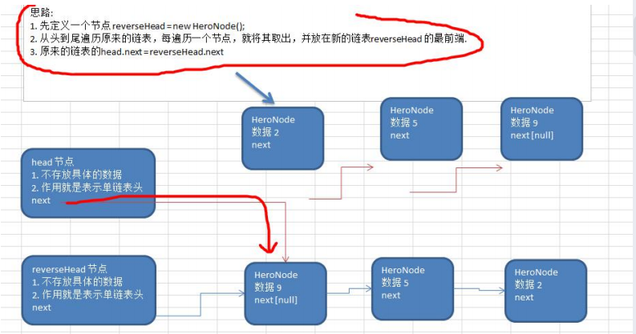
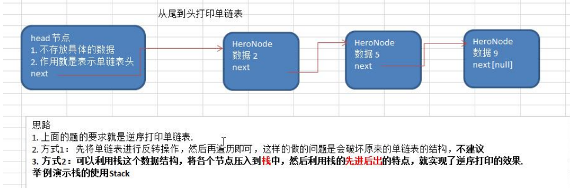

#### 求单链表中有效节点的个数

```java
/**
  * 获取单链表的个数
  *
  * @param head 头节点
  * @return 节点总个数
  */
public static int getLength(HeroNode head) {
    int length = 0;
    HeroNode cur = head;

    while (true) {
        if (cur.next == null) {
            return length;
        }
        length++;
        cur = cur.next;
    }
}
```

#### 查找单链表中的倒数第k个结点 【新浪面试题】

```java
// 查找单链表中的倒数第k个结点
// 编写一个方法，接受head节点，同时接受一个index，index指的是倒数第几个节点
// 先遍历一遍链表，获得到链表总长度
// 得到size 后，我们从链表开始遍历（size - index）个就可以得到
// 如果找到了，就返回，否则返回null
public static HeroNode findLastIndexNode(HeroNode head, int index){
    if (head == null){
        return null; // 没有找到
    }

    // 第一遍遍历得到的链表长度
    int size = getLength(head);
    // 第二遍遍历链表到 size - index位置。就是我们倒数的第k个
    HeroNode cur = head.next;
    if (index < 0 || index > size){
        return null;
    }

    for (int i = 0; i < size - index; i++) {
        cur = cur.next;
    }

    return cur;
}
```

#### 单链表的反转【腾讯面试题，有点难度】




```java
// 单链表的反转【腾讯面试题，有点难度】利用头插法完成链表反转
public static void reversetList(HeroNode head) {
    // 如果当前链表为空或者只有一个结点，那么无需反转直接返回即可
    if (head == null || head.next == null) {
        return ;
    }

    // 创建一个新头节点
    HeroNode newNode = new HeroNode(0, "", "");
    // 定义一个辅助变量，即原结点的第一个值
    HeroNode cur = head.next;

    while (cur != null) {
        // 取出原节点的当前值值,然后将当前值后移
        HeroNode oldCur = cur;
        cur = cur.next;

        oldCur.next = newNode.next;
        newNode.next = oldCur;
    }

    // 将 head.next 指向 newNode.next实现反转
    head.next = newNode.next;
}
```

#### 从尾到头打印单链表 【百度，要求方式 1：反向遍历 。 方式 2：Stack 栈】 



测试state 栈的使用方法

```java
package com.romanticlei.linkedlist;

import java.util.Stack;

public class TestStack {

    public static void main(String[] args) {
        Stack<String> stack = new Stack<>();
        // 入栈
        stack.add("jack");
        stack.add("tom");
        stack.add("smith");

        // 出栈
        while (stack.size() > 0){
            System.out.println(stack.pop());
        }
    }
}
```

单链表的逆序打印代码:

```java
// 可以利用这个数据结构，将各个节点压入到栈中，然后利用栈的先进后出的特点实现逆序打印
public static void reversePrint(HeroNode head){
    if (head.next == null){
        return; // 空链表，不能打印
    }

    // 创建一个栈，将各个节点压入栈中
    Stack<HeroNode> stack = new Stack<>();
    HeroNode cur = head.next;
    while (cur != null){
        stack.push(cur);
        cur = cur.next;
    }

    while (stack.size() > 0){
        System.out.println(stack.pop());
    }
}
```

#### 合并两个有序的单链表，合并之后的链表依然有序

```java
// 合并两个有序单链表
public static HeroNode mergeSingleLinkedList(HeroNode node1, HeroNode node2){
    // 判断有没有链表是空
    if (node1.next == null && node2.next == null){
        return null;
    }

    if (node1.next == null){
        return node2.next;
    }

    if (node2.next == null){
        return node1.next;
    }

    HeroNode newNode = new HeroNode(0, "", "");
    HeroNode cur;

    // 比较第一个有效值的大小
    if (node1.next.no > node2.next.no){
        // 将小值放在新链表后面
        newNode = node2.next;
        // 头结点后移一位，即移到第一个有效值
        node1 = node1.next;
        // 头结点后移两位，即移动到第二个值
        node2 = node2.next.next;

        // 声明一个临时变量
        cur = newNode;
        cur.next = null;

    }else {
        newNode = node1.next;
        node1 = node1.next.next;
        node2 = node2.next;

        cur = newNode;
        cur.next = null;
    }

    // node1 node2 都已指向了实际的数据
    while (node1 != null && node2 != null){
        if (node1.no > node2.no){
            cur.next = node2;
            cur = cur.next;
            node2 = node2.next;

        } else {
            cur.next = node1;
            cur = cur.next;
            node1 = node1.next;
        }
    }

    if (node1 == null){
        cur.next = node2;
    }else {
        cur.next = node1;
    }

    return newNode;
}
```


