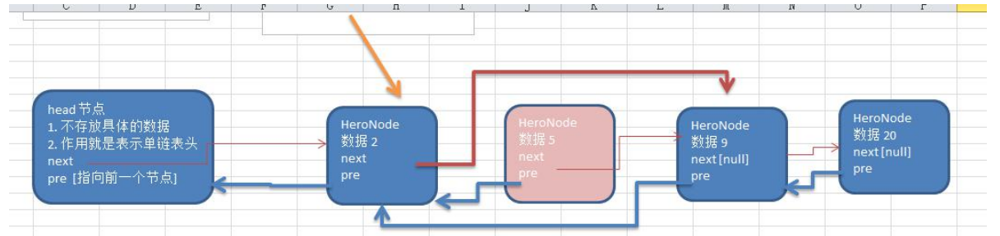

### 双向链表

#### 双向链表的操作分析和实现

使用带 head 头的双向链表实现 

管理单向链表的缺点分析: 

1) 单向链表，查找的方向只能是一个方向，而双向链表可以向前或者向后查找。 （删除单向链表需要找到待删除节点的前一个结点，而双向链表找到当前结点删除即可）。

2) 单向链表不能自我删除，需要靠辅助节点 ，而双向链表，则可以自我删除，所以前面我们单链表删除 时节点，总是找到 temp,temp 是待删除节点的前一个节点。 

3) 分析了双向链表如何完成遍历，添加，修改和删除的思路。



**对上图的说明**: 

分析 双向链表的遍历，添加，修改，删除的操作思路===》代码实现 

1) **遍历** 方法和单链表一样，只是可以向前，也可以向后查找 

2) **添加** (默认添加到双向链表的最后) 

(1) 先找到双向链表的最后这个节点 

(2) temp.next = newHeroNode 

(3) newHeroNode.pre = temp; 

3) **修改** 思路和 原来的单向链表一样. 

4) **删除** 

(1) 因为是双向链表，因此，我们可以实现自我删除某个节点 

(2) 直接找到要删除的这个节点，比如 temp 

(3) temp.pre.next = temp.next 

(4) temp.next.pre = temp.pre; 


```java
package com.romanticlei.linkedlist;

public class DoubleLinkedList {

    public static void main(String[] args) {
        System.out.println("双向链表的测试");
        HeroNode2 hero1 = new HeroNode2(1, "宋江", "及时雨");
        HeroNode2 hero2 = new HeroNode2(2, "卢俊义", "玉麒麟");
        HeroNode2 hero3 = new HeroNode2(5, "吴用", "智多星");
        HeroNode2 hero4 = new HeroNode2(6, "林冲", "豹子头");
        //创建一个双向链表
        DoubleLinkedListDemo doubleLinkedList = new DoubleLinkedListDemo();
        doubleLinkedList.add(hero1);
        doubleLinkedList.add(hero2);
        doubleLinkedList.add(hero3);
        doubleLinkedList.add(hero4);
        doubleLinkedList.list();

        // 修改
        System.out.println("修改后的链表~~~");
        HeroNode2 hero5 = new HeroNode2(3, "公孙胜", "入云龙");
        doubleLinkedList.update(hero5);
        doubleLinkedList.list();

        // 删除
        System.out.println("删除指定编号的链表为~~~");
        doubleLinkedList.delete(3);
        doubleLinkedList.list();

        // 有序加入链表
        System.out.println("按序加入到双向链表");
        HeroNode2 hero6 = new HeroNode2(7, "公孙胜", "入云龙");
        doubleLinkedList.addByOrder(hero6);
        doubleLinkedList.list();
    }
}

class DoubleLinkedListDemo {
    // 先初始化一个头节点，头节点不要懂，不存储任何具体的数据
    HeroNode2 head = new HeroNode2(0, "", "");

    // 获取到头节点
    public HeroNode2 getHead() {
        return head;
    }

    // 遍历显示双向链表
    public void list() {
        // 判断链表是否为空
        if (head.next == null) {
            System.out.println("链表为空");
            return;
        }

        // 因为头节点不能动，所以仍旧需要一个临时节点
        HeroNode2 temp = head;
        while (true) {
            if (temp.next == null) {
                System.out.println("遍历完毕");
                break;
            }

            System.out.println(temp.next + "->");
            temp = temp.next;
        }
    }

    // 添加一个数据到双向链表的尾部
    public void add(HeroNode2 heroNode) {
        // 头节点不能动，我们需要一个临时变量来存储头节点
        HeroNode2 temp = head;
        while (true) {
            if (null == temp.next) {
                break;
            }

            // 存在后一个节点，临时节点后移
            temp = temp.next;
        }

        // 当退出while循环时，temp就指向了链表的最后
        // 并将最后这个节点的 next 指向新的节点
        temp.next = heroNode;
        heroNode.pre = temp;

    }

    // 按序插入到双向唤醒列表
    public void addByOrder(HeroNode2 node) {
        HeroNode2 cur = head;
        boolean flag = false;

        while (true){
            if (cur.next == null){
                flag = true;
                break;
            }

            if (cur.next.no > node.no){
                break;
            }

            if (cur.next.no == node.no){
                update(node);
                return;
            }

            cur = cur.next;
        }

        if (flag){
            node.pre = cur;
            cur.next = node;
        } else {
            node.next = cur.next;
            cur.next.pre = node;
            cur.next = node;
            node.pre = cur;
        }

    }

    public void update(HeroNode2 newHeroNode) {
        if (head == null) {
            System.out.println("链表为空");
            return;
        }

        // 找到需要修改的结点，根据编号no
        HeroNode2 temp = head.next;
        boolean flag = false;
        while (true) {
            if (temp == null) {
                break;
            }

            if (temp.no == newHeroNode.no) {
                flag = true;
                break;
            }
            temp = temp.next;
        }

        if (flag) {
            temp.name = newHeroNode.name;
            temp.nickName = newHeroNode.nickName;
        } else {
            System.out.println("没有找到编号为" + newHeroNode.no + "的节点");
        }
    }

    // 删除节点
    public void delete(int no) {
        if (head.next == null) {
            System.out.println("链表为空，无法删除");
            return;
        }

        HeroNode2 temp = head.next;
        while (true) {
            if (temp == null) {
                System.out.println("删除数据不存在，删除失败");
                break;
            }
            if (temp.no == no) {
                temp.pre.next = temp.next;
                // 如果是最后一个节点，就不需要执行这句话
                if (temp.next != null) {
                    temp.next.pre = temp.pre;
                }
                temp.next = null;
                temp.pre = null;
                break;
            }
            temp = temp.next;
        }
    }
}

// 定义 HeroNode，每个 HeroNode 对象就是一个节点
class HeroNode2 {
    public int no;
    public String name;
    public String nickName;
    public HeroNode2 next; // 指向下一个节点
    public HeroNode2 pre; // 指向前一个节点

    public HeroNode2(int no, String name, String nickName) {
        this.no = no;
        this.name = name;
        this.nickName = nickName;
    }

    //为了显示方便，重写toString方法
    @Override
    public String toString() {
        return "HeroNode{" +
                "no=" + no +
                ", name='" + name + '\'' +
                ", nickName='" + nickName + '\'' +
                '}';
    }

}
```

