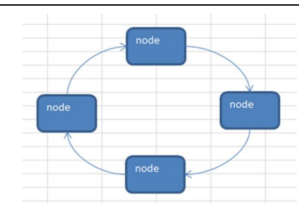
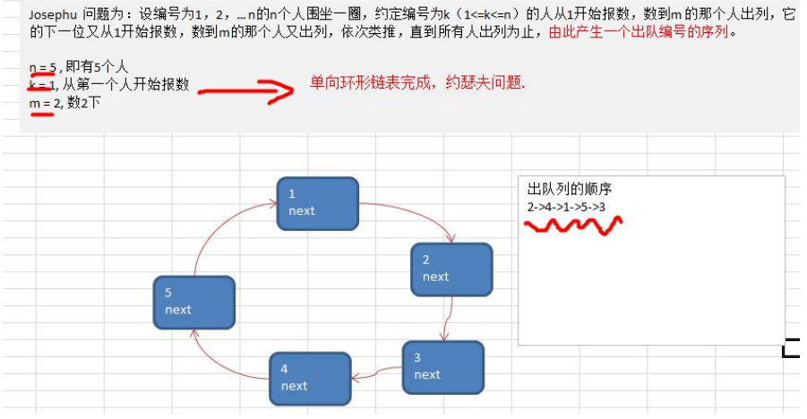
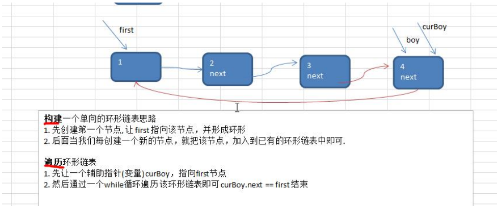
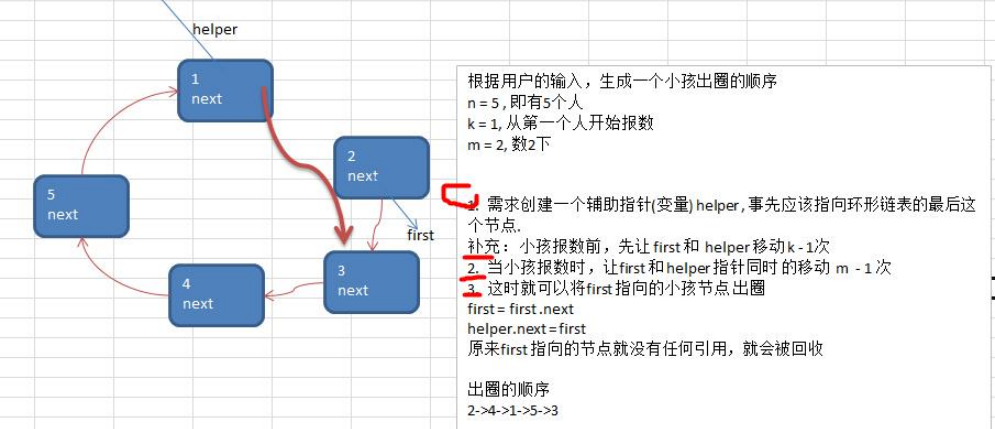

### 单向环形链表

#### Josephu(约瑟夫、约瑟夫环) 问题 

Josephu 问题为：设编号为 1，2，… n 的 n 个人围坐一圈，约定编号为k（1<=k<=n）的人从 1 开始报数，数 到 m 的那个人出列，它的下一位又从 1 开始报数，数到 m 的那个人又出列，依次类推，直到所有人出列为止，由 此产生一个出队编号的序列。 

提示：用一个不带头结点的循环链表来处理 Josephu 问题：先构成一个有 n 个结点的单循环链表，然后由 k 结 点起从 1 开始计数，计到 m 时，对应结点从链表中删除，然后再从被删除结点的下一个结点又从 1 开始计数，直 到最后一个结点从链表中删除算法结束。

#### 单向环形链表介绍



#### Josephu 问题



约瑟夫问题-创建环形链表的思路图解



约瑟夫问题-小孩出圈的思路分析图



```java
package com.romanticlei.linkedlist;

public class Josephu {

    public static void main(String[] args) {

        CircleSingleLinkedList circleSingleLinkedList = new CircleSingleLinkedList();
        circleSingleLinkedList.addBoy(5);
        circleSingleLinkedList.showBoy();

        System.out.println("测试约瑟夫出圈问题");
        circleSingleLinkedList.countBoy(1, 2, 5);
    }
}

// 创建一个环形的单向链表
class CircleSingleLinkedList {
    // 创建一个first 节点，没有编号
    private Boy first = null;

    public void addBoy(int nums) {
        if (nums < 1) {
            System.out.println("nums 的值不正确");
            return;
        }

        // 创建一个辅助指针，帮助构建环形链表
        Boy curBoy = null;
        // 使用for 循环来创建我们的唤醒链表
        for (int i = 1; i <= nums; i++) {
            // 根据编号，创建小孩节点
            Boy boy = new Boy(i);
            if (i == 1) {
                first = boy;
                // 构成环
                first.setNext(first);
                // 让curBoy 指向第一个节点
                curBoy = boy;
            } else {
                curBoy.setNext(boy);
                boy.setNext(first);
                curBoy = boy;
            }
        }
    }

    // 遍历当前环形链表
    public void showBoy() {
        // 判断链表是否为空
        if (first == null) {
            System.out.println("没有任何节点可以遍历");
            return;
        }

        // 因为first 不能动，因此需要一个辅助指针完成遍历
        Boy curBoy = first;
        while (true) {
            System.out.println("当前小孩出队编号为：" + curBoy.getNo());
            if (curBoy.getNext() == first) {
                break;
            }

            curBoy = curBoy.getNext();
        }
    }

    /**
     * 根据用户的输入，计算出小孩出圈的顺序
     *
     * @param startNo  表示从第多少个小孩开始数数
     * @param countNum 表示数几下
     * @param nums     表示最初有多少小孩在圈中
     */
    public void countBoy(int startNo, int countNum, int nums) {
        // 对数据进行校验
        if (first == null || startNo < 1 || startNo > nums) {
            System.out.println("输入参数有误，请重新输入");
            return;
        }

        // 创建一个辅助指针
        Boy helper = first;
        // 创建的这个辅助指针，应该遍历指向环形链表的最后一个节点
        while (true) {
            if (helper.getNext() == first) {
                break;
            }

            helper = helper.getNext();
        }

        // 出圈遍历前，先让first 和 helper 移动 k-1次（因为当前值也算一个数）
        for (int i = 0; i < startNo - 1; i++) {
            first = first.getNext();
            helper = helper.getNext();
        }
        // 找到出圈节点，让 first 和 helper 移动 countNum-1次
        while (true){
            if (first == helper){
                break;
            }
            // 让 first 和 helper 指针同时移动 countNum - 1
            for (int i = 0; i < countNum - 1; i++) {
                first = first.getNext();
                helper = helper.getNext();
            }
            // 这时 first 指向的节点，就是要出圈的节点
            System.out.println("出圈的节点编号为 " + first.getNo());
            first = first.getNext();
            helper.setNext(first);
        }

        System.out.println("最后留在圈中的编号为 " + first.getNo());
    }
}

// 创建一个Boy类，表示一个节点
class Boy {
    private int no;
    private Boy next;

    public Boy(int no) {
        this.no = no;
    }

    public int getNo() {
        return no;
    }

    public void setNo(int no) {
        this.no = no;
    }

    public Boy getNext() {
        return next;
    }

    public void setNext(Boy next) {
        this.next = next;
    }
}
```


