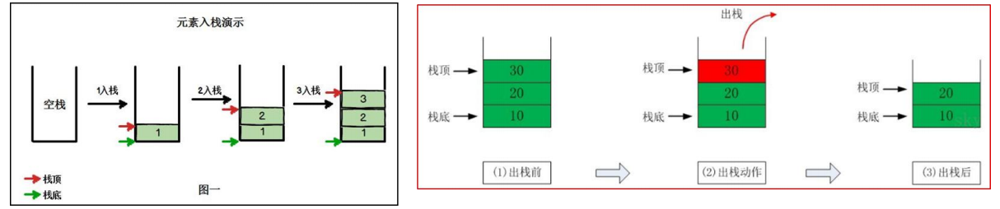
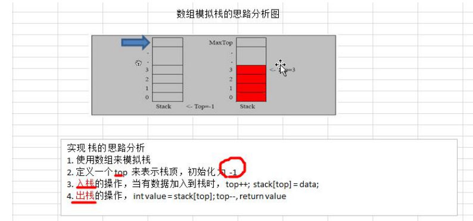

### 栈

#### 栈的介绍

**1)** **栈的英文为**(stack)

**2)** **栈是一个先入后出(FILO-First In Last Out)的有序列表。** 

**3)** **栈**(stack)是 限制线性表中元素的插入和删除只能在线性表的同一端进行的一种特殊线性表。允许插入和删除的 **一端为变化的一端，称为栈顶(Top)**，另一端为固定的一端，称为栈底(Bottom)。

**4)** **根据栈的定义可知，最先放入栈中元素在栈底，最后放入的元素在栈顶，而删除元素刚好相反，最后放入的元素最先删除，最先放入的元素最后删除** 

**5)** **图解方式说明出栈(pop)**和**入栈(push)**的概念



#### 栈的应用场景

1) 子程序的调用：在跳往子程序前，会先将下个指令的地址存到堆栈中，直到子程序执行完后再将地址取出，以 

回到原来的程序中。 

2) 处理递归调用：和子程序的调用类似，只是除了储存下一个指令的地址外，也将参数、区域变量等数据存入堆 

栈中。 

3) 表达式的转换[中缀表达式转后缀表达式]与求值(实际解决)。 

4) 二叉树的遍历。 

5) 图形的深度优先(depth 一 first)搜索法。

#### 栈入门

- 用数组模拟栈的使用，由于栈是一种有序列表，可以使用数组的结构来存储栈的数据内容
- 实现思路，示意图如下：




```java
package com.romanticlei.stack;

import java.util.Scanner;

public class ArrayStackDemo {

    public static void main(String[] args) {
        // 创建一个ArrayStack 对象
        ArrayStack stack = new ArrayStack(4);
        String key = "";
        Scanner scanner = new Scanner(System.in);

        while (true){
            System.out.println("show：表示显示栈");
            System.out.println("exit：表示退出栈");
            System.out.println("push：表示数据入栈");
            System.out.println("pop：表示数据出栈");
            System.out.println("请输入您的选择");
            key = scanner.next();
            switch (key){
                case "show":
                    stack.list();
                    break;
                case "push":
                    System.out.println("请输入一个数：");
                    int val = scanner.nextInt();
                    stack.push(val);
                    break;
                case "pop":
                    int value = stack.pop();
                    System.out.println("出栈的数据为：" + value);
                    break;
                case "exit":
                    System.exit(-1);
                    break;
                default:
                    System.out.println("输入有误！");
                    break;
            }
        }

    }
}

class ArrayStack {
    private int maxSize;    // 栈的大小
    private int[] stack;    // 数组，数组模拟栈，数据就放在该数组中
    private int top = -1;   // top 表示栈顶，初始化为-1

    public ArrayStack(int maxSize) {
        this.maxSize = maxSize;
        this.stack = new int[maxSize];
    }

    // 判断栈空
    public boolean isEmpty() {
        return top == -1;
    }

    // 判断栈满
    public boolean isFull() {
        return top == maxSize - 1;
    }

    // 入栈
    public void push(int value) {
        // 判断是否栈满
        if (isFull()) {
            System.out.println("栈已满！");
            return;
        }

        top++;
        stack[top] = value;
    }

    // 出栈
    public int pop(){
        if (isEmpty()){
            System.out.println("栈已空");
            return -1;
        }

        int value = stack[top];
        top--;
        return value;
    }

    // 遍历栈，遍历时，需要从栈顶开始显示数据
    public void list(){
        if (isEmpty()){
            System.out.println("栈已空");
            return;
        }

        for (int i = top; i >= 0; i--) {
            System.out.println("出栈数据为stack[" + i + "] = " + stack[i]);
        }
    }

}
```


```java
show：表示显示栈
exit：表示退出栈
push：表示数据入栈
pop：表示数据出栈
请输入您的选择
```


