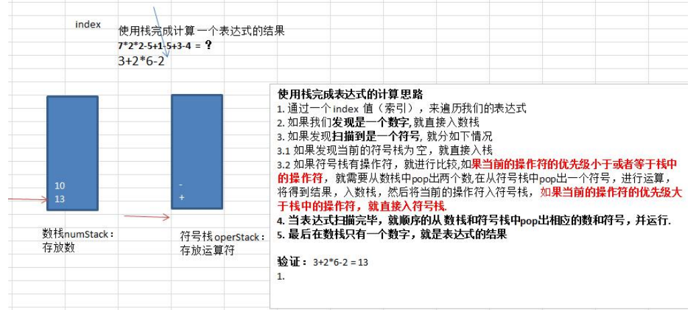

### 栈实现综合计算器(中缀表达式)

使用栈来实现综合计算器

思路分析



代码实现(先实现一位数的运算，在扩展到多位数的运算)

```java
package com.romanticlei.stack;

public class Calculator {

    public static void main(String[] args) {
        String exp = "9+8*2+6";
        ArrayStack2 numStack = new ArrayStack2(10);
        ArrayStack2 operStack = new ArrayStack2(10);
        // 定义需要的相关变量
        int index = 0; // 用于扫描
        int num1 = 0;
        int num2 = 0;
        int oper = 0;
        int res = 0;
        char ch = ' '; // 将每次扫描得到的char 保存到ch
        while (true) {
            ch = exp.substring(index, index + 1).charAt(0);
            // 判断ch是什么，需要做相应的处理
            if (operStack.isOper(ch)) {
                // 判断当前的符号栈是否为空
                if (!operStack.isEmpty()) {
                    // 如果符号栈有操作符，就进行比较，看当前的操作符优先级小于或者等于栈中的操作符，就需要从数栈中pop出两个数
                    // 在从符号栈中pop出一个符号栈，进行运算，将得到的结果入数栈，然后将当前的操作符入符号栈
                    if (operStack.priority(ch) <= operStack.priority(operStack.peek())) {
                        num1 = numStack.pop();
                        num2 = numStack.pop();
                        oper = operStack.pop();
                        res = numStack.cal(num1, num2, oper);
                        // 将运算的结果入数栈
                        numStack.push(res);
                        // 将当前的操作符入符号栈
                        operStack.push(ch);
                    } else {
                        // 否则直接将操作符入栈
                        operStack.push(ch);
                    }
                } else {
                    // 如果为空直接入栈,但是需要进行转换
                    operStack.push(ch);
                }
            } else {
                // 如果是数，则直接入数栈
                numStack.push(ch - 48);
            }

            // 将index 后移，并判断是否扫描到了exp最后
            index++;
            if (index >= exp.length()){
                break;
            }
        }

        // 当计算完毕，就顺序的从数栈和符号栈中pop出相应的数和符号，并运行
        while (true){
            if (operStack.isEmpty()){
                break;
            }
            num1 = numStack.pop();
            num2 = numStack.pop();
            oper = operStack.pop();
            res = numStack.cal(num1, num2, oper);
            numStack.push(res);
        }

        System.out.println("表达式 " + exp + "的值为 = " + numStack.pop());
    }
}

class ArrayStack2 {
    private int maxSize;    // 栈的大小
    private int[] stack;    // 数组，数组模拟栈，数据就放在该数组中
    private int top = -1;   // top 表示栈顶，初始化为-1

    public ArrayStack2(int maxSize) {
        this.maxSize = maxSize;
        this.stack = new int[maxSize];
    }

    // 判断栈空
    public boolean isEmpty() {
        return top == -1;
    }

    // 判断栈满
    public boolean isFull() {
        return top == maxSize - 1;
    }

    // 获取栈顶的值，不弹出栈
    public int peek() {
        return stack[top];
    }

    // 入栈
    public void push(int value) {
        // 判断是否栈满
        if (isFull()) {
            System.out.println("栈已满！");
            return;
        }

        top++;
        stack[top] = value;
    }

    // 出栈
    public int pop() {
        if (isEmpty()) {
            System.out.println("栈已空");
            return -1;
        }

        int value = stack[top];
        top--;
        return value;
    }

    // 遍历栈，遍历时，需要从栈顶开始显示数据
    public void list() {
        if (isEmpty()) {
            System.out.println("栈已空");
            return;
        }

        for (int i = top; i >= 0; i--) {
            System.out.println("出栈数据为stack[" + i + "] = " + stack[i]);
        }
    }

    // 返回运算符的优先级，优先级是开发来确定，优先级使用数组表示，数字越大优先级越高
    public int priority(int oper) {
        if (oper == '*' || oper == '/') {
            return 1;
        } else if (oper == '+' || oper == '-') {
            return 0;
        } else {
            return -1; //假定只能有+ — * /
        }
    }

    // 判断是否是一个运算符
    public boolean isOper(char val) {
        return val == '+' || val == '-' || val == '*' || val == '/';
    }

    public int cal(int num1, int num2, int oper) {
        int res = 0; // res 用于存放计算的结果
        switch (oper) {
            case '+':
                res = num1 + num2;
                break;
            case '-':
                res = num2 - num1;
                break;
            case '*':
                res = num1 * num2;
                break;
            case '/':
                res = num2 / num1;
                break;
            default:
                break;
        }
        return res;
    }
}
```


