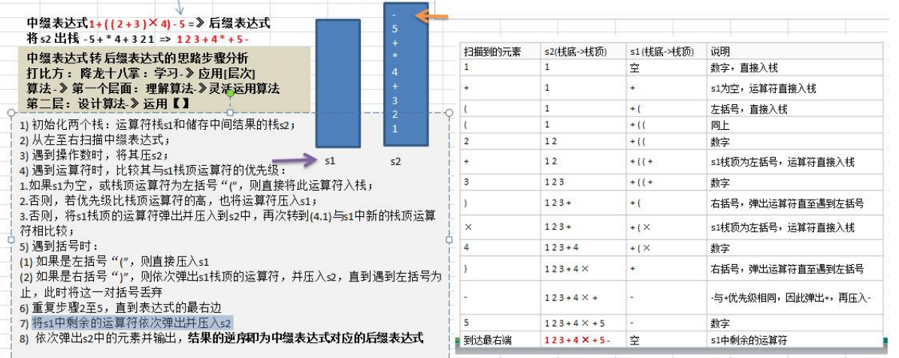

### 中缀表达式转后缀表达式

后缀表达式适合计算式进行运算，但是人却不太容易写出来，尤其是表达式很长的情况下，因此在开发中，我们需要将中缀表达式转成后缀表达式。 

#### 具体步骤如下: 

1) 初始化两个栈：运算符栈 s1 和储存中间结果的栈 s2； 

2) 从左至右扫描中缀表达式； 

3) 遇到操作数时，将其压 s2； 

4) 遇到运算符时，比较其与 s1 栈顶运算符的优先级： 

1.如果 s1 为空，或栈顶运算符为左括号“(”，则直接将此运算符入栈； 

2.否则，若优先级比栈顶运算符的高，也将运算符压入 s1； 

3.否则，将 s1 栈顶的运算符弹出并压入到 s2 中，再次转到(4.1)与 s1 中新的栈顶运算符相比较； 

5) 遇到括号时： 

(1) 如果是左括号“(”，则直接压入 s1 

(2) 如果是右括号“)”，则依次弹出 s1 栈顶的运算符，并压入 s2，直到遇到左括号为止，此时将这一对括号丢弃 

6) 重复步骤 2 至 5，直到表达式的最右边 

7) 将 s1 中剩余的运算符依次弹出并压入 s2 

8) 依次弹出 s2 中的元素并输出，结果的逆序即为中缀表达式对应的后缀表达式 

#### 举例说明

将中缀表达式“1+((2+3)×4)-5”转换为后缀表达式的过程如下 

因此结果为 :"1 2 3 + 4 × + 5 –"


#### 思路分析




```java
package com.romanticlei.stack;

import java.util.ArrayList;
import java.util.Arrays;
import java.util.List;
import java.util.Stack;

public class PolandNotation {

    public static void main(String[] args) {

        // 完成一个中缀表达式转集合
        /**
         * 直接将字符串转成后缀表达式不方便，素偶一我们需要将字符串先转成list
         * 例如：1+((2+3)x4)-5 => 转成 [1, +, (, (, 2, +, 3, ), x, 4, ), -, 5]
         */
        List<String> infixExpressionList = toInfixExpressionList("1+((2+3)*4)-5");
        System.out.println("中缀表达式转集合之后：" + infixExpressionList);

        /**
         * 将得到的中缀表达式list => 转成后缀表达式的list
         */
        List<String> parseSuffixExpreesionList = parseSuffixExpreesionList(infixExpressionList);
        System.out.println("后缀表达式对应的集合：" + parseSuffixExpreesionList);

        // 先定义一个逆波兰表达式
        // (3+4)x5-6 => 3 4 + 5 x 6 -
        // 说明：为了方便，逆波兰表达式和符号使用空格隔开
        String suffixExpression = "3 4 + 5 * 6 -";
        // 思路
        // 先将 "3 4 + 5 x 6 -" => 放到 ArrayList中
        // 将 ArrayList 传递给一个方法，然后遍历 ArrayList 配合栈完成计算

        System.out.println(getListString(suffixExpression));
        int res = calculate(getListString(suffixExpression));

        System.out.println("计算结果为： " + res);
    }

    // 将中缀表达式转成后缀表达式
    public static List<String> toInfixExpressionList(String expression) {
        int i = 0;  // 定义索引
        String str;
        char ch = ' ';
        List<String> list = new ArrayList<>();
        do {
            if ((ch = expression.charAt(i)) < 48 || (ch = expression.charAt(i)) > 57) {
                list.add(String.valueOf(ch));
                i++;
            } else {
                str = "";
                while (i < expression.length() && (ch = expression.charAt(i)) >= 48 && (ch = expression.charAt(i)) <= 57){
                    str += ch;
                    i++;
                }
                list.add(str);
            }
        } while (i < expression.length());

        return list;
    }

    public static List<String> parseSuffixExpreesionList(List<String> list) {
        Stack<String> s1 = new Stack<>();
        List<String> s2 = new ArrayList<>();
        for (String item : list) {
            if (item.matches("\\d+")){
                s2.add(item);
            } else if ("(".equals(item)){
                s1.push(item);
            } else if (")".equals(item)){
                while (!"(".equals(s1.peek())){
                    s2.add(s1.pop());
                }
                // 如果弹出的是 "(" 那就直接清除 "("
                s1.pop();
            } else {
                // 当 item 的优先级小于等于s1 栈顶运算符，那么就需要将s1栈顶的数据弹出，直到item 运算符优先级高或者s1栈顶为空，item 入栈
                while (s1.size() > 0 && Operation.getValue(s1.peek()) >= Operation.getValue(item)){
                    s2.add(s1.pop());
                }

                // 将 item 放入大栈顶
                s1.push(item);
            }
        }

        // 将s1 中剩余的运算符一次弹出并加入到 s2
        while (s1.size() != 0){
            s2.add(s1.pop());
        }

        return s2;
    }

    // 将一个逆波兰表达式，依次将数据和运算符 放入到 ArrayList中
    public static List<String> getListString(String suffixExpression) {
        String[] split = suffixExpression.split(" ");
        List<String> list = Arrays.asList(split);

        return list;
    }

    // 完成对逆波兰表达式的运算
    public static int calculate(List<String> list) {
        Stack<String> stack = new Stack<>();
        // 遍历集合 list
        for (String item : list) {
            // 判断是否是数字
            if (item.matches("\\d+")) {
                stack.push(item);
            } else {
                int num2 = Integer.parseInt(stack.pop());
                int num1 = Integer.parseInt(stack.pop());
                int res = 0;
                if ("+".equals(item)) {
                    res = num1 + num2;
                } else if ("-".equals(item)) {
                    res = num1 - num2;
                } else if ("*".equals(item)) {
                    res = num1 * num2;
                } else if ("/".equals(item)) {
                    res = num1 / num2;
                } else {
                    throw new RuntimeException("无法识别的运算符");
                }
                stack.push(String.valueOf(res));
            }
        }
        return Integer.parseInt(stack.pop());
    }
}

// 编写一个类 Operation，可以返回一个运算符对应的优先级
class Operation{
    private static int ADD = 1;
    private static int SUB = 1;
    private static int MUL = 2;
    private static int DIV = 2;

    // 判断对应运算符的优先级
    public static int getValue(String operation) {
        switch (operation){
            case "+":
                return ADD;
            case "-":
                return SUB;
            case "*":
                return MUL;
            case "/":
                return DIV;
            default:
                System.out.println("运算符不存在");
                return 0;
        }
    }
}
```


```console
中缀表达式转集合之后：[1, +, (, (, 2, +, 3, ), *, 4, ), -, 5]
运算符不存在  --> 这句话是因为我们程序在比较运算符与（大小时打印的
运算符不存在
后缀表达式对应的集合：[1, 2, 3, +, 4, *, +, 5, -]
[3, 4, +, 5, *, 6, -]
计算结果为： 29
```


