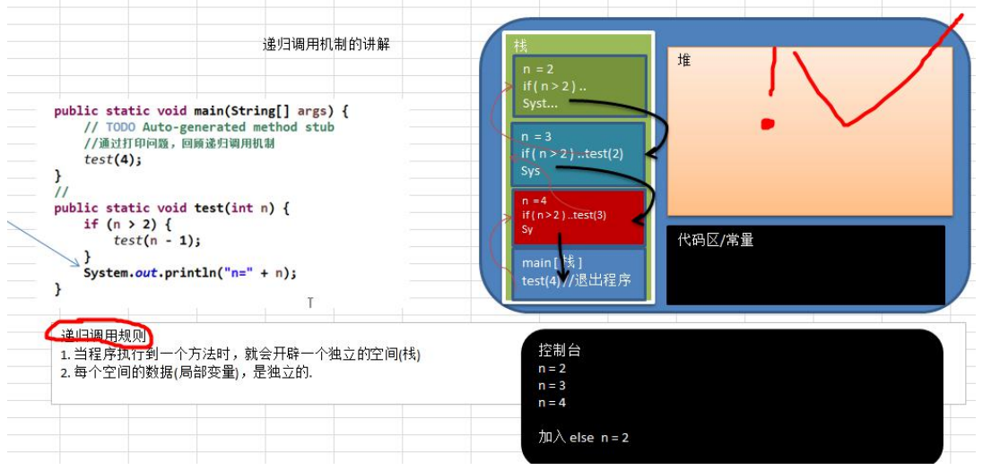

### 递归

#### 递归运行场景

迷宫问题(回溯)， 递归(Recursion)


#### 递归的概念

简单的说：递归就是方法自己调用自己，每次调用时传入不同的变量，递归有助于编程中解决复杂的问题，同时可以让代码变得简洁。


#### 递归调用机制



代码演示

```java
package com.romanticlei.recursion;

public class recursionTest {

    public static void main(String[] args) {
        test(4);

        int x = 5;
        int value = factorial(x);
        System.out.println("递归求阶乘-> " + x +"! = " + value);
    }

    public static void test(int n) {
        if (n > 2){
            test(n - 1);
        }
        System.out.println("n = " + n);
    }

    public static int factorial(int n){
        if (n > 1){
            return factorial(n - 1) * n;
        } else {
            return 1;
        }
    }

}
```


```console
n = 2
n = 3
n = 4
递归求阶乘-> 5! = 120
```


#### 递归能解决什么样的问题 

递归能解决什么样的问题

1. 各种数学问题如: 8 皇后问题 , 汉诺塔, 阶乘问题, 迷宫问题, 球和篮子的问题(google 编程大赛) 
2. 各种算法中也会使用到递归，比如快排，归并排序，二分查找，分治算法等. 
3. 将用栈解决的问题-->第归代码比较简洁


#### 递归需要遵守的重要规则 

1) 执行一个方法时，就创建一个新的受保护的独立空间(栈空间) 

2) 方法的局部变量是独立的，不会相互影响, 比如 n 变量 

3) 如果方法中使用的是引用类型变量(比如数组)，就会共享该引用类型的数据. 

4) 递归**必须向退出递归的条件逼近**，否则就是无限递归,出现 StackOverflowError

5) 当一个方法执行完毕，或者遇到 return，就会返回，**遵守谁调用，就将结果返回给谁**，同时当方法执行完毕或者返回时，该方法也就执行完毕


