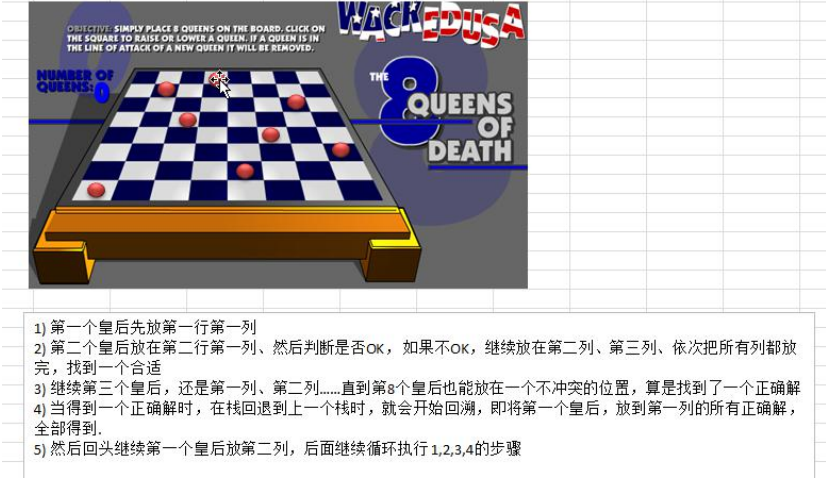

### 八皇后问题（回溯算法）

#### 八皇后问题介绍

八皇后问题，是一个古老而著名的问题，是回溯算法的典型案例。该问题是国际西洋棋棋手马克斯·贝瑟尔于 1848 年提出：在 8×8 格的国际象棋上摆放八个皇后，使其不能互相攻击，即：**任意两个皇后都不能处于同一行、同一列或同一斜线上，问有多少种摆法**(92)。

#### 八皇后问题算法思路分析

1. 第一个皇后先放到第一行第一列
2. 第二个皇后放在第二行第一列，然后判断是否OK，如果不OK，继续放到第二列。。。依次把所有的列都放完，找到一个合适的位置
3. 继续第三个皇后，还是第一列开始、第二列。。。直到第8个皇后也能放到一个不产生冲突的位置，就算找到了一个正确解
4. 当得到一个正确解时，然后栈回退到上一个栈的位置，就会开始回溯，即  将第一个皇后放到第一个位置的全部解都得到
5. 然后回头继续第一个皇后放第二列，后面继续循环执行  1,2,3,4的步骤

理论上应该创建一个二维数组来表示棋盘，但是实际上可以通过算法，用一个一维数组即可解决问题. arr[8] = {0 , 4, 7, 5, 2, 6, 1, 3} //对应 arr 下标 表示第几行，即第几个皇后，arr[i] = val , val 表示第 i+1 个皇后，放在第 i+1 行的第 val+1 列

