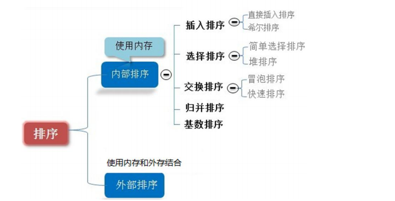
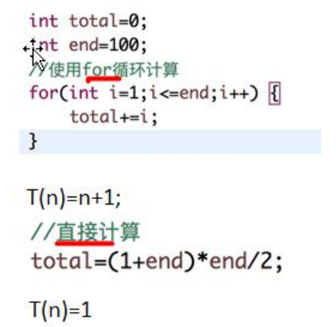
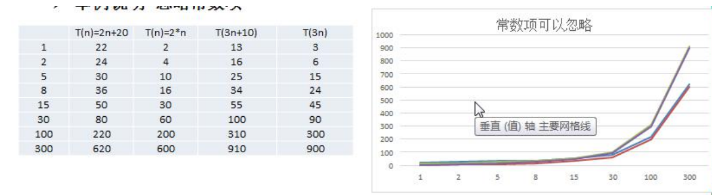
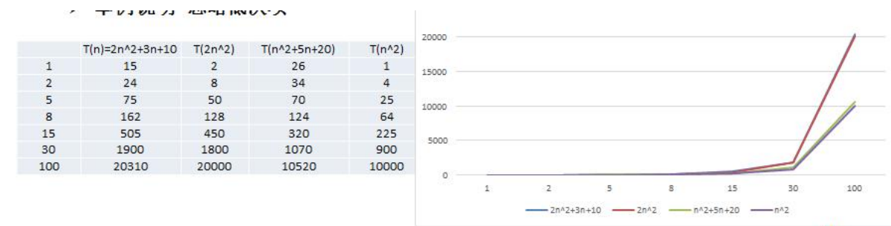
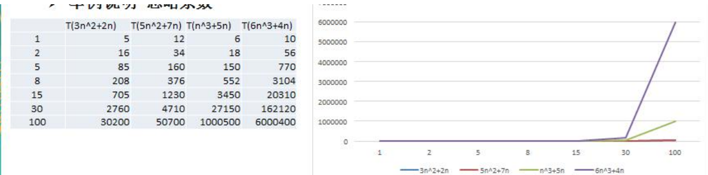

### 排序算法的介绍

排序也称排序算法(Sort Algorithm)，排序是将一组数据，依指定的顺序进行排序的过程。

### 排序的分类

1. 内部排序：

   指将需要处理的所有数据都加载到**内部存储器（内存）**中进行排序

2. 外部排序：

   数据量过大，无法全部加载到内存中，需要借助**外部存储（文件等）**进行排序

常见的排序算法分类（见右图）

### 算法的时间复杂度

度量一个程序(算法)执行时间的两种方法：

1) 事后统计的方法 

这种方法可行, 但是有两个问题：一是要想对设计的算法的运行性能进行评测，需要实际运行该程序；二是所得时间的统计量依赖于计算机的硬件、软件等环境因素, 这种方式，要在同一台计算机的相同状态下运行，才能比较那个算法速度更快。 

2) 事前估算的方法 

通过分析某个算法的**时间复杂度**来判断哪个算法更优.

### 时间频度

时间频度：一个算法花费的时间与算法中语句的执行次数成正比例，哪个算法中语句执行次数多，它花费时间就多。**一个算法中的语句执行次数称为语句频度或时间频度**。记为 T(n)。[举例说明]  

#### 举例说明-基本案例 

比如计算 1-100 所有数字之和, 我们设计两种算法

#### 举例说明-忽略常数项

结论: 

1) 2n+20 和 2n 随着 n 变大，执行曲线无限接近, 20 可以忽略 

2) 3n+10 和 3n 随着 n 变大，执行曲线无限接近, 10 可以忽略 

#### 举例说明-忽略低次项

结论: 

1) 2n^2+3n+10 和 2n^2 随着 n 变大, 执行曲线无限接近, 可以忽略 3n+10 

2) n^2+5n+20 和 n^2 随着 n 变大,执行曲线无限接近, 可以忽略 5n+20 

#### 举例说明-忽略系数

结论: 

1) 随着 n 值变大，5n^2+7n 和 3n^2 + 2n ，执行曲线重合, 说明 这种情况下, 5 和 3 可以忽略。 

2) 而 n^3+5n 和 6n^3+4n ，执行曲线分离，说明多少次方式关键

