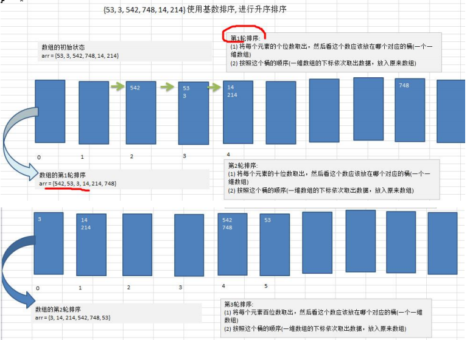
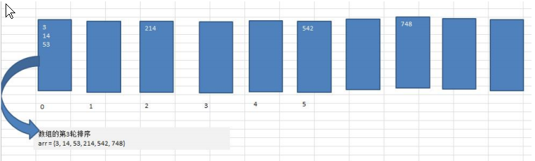

### 基数排序

#### 基数排序(桶排序)介绍:

1) 基数排序（radix sort）属于“分配式排序”（distribution sort），又称“桶子法”（bucket sort）或 bin sort，顾名思义，它是通过键值的各个位的值，将要排序的元素分配至某些“桶”中，达到排序的作用 

2) 基数排序法是属于稳定性的排序，基数排序法的是效率高的**稳定性**排序法 

3) 基数排序(Radix Sort)是桶排序的扩展 

4) 基数排序是 1887 年赫尔曼·何乐礼发明的。它是这样实现的：将整数按位数切割成不同的数字，然后按每个位数分别比较。

#### 基数排序基本思想

将所有待比较数值统一为同样的数位长度，数位较短的数前面补零。然后，从最低位开始，依次进行一次排序。这样从最低位排序一直到最高位排序完成以后, 数列就变成一个有序序列。

#### 基数排序图文说明





基数排序代码

```java
package com.romanticlei.sort;

import java.util.Arrays;

public class RadixSort {

    public static void main(String[] args) {
        int[] arr = {53, 3, 542, 748, 14, 214};
        radixSort(arr);
        System.out.println("排序后的数组为" + Arrays.toString(arr));

        // 测试基数排序效率
        int[] array = new int[8000000];
        for (int i = 0; i < 8000000; i++) {
            array[i] = (int) (Math.random() * 8000000);
        }

        long currentTimeMillis_start = System.currentTimeMillis();
        radixSort(array);
        long currentTimeMillis_end = System.currentTimeMillis();
        // 基数排序数据比较耗时 2161(时间与机器性能有关)
        System.out.println("一共耗时：" + (currentTimeMillis_end - currentTimeMillis_start));

    }

    // 基数排序方法
    public static void radixSort(int[] arr) {

        // 找到数组中最大数的位数
        int max = arr[0];
        for (int i = 1; i < arr.length; i++) {
            if (max < arr[i]) {
                max = arr[i];
            }
        }

        // 定义一个变量获取最大值的长度
        int maxLength = (max + "").length();

        // 定义一个二维数组，表示十个桶，每个桶就是一个一维数组
        // 说明：二维数组包含十个桶
        // 为了防止放入数据时，数据溢出，则每个一维数组（桶）的大小定位arr.length
        // 所以很明确，基数排序就是使用的空间换时间的算法
        int[][] bucket = new int[10][arr.length];

        // 为了记录每个桶中，实际有多少数据，我们定义一个一维数组来记录各个桶的每次放入的数据个数
        // 比如 bucketElementCounts[0] 记录的就是 bucket[0] 桶的放入数据个数
        int[] bucketElementCounts = new int[10];

        for (int i = 0; i < maxLength; i++) {
            // 将每个元素进行排序处理
            for (int j = 0; j < arr.length; j++) {
                // 获取每个元素的某位的值进行排序处理
                double tmp = Math.pow(10, i);
                int digitOfElement = (int) (arr[j] / (Math.pow(10, i)) % 10);
                // 放入到对应的桶中(将当前值放入到对应桶中的对应位置,从对应桶中第一个位置开始放)
                bucket[digitOfElement][bucketElementCounts[digitOfElement]] = arr[j];
                // 将bucketElementCounts 加1，获取到当前位置数据的个数
                bucketElementCounts[digitOfElement]++;
            }
            // 按照这个桶的顺序（从一维数组的下标依次取出数据，放入到原来的数组）
            int index = 0;
            // 遍历每一个桶，并将桶中的数据，放入到原数组
            for (int k = 0; k < bucketElementCounts.length; k++) {
                // 如果桶中有数据，我们才放入到原数组
                if (bucketElementCounts[k] != 0) {
                    // 循环该桶
                    for (int l = 0; l < bucketElementCounts[k]; l++) {
                        arr[index++] = bucket[k][l];
                    }
                }
                // 清空当前桶的个数
                bucketElementCounts[k] = 0;
            }

            // System.out.println("第" + (i + 1) + "轮排序后的结果为：" + Arrays.toString(arr));
        }
    }
}
```

#### 基数排序的说明: 

1) 基数排序是对传统桶排序的扩展，速度很快. 

2) 基数排序是经典的空间换时间的方式，占用内存很大, 当对海量数据排序时，容易造成 OutOfMemoryError 。 

3) 基数排序时稳定的。[注:假定在待排序的记录序列中，存在多个具有相同的关键字的记录，若经过排序，这些记录的相对次序保持不变，即在原序列中，r[i]=r[j]，且 r[i]在 r[j]之前，而在排序后的序列中，r[i]仍在 r[j]之前，则称这种排序算法是稳定的；否则称为不稳定的] 

4) 有负数的数组，我们不用基数排序来进行排序, 如果要支持负数，参考: https://code.i-harness.com/zh-CN/q/e98fa9 


