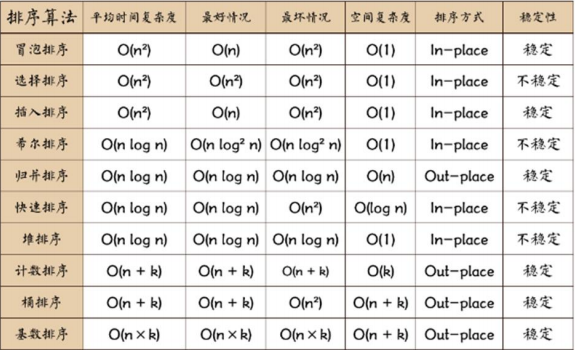

### 常用的排序算法总结和对比

#### 一张排序算法的比较图

#### 相关术语解释

1) 稳定：如果 a 原本在 b 前面，而 a=b，排序之后 a 仍然在 b 的前面； 

2) 不稳定：如果 a 原本在 b 的前面，而 a=b，排序之后 a 可能会出现在 b 的后面； 

3) 内排序：所有排序操作都在内存中完成； 

4) 外排序：由于数据太大，因此把数据放在磁盘中，而排序通过磁盘和内存的数据传输才能进行； 

5) 时间复杂度： 一个算法执行所耗费的时间。 

6) 空间复杂度：运行完一个程序所需内存的大小。 

7) n: 数据规模 

8) k: “桶”的个数 

9) In-place: 不占用额外内存 

10) Out-place: 占用额外内存

