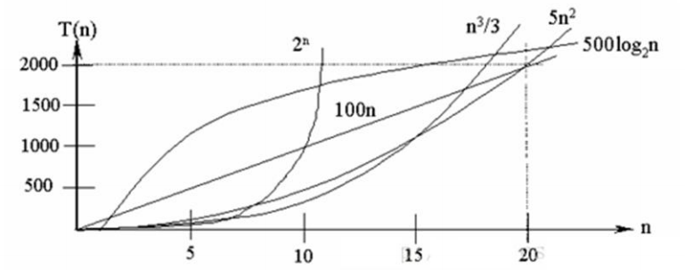
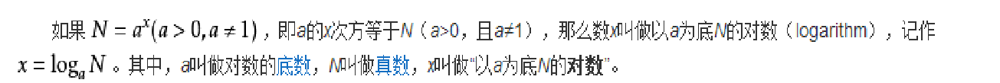
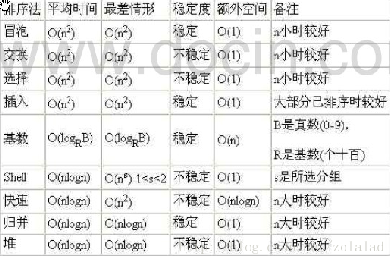

### 时间复杂度

1) 一般情况下，**算法中的基本操作语句的重复执行次数是问题规模** **n** **的某个函数**，用 T(n)表示，若有某个辅助函数 f(n)，使得当 n 趋近于无穷大时，T(n) / f(n) 的极限值为不等于零的常数，则称 f(n)是 T(n)的同数量级函数。 记作 **T(n)=Ｏ( f(n) )**，称Ｏ( f(n) ) 为算法的渐进时间复杂度，简称时间复杂度。 

2) T(n) 不同，但时间复杂度可能相同。 如：T(n)=n²+7n+6 与 T(n)=3n²+2n+2 

它们的 T(n) 不同，但时间复杂 度相同，都为 **O(n²)**。 

3) 计算时间复杂度的方法： 

- 用常数 1 代替运行时间中的所有加法常数 T(n)=n²+7n+6 => T(n)=n²+7n+1 

- 修改后的运行次数函数中，只保留最高阶项 T(n)=n²+7n+1 => T(n) = n² 

- 去除最高阶项的系数 T(n) = n² => T(n) = n² => O(n²) 

### 常见的时间复杂度 

1) 常数阶 O(1) 

2) 对数阶 O(log2n) 

3) 线性阶 O(n) 

4) 线性对数阶 O(nlog2n)

5) 平方阶 O(n^2) 

6) 立方阶 O(n^3) 

7) k 次方阶 O(n^k) 

8) 指数阶 O(2^n) 

#### **常见的时间复杂度对应的图**:

说明：

1) 常见的算法时间复杂度由小到大依次为：Ο(1)＜Ο(log2n)＜Ο(n)＜Ο(nlog2n)＜Ο(n2)＜Ο(n3)＜ Ο(nk) ＜Ο(2n)  ，随着问题规模 n 的不断增大，上述时间复杂度不断增大，算法的执行效率越低 

2) 从图中可见，我们应该尽可能避免使用指数阶的算法 

### 常数阶 O(1)

无论代码执行了多少行，只要是没有循环等复杂结构，那这个代码的时间复杂度就都是O(1)

.jpg)

上述代码在执行的时候，它消耗的时候并不随着某个变量的增长而增长，那么无论这类代码有多长，即使有几万几十万行，都可以用O(1)来表示它的时间复杂度。

### 对数阶O(log2n)

.jpg)

说明：在while循环里面，每次都将 i 乘以 2，乘完之后，i 距离 n 就越来越近了。假设循环x次之后，i 就大于 2 了，此时这个循环就退出了，也就是说 2 的 x 次方等于 n，那么 x = log2n也就是说当循环 log2n 次以后，这个代码就结束了。因此这个代码的时间复杂度为：O(log2n)  。 O(log2n) 的这个2 时间上是根据代码变化的，i = i * 3 ，则是 O(log3n) .

### 线性阶O(n)

.jpg)

说明：这段代码，for循环里面的代码会执行n遍，因此它消耗的时间是随着n的变化而变化的，因此这类代码都可以用O(n)来表示它的时间复杂度

### 线性对数阶O(nlogN)

.jpg)

说明：线性对数阶O(nlogN) 其实非常容易理解，将时间复杂度为O(logn)的代码循环N遍的话，那么它的时间复杂度就是 n * O(logN)，也就是了O(nlogN)

### 平方阶O(n²)

.jpg)

说明：平方阶O(n²) 就更容易理解了，如果把 O(n) 的代码再嵌套循环一遍，它的时间复杂度就是 O(n²)，这段代码其实就是嵌套了2层n循环，它的时间复杂度就是 O(n*n)，即  O(n²) 如果将其中一层循环的n改成m，那它的时间复杂度就变成了 O(m*n)

### 立方阶O(n³)、K次方阶O(n^k)

说明：参考上面的O(n²) 去理解就好了，O(n³)相当于三层n循环，其它的类似

### 平均时间复杂度和最坏时间复杂度
平均时间复杂度是指所有可能的输入实例均以等概率出现的情况下，该算法的运行时间。
最坏情况下的时间复杂度称最坏时间复杂度。一般讨论的时间复杂度均是最坏情况下的时间复杂度。 这样做的原因是：最坏情况下的时间复杂度是算法在任何输入实例上运行时间的界限，这就保证了算法的运行时间不会比最坏情况更长。
平均时间复杂度和最坏时间复杂度是否一致，和算法有关(如图:)。

