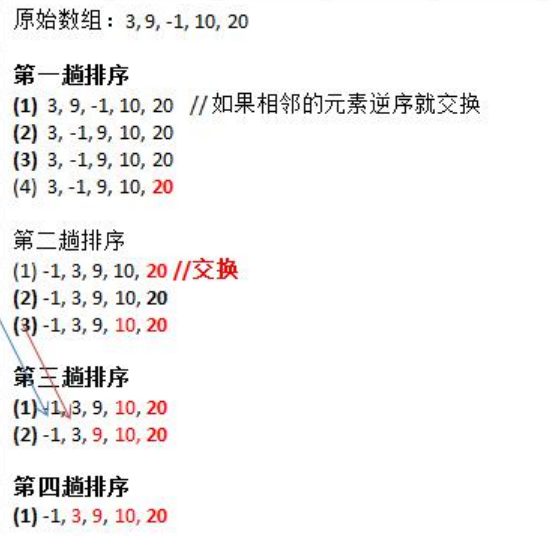

### 冒泡排序

冒泡排序(Bubble Sorting)的基本思想是：通过对待排序序列从前向后（从下标较小的元素开始），依次比较相邻元素的值，若发现逆序则交换，使较大的元素逐渐从前移向后部，就像水底的起泡一样逐渐向上冒。

优化：

因为排序的过程中，各元素不断接近自己的位置，**如果一趟比较下来没有进行过交换，就说明序列有序**，因此要在排序过程中设置一个标志 flag 判断元素是否进行过交换。从而减少不必要的比较。(这里说的优化，可以在冒泡排 序写好后，在进行)



小结冒泡排序规则：

1. 一共进行了数组大小-1次大的循环
2. 每一趟排序的次数都在逐渐的减少
3. 如果我们发现在某趟排序中，没有发生一次交换，可以提前结束冒泡排序

冒泡排序实例：

```java
package com.romanticlei.sort;

import java.util.Arrays;

public class BubbleSort {

    public static void main(String[] args) {
        int arr[] = {3, 9, -1, 10, -2};
        int temp;

        for (int i = 0; i < arr.length - 1; i++) {
            for (int j = 0; j < arr.length - 1 - i; j++) {
                if (arr[j] > arr[j+1]){
                    temp = arr[j];
                    arr[j] = arr[j+1];
                    arr[j+1] = temp;
                }
            }
        }
        System.out.println("排序完毕之后的数组为 ： " + Arrays.toString(arr));
    }
}
```


