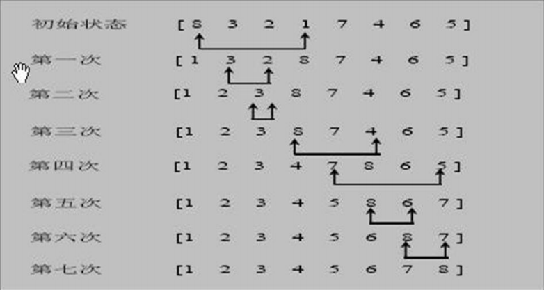
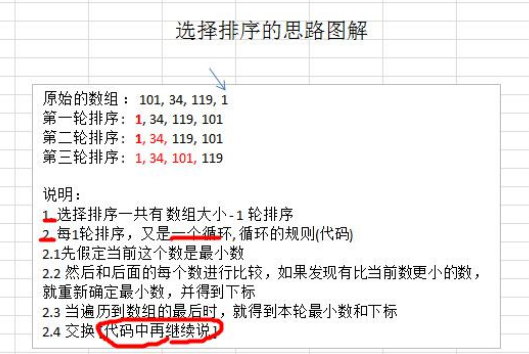

### 选择排序

#### 基本介绍

选择排序也属于内部排序法，是从欲排序的数据中，按指定的规则选出某一元素，在依规定交换位置后达到排序的目的

#### 选择排序思想

选择排序（select sorting）也是一种简单的排序方法。它的基本思想是：第一次从 arr[0]~arr[n-1]中选取最小值，与 arr[0]交换，第二次从 arr[1]~arr[n-1]中选取最小值，与 arr[1]交换，第三次从 arr[2]~arr[n-1]中选取最小值，与 arr[2] 交换，…，第 i 次从 arr[i-1]~arr[n-1]中选取最小值，与 arr[i-1]交换，…, 第 n-1 次从 arr[n-2]~arr[n-1]中选取最小值，与 arr[n-2]交换，总共通过 n-1 次，得到一个按排序码从小到大排列的有序序列。 



选择排序思路：




```java
package com.romanticlei.sort;

import java.util.Arrays;

public class SelectSort {

    public static void main(String[] args) {
        int[] arr = {101, 34, 119, 1};
        System.out.println("排序前" + Arrays.toString(arr));
        selectSort(arr);
        System.out.println("排序后" + Arrays.toString(arr));

        // 测试插入排序效率
        int[] array = new int[80000];
        for (int i = 0; i < 80000; i++) {
            array[i] = (int)(Math.random() * 80000);
        }

        long currentTimeMillis_start = System.currentTimeMillis();
        selectSort(array);
        long currentTimeMillis_end = System.currentTimeMillis();
        // 冒泡排序数据量大比较耗时 4161(时间与机器性能有关)
        System.out.println("一共耗时：" + (currentTimeMillis_end - currentTimeMillis_start));
    }

    public static void selectSort(int[] arr){
        // 保存循环中最小的值
        int min = 0;
        int index = 0;
        for (int i = 0; i < arr.length - 1; i++) {
            min = arr[i];
            index = i;
            for (int j = i + 1; j < arr.length; j++) {
                if (min > arr[j]) {
                    // 将当前值置为最小值
                    min = arr[j];
                    index = j;
                }
            }
            if (i != index) {
                arr[index] = arr[i];
                arr[i] = min;
            }
            // System.out.println("第" + (i + 1) + "次排序结果： " + Arrays.toString(arr));
        }
    }
}
```


