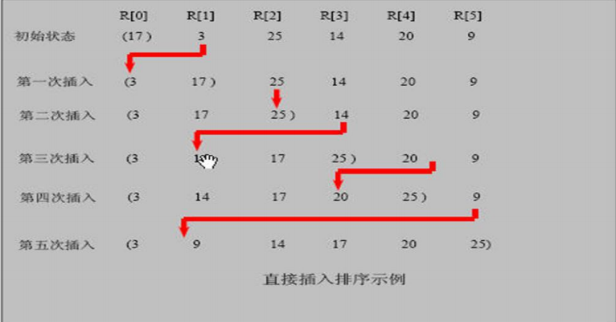

### 插入排序

#### 插入排序法介绍：

插入式排序属于内部排序法，是对于欲排序的元素以插入的方式找寻该元素的适当位置，以达到排序的目的

#### 插入排序法思想

插入排序（Insertion Sorting）的基本思想是：**把** **n** **个待排序的元素看成为一个有序表和一个无序表**，开始时**有序表中只包含一个元素**，无序表中包含有 **n-1** **个元素**，排序过程中每次从无序表中取出第一个元素，把它的排序码依次与有序表元素的排序码进行比较，将它插入到有序表中的适当位置，使之成为新的有序表。 

#### 插入排序思路图




```java
package com.romanticlei.sort;

import java.util.Arrays;

public class insertSort {

    public static void main(String[] args) {
        int[] arr = {101, 34, 119, 1, -1, 68};
        insertSort(arr);

        // 测试插入排序效率
        int[] array = new int[80000];
        for (int i = 0; i < 80000; i++) {
            array[i] = (int)(Math.random() * 80000);
        }

        long currentTimeMillis_start = System.currentTimeMillis();
        insertSort(array);
        long currentTimeMillis_end = System.currentTimeMillis();
        // 冒泡排序数据量大比较耗时 1375(时间与机器性能有关)
        System.out.println("一共耗时：" + (currentTimeMillis_end - currentTimeMillis_start));
    }
    
    public static void insertSort(int[] arr){
        int insertValue = 0;
        int insertIndex = 0;
        for (int i = 1; i < arr.length; i++) {
            insertValue = arr[i];
            insertIndex = i - 1;
            while (insertIndex >= 0 && insertValue < arr[insertIndex]) {
                arr[insertIndex + 1] = arr[insertIndex];
                insertIndex--;
            }

            arr[insertIndex + 1] = insertValue;
            // System.out.println("第" + i + "次排序后的结果是：" + Arrays.toString(arr));
        }
    }
}
```


