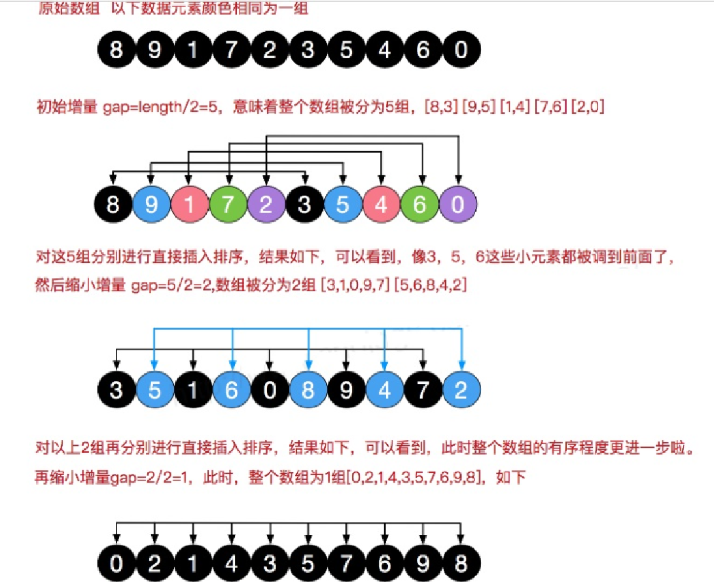

### 希尔排序

简单的插入排序存在着问题，数组arr = {2,3,4,5,6,1} 这时需要插入的数 1**(最小**), 这样的过程是：

{2,3,4,5,6,6} 

{2,3,4,5,5,6} 

{2,3,4,4,5,6} 

{2,3,3,4,5,6} 

{2,2,3,4,5,6} 

{1,2,3,4,5,6} 

**结论**:当**需要插入的数是较小的数时，后移的次数明显增多**，对**效率**有影响

#### 希尔排序介绍

希尔排序也是一种插入排序，它是简单插入排序经过改进之后的一个更高效的版本，也称为缩小增量排序。

#### 希尔排序法基本思想

希尔排序是把记录按下标的一定增量分组，对每组使用直接插入排序算法排序；随着增量逐渐减少，每组包含的关键词越来越多，**当增量减至** **1** **时**，整个文件恰被分成一组，算法便终止 

希尔排序法的示意图



.jpg)


1) 希尔排序时，对有序序列在插入时采用**交换法**，并测试排序速度。（慢）

2) 希尔排序时，对有序序列在插入时采用**移动法**，并测试排序速度。（快）


```java
package com.romanticlei.sort;

import java.util.Arrays;

public class ShellSort {

    public static void main(String[] args) {
        // int[] arr = {8, 9, 1, 7, 2, 3, 5, 4, 6, 0};
        // shellSort(arr);
        // System.out.println("排序后的数组为 " + Arrays.toString(arr));

        // 测试插入排序效率
        int[] array = new int[80000];
        for (int i = 0; i < 80000; i++) {
            array[i] = (int) (Math.random() * 80000);
        }

        long currentTimeMillis_start = System.currentTimeMillis();
        shellSort2(array);
        long currentTimeMillis_end = System.currentTimeMillis();
        // 冒泡排序数据量大比较耗时 1375(时间与机器性能有关)
        System.out.println("一共耗时：" + (currentTimeMillis_end - currentTimeMillis_start));
        // System.out.println("排序后的数组为 " + Arrays.toString(array));
    }

    // 交换式希尔排序
    public static void shellSort(int[] arr) {
        int temp = 0;
        for (int gap = arr.length / 2; gap > 0; gap /= 2) {
            for (int i = gap; i < arr.length; i++) {
                for (int j = i - gap; j >= 0; j -= gap) {
                    if (arr[j] > arr[j + gap]) {
                        temp = arr[j];
                        arr[j] = arr[j + gap];
                        arr[j + gap] = temp;
                    }
                }
            }
        }
    }

    // 移动法希尔排序
    public static void shellSort2(int[] arr) {
        int temp = 0;
        for (int gap = arr.length / 2; gap > 0; gap /= 2) {
            for (int i = gap; i < arr.length; i++) {
                int j = i;
                temp = arr[j];
                while (j - gap >= 0 && temp < arr[j - gap]){
                    arr[j] = arr[j - gap];
                    j -= gap;
                }
                arr[j] = temp;
            }
        }
    }
}
```


