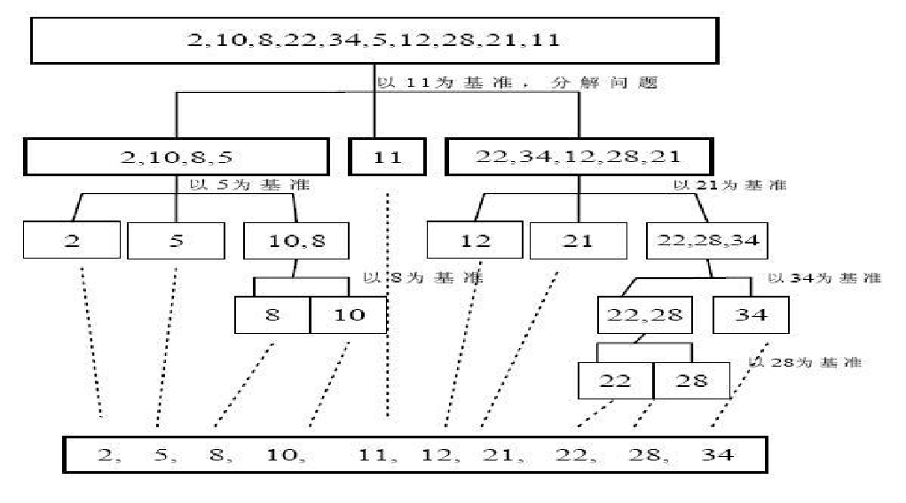
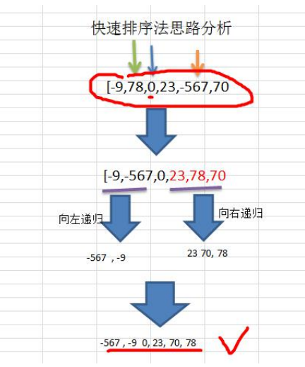

### 快速排序介绍

快速排序（Quicksort）是对**冒泡排序**的一种改进。基本思想是：通过一趟排序将要排序的数据分割成独立的两部分，其中一部分的所有数据都比另外一部分的所有数据都要小，然后再按此方法对这两部分数据分别进行快速排序，**整个排序过程可以递归进行**，以此达到整个数据变成有序序列






```java
package com.romanticlei.sort;

import java.util.Arrays;

public class QuickSort {

    public static void main(String[] args) {
        // int[] arr = {-9, 78, 0, 23, -567, 70};
        // int[] arr = {-3, -2, 0, 6, 0, 5, 0, -1, -6};
        // quickSort(arr, 0, arr.length - 1);
        // System.out.printf("排序后的值为 " + Arrays.toString(arr));

        int[] array = new int[8000000];
        for (int i = 0; i < 8000000; i++) {
            array[i] = (int) (Math.random() * 8000000);
        }
        long currentTimeMillis_start = System.currentTimeMillis();
        quickSort(array, 0, array.length - 1);
        long currentTimeMillis_end = System.currentTimeMillis();
        // 快速排序数据量大比较耗时 1375(时间与机器性能有关)
        System.out.println("一共耗时：" + (currentTimeMillis_end - currentTimeMillis_start));

    }

    public static void quickSort(int[] arr, int left, int right) {
        int l = left; // 左下标
        int r = right;// 右下标
        // pivot 中轴值
        int pivot = arr[(left + right) / 2];
        int temp = 0;

        while (l < r) {
            // 在 pivot 的左边，找到小于等于 pivot值，才退出
            while (arr[l] < pivot) {
                l++;
            }

            while (arr[r] > pivot) {
                r--;
            }

            if (l >= r) {
                break;
            }

            // 交换
            temp = arr[l];
            arr[l] = arr[r];
            arr[r] = temp;

            // 如果 arr[l] == pivot，r-- 防止进入死循环
            if (arr[l] == pivot) {
                // l++; // 这是错误的写法，如果当前值和中轴值一样的话，移动下标会错误的导致自己放到中轴值右边
                r--;
            }

            // 如果 arr[l] == pivot，l++ 防止进入死循环
            if (arr[r] == pivot) {
                // r--;
                l++;
            }
        }

        // 如果 l == r ，必须l++, r--,否则会出现栈溢出
        if (l == r){
            l++;
            r--;
        }

        // 向左递归
        if (left < r){
            quickSort(arr, left, r);
        }

        // 向右递归
        if (right > l) {
            quickSort(arr, l, right);
        }
    }
}

```


