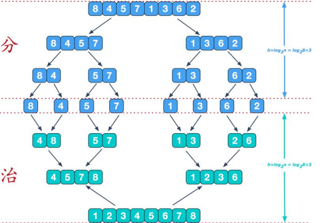
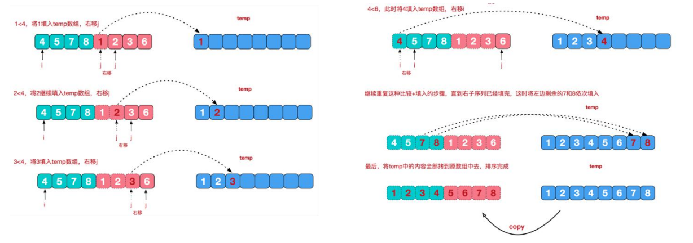

### 归并排序

#### 归并排序介绍：

归并排序（MERGE-SORT）是利用归并的思想实现的排序方法，该算法采用经典的**分治（divide-and-conquer）**策略（分治法将问题分(divide)成一些**小的问题然后递归求解**，而治(conquer)的阶段则将分的阶段得到的各答案"修补"在一起，即分而治之)。

归并排序示意图1-基本思想




#### 归并排序示意图2-合并相邻的有序子序列




代码实现：

```java
package com.romanticlei.sort;

import java.util.Arrays;

public class MergeSort {

    public static void main(String[] args) {
        int arr[] = {8, 4, 5, 7, 1, 3, 6, 2};
        // 归并排序，需要一个额外的空间
        int[] temp = new int[arr.length];
        mergeSort(arr, 0, arr.length - 1, temp);
        System.out.println("归并排序后的数据为 = " + Arrays.toString(arr));

        int[] array = new int[8000000];
        int[] temp1 = new int[array.length];
        for (int i = 0; i < 8000000; i++) {
            array[i] = (int) (Math.random() * 8000000);
        }
        long currentTimeMillis_start = System.currentTimeMillis();
        mergeSort(array, 0, array.length - 1, temp1);
        long currentTimeMillis_end = System.currentTimeMillis();
        // 归并排序数据量大比较耗时 2169(时间与机器性能有关)
        System.out.println("一共耗时：" + (currentTimeMillis_end - currentTimeMillis_start));
    }

    // 分+合的方法
    public static void mergeSort(int[] arr, int left, int right, int[] temp) {
        if (left < right) {
            int mid = (left + right) / 2;
            // 向左递归
            mergeSort(arr, left, mid, temp);
            // 向右递归
            mergeSort(arr, mid + 1, right, temp);
            merge(arr, left, mid, right, temp);
        }
    }

    /**
     *  合并的方法
     * @param arr   排序前的数组
     * @param left  左边有序序列的初始索引
     * @param mid   中间值索引
     * @param right 右边有序序列的结束索引
     * @param temp  临时中转的数组
     */
    public static void merge(int[] arr, int left, int mid, int right, int[] temp) {
        int i = left;
        int j = mid + 1;
        int t = 0; // 指向临时数组的索引

        while (i <= mid && j <= right) {
            // 如果左边的有序序列的当前元素，小于等于右边的有序序列的当前元素
            // 那么就将左边的当前元素，填充到右边
            if (arr[i] <= arr[j]){
                temp[t] = arr[i];
                i++;
                t++;
            }else {
                temp[t] = arr[j];
                j++;
                t++;
            }
        }

        // 把现有剩余的数据的一边全部填充到temp
        while (i <= mid) {
            temp[t] = arr[i];
            i++;
            t++;
        }

        while (j <= right) {
            temp[t] = arr[j];
            j++;
            t++;
        }

        // 将 temp 数组的元素拷贝到arr
        t = 0;
        int tempLeft = left;
        while (tempLeft <= right) {
            arr[tempLeft] = temp[t];
            tempLeft++;
            t++;
        }
    }
}
```


s