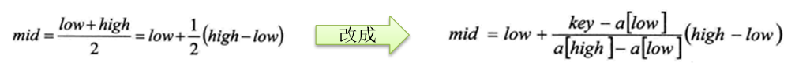
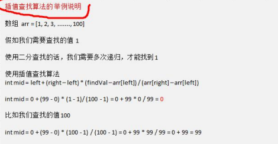

###  插值查找算法

1) 插值查找原理介绍: 

插值查找算法类似于二分查找，不同的是插值查找每次从自适应 mid 处开始查找。 

2) 将折半查找中的求 mid 索引的公式 , low 表示左边索引 left, high 表示右边索引 right. key 就是前面我们讲的 findVal



3) int mid = low + (high - low) * (key - arr[low]) / (arr[high] - arr[low]); /* 插值索引 */ 

对应前面的代码公式： 

int mid = left + (right – left) * (findVal – arr[left]) / (arr[right] – arr[left]) 

4) **举例说明插值查找算法** 1-100 的数组




插值查找代码

```java
package com.romanticlei.search;

public class InsertValueSearch {

    public static void main(String[] args) {
        int[] arr = new int[100];
        for (int i = 0; i < 100; i++) {
            arr[i] = i + 1;
        }

        int i = insertValueSearch(arr, 0, arr.length - 1, -1);
        System.out.println(i);
    }

    public static int insertValueSearch(int[] arr, int left, int right, int findVal){

        // 不加 findVal < arr[0] || findVal > arr[right] 在求mid时可能会出现数组越界
        if (left > right || findVal < arr[0] || findVal > arr[right]) {
            return -1;
        }

        // 求出mid
        int mid = left + (right - left) * (findVal - arr[left]) / (arr[right] - findVal);
        int midVal = arr[mid];

        if (midVal > findVal) {
            return insertValueSearch(arr, left, mid - 1, findVal);
        }

        if (midVal < findVal) {
            return insertValueSearch(arr, mid + 1, right, findVal);
        }

        return mid;
    }
}
```


**插值查找注意事项：** 

1) 对于数据量较大，关键字分布比较均匀的查找表来说，采用插值查找, 速度较快. 

2) 关键字分布不均匀的情况下，该方法不一定比折半查找要好 

