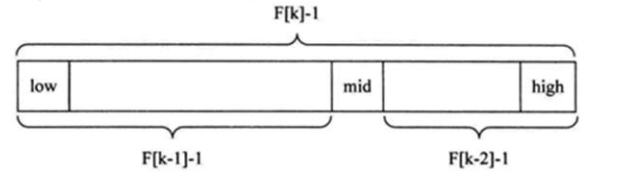

### 斐波那契(黄金分割法)查找算法

斐波那契(黄金分割法)查找基本介绍:

1) 黄金分割点是指把一条线段分割为两部分，使其中一部分与全长之比等于另一部分与这部分之比。取其前三位 数字的近似值是 0.618。由于按此比例设计的造型十分美丽，因此称为黄金分割，也称为中外比。这是一个神奇的数字，会带来意向不大的效果。 

2) 斐波那契数列 {1, 1, 2, 3, 5, 8, 13, 21, 34, 55 } 发现斐波那契数列的两个相邻数的比例，无限接近黄金分割值0.618


#### 斐波那契(黄金分割法)原理:

斐波那契查找原理与前两种相似，仅仅改变了中间结点（mid）的位置，mid 不再是中间或插值得到，而是位于黄金分割点附近，即 mid=low+F(k-1)-1（F 代表斐波那契数列），如下图所示 



**对** **F(k-1)-1** **的理解**：

1) 由斐波那契数列 F[k]=F[k-1]+F[k-2] 的性质，可以得到 （F[k]-1）=（F[k-1]-1）+（F[k-2]-1）+1 。该式说明：只要顺序表的长度为 F[k]-1，则可以将该表分成长度为 F[k-1]-1 和 F[k-2]-1 的两段，即如上图所示。从而中间位置为 mid=low+F(k-1)-1

2) 类似的，每一个子段也可以用相同的方式分隔

3) 但顺序表长度 n 不一定刚好等于 F[k]-1，所以需要将原来的顺序表长度 n 增加至 F[k]-1。这里的 k 值只要能使得 F[k]-1 恰好大于或等于 n 即可，由以下代码得到,顺序表长度增加后，新增的位置（从 n+1 到 F[k]-1 位置），都赋为 n 位置的值即可。

while(n>fib(k)-1) 

​	k++; 


#### 斐波那契查找应用案例：

请对一个**有序数组**进行斐波那契查找 {1,8, 10, 89, 1000, 1234} ，输入一个数看看该数组是否存在此数，并且求出下标，如果没有就提示"没有这个数"。

```java
package com.romanticlei.search;

import java.util.Arrays;

public class FibonacciSearch {

    public static int maxSize = 20;

    public static void main(String[] args) {
        int[] arr = {1, 8, 10, 89, 1000, 1234};

        System.out.println("index = " + fibSearch(arr, 89));
    }

    // 创建一个斐波那契数组
    public static int[] fib() {
        int[] f = new int[maxSize];
        f[0] = 1;
        f[1] = 1;
        for (int i = 2; i < maxSize; i++) {
            f[i] = f[i - 1] + f[i - 2];
        }

        return f;
    }

    /**
     * 编写一个斐波那契查找算法， 使用非递归的方式编写
     * @param a
     * @param key
     * @return
     */
    public static int fibSearch(int[] a, int key) {
        int low = 0;
        int high = a.length - 1;
        int k = 0; // 表示斐波那契分隔数值的下标
        int mid = 0; // 存放mid值
        int[] f = fib(); // 获取斐波那契数列
        // 获取到斐波那契分隔数的下标
        while (high > f[k] - 1) {
            k++;
        }

        // 因为f[k]值可能大于 数组a的长度，因此我们需要使用Arrays 类，构造一个新的数组
        // Arrays.copyOf(a, f[k]); 参数意思 =》 旧的数组，新的数组的长度
        int[] temp = Arrays.copyOf(a, f[k]);
        for (int i = high + 1; i < temp.length; i++) {
            temp[i] = a[high];
        }

        // 使用 while 来循环处理，找到我们的数 key
        while (low <= high) {
            mid = low + f[k - 1] - 1;
            if (key < temp[mid]) {
                high = mid - 1;
                k--; // 下次循环向数组的左边查找
            } else if (key > temp[mid]) {
                low = mid + 1;
                // 为什么是 k -= 2
                // 1. 全部元素 = 前面的元素 + 后面的元素
                // 2.f[k] = f[k-1] + f[k-2]
                // 3.因为后面我们有 f[k-2] 所以可以继续拆分 f[k-2] = f[k-3] +f[k-4]
                // 4.即在f[k-2] 的前面进行查找 k-=2
                // 5.即下次循环mid = f[k-1-2]-1
                k -= 2; // 下次循环向数组的右边查找
            } else {
                if (mid <= high) {
                    return mid;
                } else {
                    return high;
                }
            }
        }
        return -1;
    }
}
```

