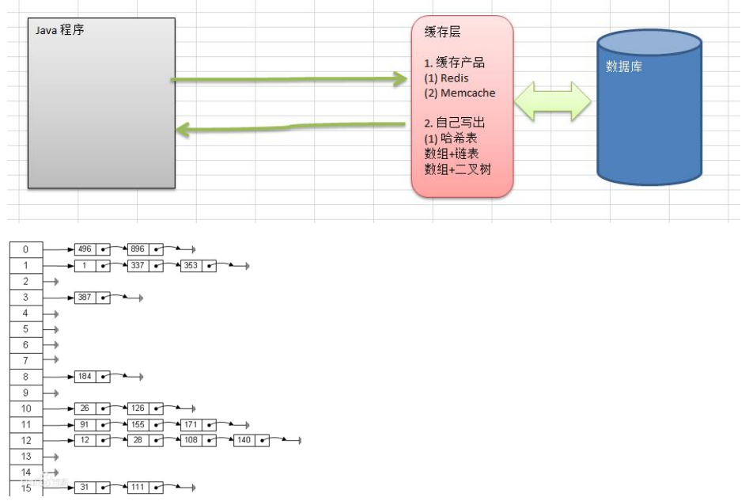
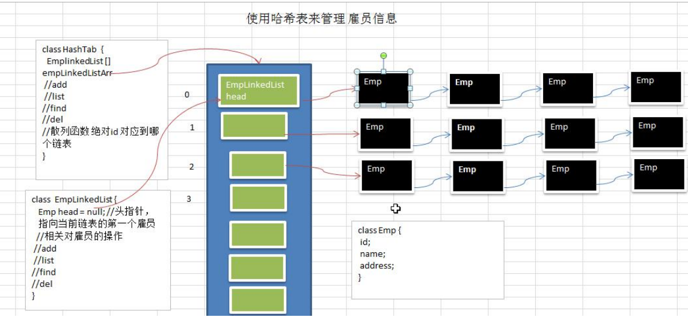

### 哈希表

1) 看一个实际需求，google 公司的一个上机题: 

2) 有一个公司,当有新的员工来报道时,要求将该员工的信息加入(id,性别,年龄,住址..),当输入该员工的 id 时,要求查找到该员工的 所有信息. 

3) 要求: 不使用数据库,尽量节省内存,速度越快越好=>哈希表(散列)

#### 哈希表的基本介绍 

散列表（Hash table，也叫哈希表），是根据关键码值(Key value)而直接进行访问的数据结构。也就是说，它通过把关键码值映射到表中一个位置来访问记录，以加快查找的速度。这个映射函数叫做散列函数，存放记录的数组叫做散列表。



#### google 公司的一个上机题

有一个公司,当有新的员工来报道时,要求将该员工的信息加入(id,性别,年龄,名字,住址..),当输入该员工的 id 时, 要求查找到该员工的 所有信息

**要求**: 

1) 不使用数据库,,速度越快越好=>哈希表(散列) 

2) 添加时，保证按照 id 从低到高插入 [课后思考：**如果** **id** **不是从低到高插入**，但要求各条链表仍是从低到高，怎么解决?] 

3) 使用链表来实现哈希表, 该链表不带表头[即: 链表的第一个结点就存放雇员信息] 

4) 思路分析并画出示意图



#### 代码实现

```java
package com.romanticlei.hashTable;

import java.util.Scanner;

public class HashTableDemo {

    public static void main(String[] args) {
        // 创建哈希表
        HashTable hashTable = new HashTable(7);
        String key = "";
        Scanner scanner = new Scanner(System.in);
        while (true) {
            System.out.println("add:    添加雇员");
            System.out.println("find:   查找雇员");
            System.out.println("list:   显示雇员");
            System.out.println("delete: 删除雇员");
            System.out.println("exit:   退出系统");

            key = scanner.next();
            switch (key) {
                case "add":
                    System.out.println("请输入id");
                    int id = scanner.nextInt();
                    System.out.println("请输入姓名");
                    String name = scanner.next();
                    Emp emp = new Emp(id, name);
                    hashTable.add(emp);
                    break;
                case "find":
                    System.out.println("请输入要查找的id");
                    id = scanner.nextInt();
                    hashTable.findEmpById(id);
                    break;
                case "list":
                    hashTable.list();
                    break;
                case "delete":
                    System.out.println("请输入要删除的id");
                    id = scanner.nextInt();
                    hashTable.deleteById(id);
                    break;
                case "exit":
                    System.exit(0);
                    break;
                default:
                    break;
            }
        }
    }
}

// 创建一个 HashTable 管理多个链表
class HashTable {
    private EmpLinkedList[] empLinkedListArray;
    private int size; // 集合的个数

    // 构造器
    public HashTable(int size) {
        this.size = size;
        empLinkedListArray = new EmpLinkedList[size];

        for (int i = 0; i < size; i++) {
            // 里面的链表也要初始化
            empLinkedListArray[i] = new EmpLinkedList();
        }
    }

    // 添加雇员
    public void add(Emp emp) {
        // 根据员工id， 得到该员工添加到那条链表
        int empLinkedListNo = hashFun(emp.id);
        empLinkedListArray[empLinkedListNo].add(emp);
    }

    public void list() {
        for (int i = 0; i < size; i++) {
            empLinkedListArray[i].list(i);
        }
    }

    public void findEmpById(int id) {
        int empLinkedListNo = hashFun(id);
        Emp emp = empLinkedListArray[empLinkedListNo].findEmpById(id);
        if (null == emp) {
            System.out.println("在哈希链表中没有找到该雇员");
        } else {
            System.out.println("第" + (empLinkedListNo + 1) + "条链表为 => id = " + emp.id + "\t name = " + emp.name);
        }
    }

    public void deleteById(int id) {
        int empLinkedListNo = hashFun(id);

        String s = empLinkedListArray[empLinkedListNo].deleteById(id);
        System.out.println(s);
    }

    // 编写散列函数，使用一个简单取模算法
    public int hashFun(int id) {
        return id % size;
    }
}

class Emp {
    public int id;
    public String name;
    public Emp next; // 下一个员工信息，默认为null

    public Emp(int id, String name) {
        this.id = id;
        this.name = name;
    }
}

// 创建 EmpLinkedList， 表示链表
class EmpLinkedList {
    // 头指针，执行第一个Emp，因此我们这个链表的 head 是直接指向第一个Emp
    private Emp head;

    public void add(Emp emp) {
        if (head == null) {
            head = emp;
            return;
        }

        // 由于头结点不能动，所以需要一个辅助指针，帮助定位
        Emp curEmp = head;
        // 找到链表的最后
        while (curEmp.next != null) {
            curEmp = curEmp.next;
        }

        curEmp.next = emp;
    }

    // 遍历链表
    public void list(int no) {
        if (head == null) {
            System.out.println("第" + (no + 1) + "条链表为空");
            return;
        }

        Emp curEmp = head;
        while (true) {
            System.out.print("第" + (no + 1) + "条链表为 => id = " + curEmp.id + "\t name = " + curEmp.name);
            if (curEmp.next == null) {
                break;
            }

            curEmp = curEmp.next;
        }
        System.out.println();
    }

    // 根据id 查找雇员
    public Emp findEmpById(int id) {
        if (head == null) {
            return null;
        }

        Emp curEmp = head;
        while (curEmp != null) {
            if (curEmp.id == id) {
                return curEmp;
            }

            curEmp = curEmp.next;
        }

        return null;
    }

    // 根据 id 删除雇员信息
    public String deleteById(int id) {
        if (head == null) {
            return "链表为空！";
        }

        Emp curEmp = head;
        // 当前头结点id 就是需要删除的id
        if (curEmp.id == id) {
            // 当前链就不止只有头结点一条数据
            if (curEmp.next != null) {
                head = curEmp.next;
            } else {
                head = null;
            }
            return "删除成功！";
        }

        while (curEmp.next != null){
            if (curEmp.next.id == id) {
                // 判断删除节点不是当前链表的最后一条数据
                if (curEmp.next.next != null){
                    curEmp.next = curEmp.next.next;
                } else {
                    // 需要删除的数据就是链表的最后一条数据集
                    curEmp.next = null;
                }

                return "删除成功！";
            }

            curEmp = curEmp.next;
        }

        return "没有找到该雇员！";
    }
}
```


