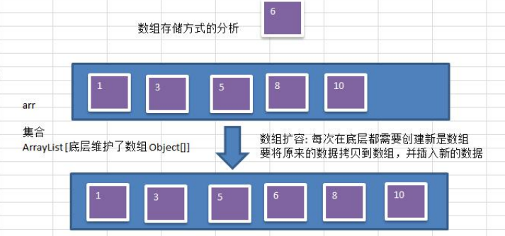
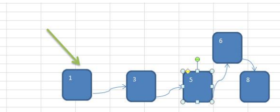
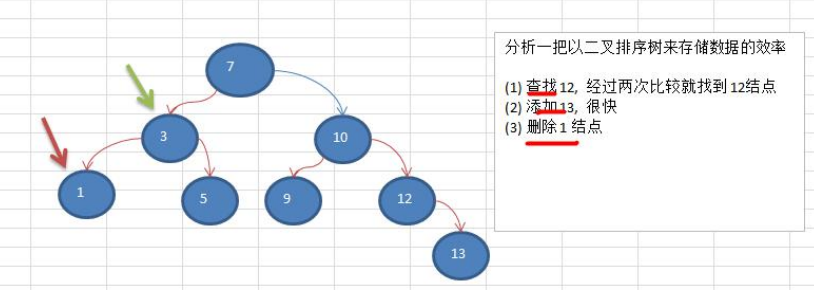
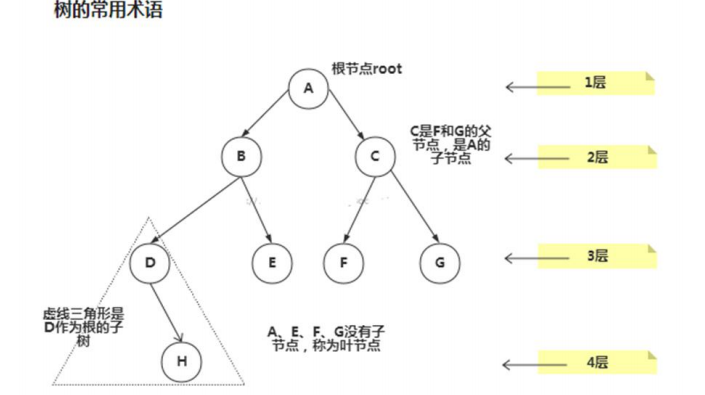
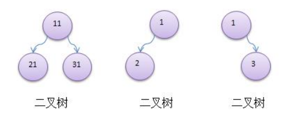
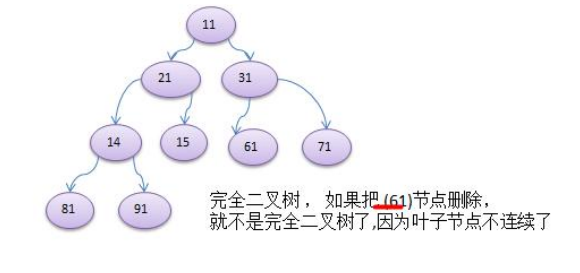

#### 为什么需要树这种数据结构

1) 数组存储方式的分析 

**优点**：通过**下标方式访问元素**，速度快。对于有序数组，还可使用**二分查找**提高检索速度。 

**缺点**：如果要检索具体某个值，或者**插入值(按一定顺序)会整体移动**，效率较低 [示意图] **画出操作示意图**：



2) 链式存储方式的分析 

**优点**：在一定程度上对数组存储方式有优化(比如：**插入**一个数值节点，只需要将插入节点，链接到链表中即可，**删除**效率也很好)。 

**缺点**：在进行**检索时**，效率仍然较低，比如(检索某个值，需要从头节点开始遍历) 

【示意图】 **操作示意图**：



3) **树存储**方式的分析 

能提高数据**存储，读取**的效率, 比如利用 **二叉排序树**(Binary Sort Tree)，既可以保证数据的检索速度，同时也可以保证数据的**插入，删除，修改**的速度。【示意图,后面详讲】 

**案例:** [7, 3, 10, 1, 5, 9, 12]



#### 树示意图



```text
树的常用术语(结合示意图理解): 
1) 节点 
2) 根节点 
3) 父节点 
4) 子节点 
5) 叶子节点 (没有子节点的节点) 
6) 节点的权(节点值) 
7) 路径(从 root 节点找到该节点的路线) 
8) 层 
9) 子树 
10) 树的高度(最大层数) 
11) 森林: 多颗子树构成森林
```

#### 二叉树的概念

1) 树有很多种，每个节点**最多只能有两个子节点**的一种形式称为二叉树。 

2) 二叉树的子节点分为左节点和右节点 

3) 示意图 



4) 如果该二叉树的所有**叶子节点**都在**最后一层**，并且结点总数= **2^n -1** , n 为层数，则我们称为满二叉树。 


5) 如果该二叉树的所有**叶子节点**都在**最后一层**或者**倒数第二层**，而且最后一层的叶子节点在左边连续，倒数第二层的叶子节点在右边连续，我们称为完全二叉树



#### 二叉树遍历的说明 

使用**前序，中序和后序**对下面的二叉树进行遍历.

1) 前序遍历:  先输出父节点，再遍历左子树和右子树 

2) 中序遍历:  先遍历左子树，再输出父节点，再遍历右子树

3) 后序遍历: 先遍历左子树，再遍历右子树，最后输出父节点 

4) **小结:**  看输出父节点的顺序，就确定是前序，中序还是后序

代码实现

```java
package com.romanticlei.tree;

public class BinaryTreeDemo {
    public static void main(String[] args) {
        // 先创建一个二叉树
        BinaryTree binaryTree = new BinaryTree();
        HeroNode root = new HeroNode(1, "宋江");
        HeroNode node2 = new HeroNode(2, "吴用");
        HeroNode node3 = new HeroNode(3, "卢俊义");
        HeroNode node4 = new HeroNode(4, "林冲");
        HeroNode node5 = new HeroNode(5, "关胜");

        root.setLeft(node2);
        root.setRight(node3);
        node3.setRight(node4);
        node3.setLeft(node5);
        binaryTree.setRoot(root);

        System.out.println("测试前序遍历");
        binaryTree.preOrder(); // 1,2,3,5,4

        System.out.println("测试中序遍历");
        binaryTree.infixOrder(); // 2,1,5,3,4

        System.out.println("测试后序遍历");
        binaryTree.postOrder(); // 2,5,4,3,1

    }
}

class BinaryTree {
    private HeroNode root;

    public void setRoot(HeroNode root) {
        this.root = root;
    }

    // 前序遍历
    public void preOrder() {
        if (this.root == null) {
            System.out.println("二叉树为空，无法遍历");
            return;
        }

        this.root.preOrder();
    }

    // 中序遍历
    public void infixOrder() {
        if (this.root == null) {
            System.out.println("二叉树为空，无法遍历");
            return;
        }

        this.root.infixOrder();
    }

    // 后续遍历
    public void postOrder() {
        if (this.root == null) {
            System.out.println("二叉树为空，无法遍历");
            return;
        }

        this.root.postOrder();
    }
}

class HeroNode {
    private int no;
    private String name;
    private HeroNode left;  // 默认为null
    private HeroNode right; // 默认为null

    public HeroNode(int no, String name) {
        this.no = no;
        this.name = name;
    }

    public int getNo() {
        return no;
    }

    public void setNo(int no) {
        this.no = no;
    }

    public String getName() {
        return name;
    }

    public void setName(String name) {
        this.name = name;
    }

    public HeroNode getLeft() {
        return left;
    }

    public void setLeft(HeroNode left) {
        this.left = left;
    }

    public HeroNode getRight() {
        return right;
    }

    public void setRight(HeroNode right) {
        this.right = right;
    }

    @Override
    public String toString() {
        return "HeroNode{" +
                "no=" + no +
                ", name='" + name + '\'' +
                '}';
    }

    // 遍历前序遍历的方法
    public void preOrder() {
        System.out.println(this); // 先输出父节点
        // 递归向左子树前序遍历
        if (this.left != null) {
            this.left.preOrder();
        }
        // 递归向右子树前序遍历
        if (this.right != null) {
            this.right.preOrder();
        }
    }

    // 遍历中序遍历的方法
    public void infixOrder() {
        // 递归向左子树
        if (this.left != null) {
            this.left.infixOrder();
        }
        // 输出父节点
        System.out.println(this);
        // 递归向右子树
        if (this.right != null) {
            this.right.infixOrder();
        }
    }

    // 遍历后续遍历方法
    public void postOrder() {
        // 递归向左子树
        if (this.left != null) {
            this.left.postOrder();
        }

        // 递归向右子树
        if (this.right != null) {
            this.right.postOrder();
        }

        // 打印向父节点
        System.out.println(this);
    }
}
```


