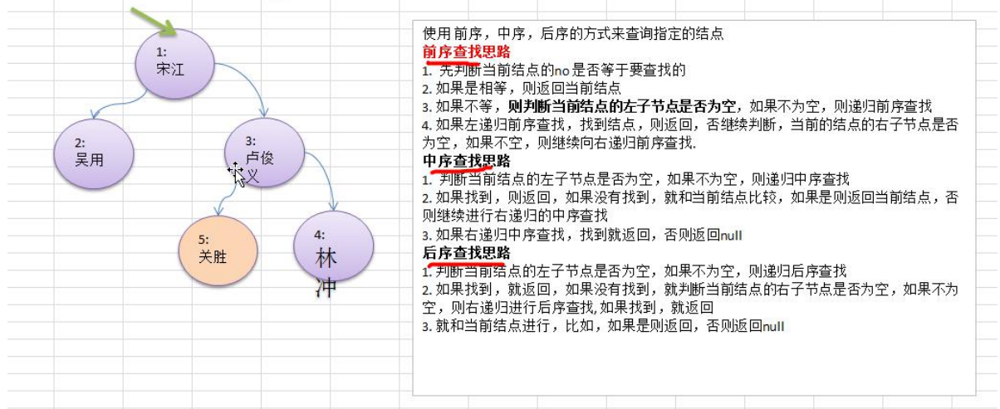

#### 二叉树-查找指定节点

要求

1) 请编写前序查找，中序查找和后序查找的方法。 

2) 并分别使用三种查找方式，查找 heroNO = 5 的节点 

3) 并分析各种查找方式，分别比较了多少次 

4) 思路分析图解




代码如下

```java
package com.romanticlei.tree;

public class BinaryTreeDemo {
    public static void main(String[] args) {
        // 先创建一个二叉树
        BinaryTree binaryTree = new BinaryTree();
        HeroNode root = new HeroNode(1, "宋江");
        HeroNode node2 = new HeroNode(2, "吴用");
        HeroNode node3 = new HeroNode(3, "卢俊义");
        HeroNode node4 = new HeroNode(4, "林冲");
        HeroNode node5 = new HeroNode(5, "关胜");
        HeroNode node6 = new HeroNode(6, "玉麒麟");
        HeroNode node7 = new HeroNode(7, "鲁智深");

        root.setLeft(node2);
        root.setRight(node3);
        node3.setRight(node4);
        node3.setLeft(node5);
        node4.setLeft(node6);
        node4.setRight(node7);
        binaryTree.setRoot(root);

        System.out.println("测试前序遍历");
        binaryTree.preOrder(); // 1,2,3,5,4

        System.out.println("测试中序遍历");
        binaryTree.infixOrder(); // 2,1,5,3,4

        System.out.println("测试后序遍历");
        binaryTree.postOrder(); // 2,5,4,3,1

        // 前序遍历查找值
        System.out.println("前序遍历方式~~");
        HeroNode resNode = binaryTree.preOrderSearch(5);
        if (resNode != null) {
            // 查找编号为5 的数据，前序查找花费 4次
            System.out.printf("找到了，信息为 no = %d \t name = %s", resNode.getNo(), resNode.getName());
        }

        System.out.println();

        // 中序遍历查找值
        System.out.println("中序遍历方式~~");
        resNode = binaryTree.infixOrderSearch(5);
        if (resNode != null) {
            // 查找编号为5 的数据，中序查找花费 3次
            System.out.printf("找到了，信息为 no = %d \t name = %s", resNode.getNo(), resNode.getName());
        }

        System.out.println();

        // 后序遍历查找值
        System.out.println("后序遍历方式~~");
        resNode = binaryTree.postOrderSearch(5);
        if (resNode != null) {
            // 查找编号为5 的数据，后序查找花费 2次
            System.out.printf("找到了，信息为 no = %d \t name = %s", resNode.getNo(), resNode.getName());
        }
    }
}

class BinaryTree {
    private HeroNode root;

    public void setRoot(HeroNode root) {
        this.root = root;
    }

    // 前序遍历
    public void preOrder() {
        if (this.root == null) {
            System.out.println("二叉树为空，无法遍历");
            return;
        }

        this.root.preOrder();
    }

    // 中序遍历
    public void infixOrder() {
        if (this.root == null) {
            System.out.println("二叉树为空，无法遍历");
            return;
        }

        this.root.infixOrder();
    }

    // 后续遍历
    public void postOrder() {
        if (this.root == null) {
            System.out.println("二叉树为空，无法遍历");
            return;
        }

        this.root.postOrder();
    }

    // 前序遍历寻找目标值
    public HeroNode preOrderSearch(int no) {
        if (root != null) {
            return root.preOrderSeach(no);
        }
        return null;
    }

    // 中序遍历寻找目标值
    public HeroNode infixOrderSearch(int no) {
        if (root != null) {
            return root.infixOrderSearch(no);
        }
        return null;
    }

    // 后序遍历寻找目标值
    public HeroNode postOrderSearch(int no) {
        if (root != null) {
            return root.postOrderSearch(no);
        }
        return null;
    }
}

class HeroNode {
    private int no;
    private String name;
    private HeroNode left;  // 默认为null
    private HeroNode right; // 默认为null

    public HeroNode(int no, String name) {
        this.no = no;
        this.name = name;
    }

    public int getNo() {
        return no;
    }

    public void setNo(int no) {
        this.no = no;
    }

    public String getName() {
        return name;
    }

    public void setName(String name) {
        this.name = name;
    }

    public HeroNode getLeft() {
        return left;
    }

    public void setLeft(HeroNode left) {
        this.left = left;
    }

    public HeroNode getRight() {
        return right;
    }

    public void setRight(HeroNode right) {
        this.right = right;
    }

    @Override
    public String toString() {
        return "HeroNode{" +
                "no=" + no +
                ", name='" + name + '\'' +
                '}';
    }

    // 遍历前序遍历的方法
    public void preOrder() {
        System.out.println(this); // 先输出父节点
        // 递归向左子树前序遍历
        if (this.left != null) {
            this.left.preOrder();
        }
        // 递归向右子树前序遍历
        if (this.right != null) {
            this.right.preOrder();
        }
    }

    // 遍历中序遍历的方法
    public void infixOrder() {
        // 递归向左子树
        if (this.left != null) {
            this.left.infixOrder();
        }
        // 输出父节点
        System.out.println(this);
        // 递归向右子树
        if (this.right != null) {
            this.right.infixOrder();
        }
    }

    // 遍历后续遍历方法
    public void postOrder() {
        // 递归向左子树
        if (this.left != null) {
            this.left.postOrder();
        }

        // 递归向右子树
        if (this.right != null) {
            this.right.postOrder();
        }

        // 打印向父节点
        System.out.println(this);
    }

    // 前序遍历查找，如果没有就返回 null
    public HeroNode preOrderSeach(int no) {
        System.out.println("*********前序遍历查找*********");
        // 比较当前结点是不是需要查找的结点
        if (this.no == no) {
            return this;
        }

        // 判断当前结点的左子节点是否为空，如果不为空，则递归前序查找
        // 如果左递归前序查找，找到结点就返回
        HeroNode resNode = null;
        if (this.left != null) {
            resNode = this.left.preOrderSeach(no);
        }

        // 找到了直接返回结点
        if (resNode != null) {
            return resNode;
        }

        // 没有找到，继续判断当前结点的右结点是否为空，如果不空，继续右递归
        if (this.right != null) {
            resNode = this.right.preOrderSeach(no);
        }

        // 向右查找不管有没有找到都直接返回（有就是返回数据，没有就是返回 null）
        return resNode;
    }

    // 中序遍历查找
    public HeroNode infixOrderSearch(int no) {
        HeroNode resNode = null;
        if (this.left != null) {
            resNode = this.left.infixOrderSearch(no);
        }

        if (resNode != null) {
            return resNode;
        }

        System.out.println("*********中序遍历查找*********");
        if (this.no == no) {
            return this;
        }

        // 否则继续进行右递归
        if (this.right != null) {
            resNode = this.right.infixOrderSearch(no);
        }

        return resNode;
    }

    // 后序遍历
    public HeroNode postOrderSearch(int no) {
        HeroNode resNode = null;
        // 扫描左子节点
        if (this.left != null) {
            resNode = this.left.postOrderSearch(no);
        }

        if (resNode != null) {
            return resNode;
        }

        // 否则继续进行右递归
        if (this.right != null) {
            resNode = this.right.postOrderSearch(no);
        }

        if (resNode != null) {
            return resNode;
        }

        System.out.println("*********后序遍历查找*********");
        if (this.no == no) {
            return this;
        }

        // 如果都没有找到就返回 null
        return resNode;
    }
}
```


