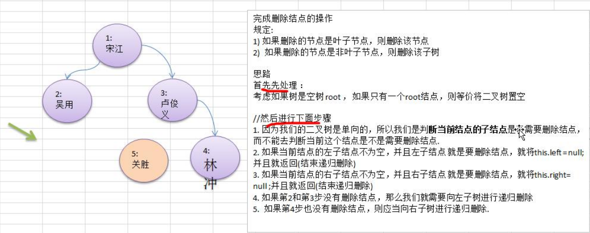

### 二叉树-删除节点及子树

要求 

1) 如果删除的节点是叶子节点，则删除该节点 

2) 如果删除的节点是非叶子节点，则删除该子树.

3) 测试，删除掉 5 号叶子节点 和 3 号子树. 

4) 完成删除思路分析




代码实现

```java
// 递归删除节点
// 1.如果删除的节点是叶子节点，则删除该节点
// 2.如果删除的节点是非叶子结点，则删除该子树
public void delAllNode(int no) {
    // 如果当前节点的左子节点不为空，并且左子节点就是要删除的节点，那么就将this.left = null，并且返回
    if (this.left != null && this.left.no == no) {
        this.left = null;
        return;
    }

    // 如果当前节点右子节点不为空，并且右子节点就是要删除节点，那么就将this.right = null，并且返回
    if (this.right != null && this.right.no == no) {
        this.right = null;
        return;
    }

    // 当前节点的左右节点都不是要删除的节点，需要向左子树进行递归
    if (this.left != null) {
        this.left.delAllNode(no);
    }

    // 当前节点的左右节点都不是要删除的节点，需要向右子树进行递归
    if (this.right != null) {
        this.right.delAllNode(no);
    }
}
```


