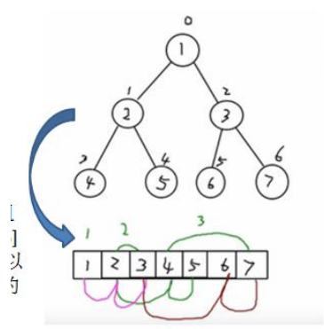

### 顺序存储二叉树

顺序存储二叉树的概念

基本说明 

从数据存储来看，数组存储方式和树的存储方式可以相互转换，即**数组可以转换成树**，**树也可以转换成数组**，看右面的示意图。



要求: 

1) 右图的二叉树的结点，要求以数组的方式来存放 arr : [1, 2, 3, 4, 5, 6, 7] 

2) 要求在遍历数组 arr 时，仍然可以以前序遍历，中序遍历和后序遍历的方式完成结点的遍历 

#### 顺序存储二叉树的特点:

1) 顺序二叉树通常只考虑完全二叉树 

2) 第 n 层（n从0开始）元素的左子节点为2 * n + 1 

3) 第 n 层元素的右子节点为2 * n + 2 

4) 第 n 层元素的父节点为 (n-1) / 2 

5) n : 表示二叉树中的第几个元素(按 0 开始编号如图所示)


#### 代码实现

```java
package com.romanticlei.tree;

public class ArrBinaryTreeDemo {

    public static void main(String[] args) {
        int[] arr = {1, 2, 3, 4, 5, 6, 7};
        // 创建一个 ArrBinaryTree
        ArrBinaryTree arrBinaryTree = new ArrBinaryTree(arr);
        // 1 2 4 5 3 6 7
        arrBinaryTree.preOrder(0);
        System.out.println();

        // 4 2 5 1 6 3 7
        arrBinaryTree.infixOrder(0);
        System.out.println();

        // 4 5 2 6 7 3 1
        arrBinaryTree.postOrder(0);
        System.out.println();


    }
}

// 编写一个ArrayBinaryTree，实现顺序存储二叉树
class ArrBinaryTree {
    // 存储数据节点的数组
    private int[] arr;

    public ArrBinaryTree(int[] arr) {
        this.arr = arr;
    }

    /**
     * 编写一个方法，完成顺序存储二叉树的前序遍历
     * @param index
     */
    public void preOrder(int index) {
        if (arr == null || arr.length == 0) {
            System.out.println("数组为空，不能按照二叉树的前序遍历");
        }

        // 输出当前这个元素
        System.out.print(arr[index] + "\t");
        // 向左递归
        if ((2 * index + 1) < arr.length){
            this.preOrder(2 * index + 1);
        }

        if ((2 * index + 2) < arr.length){
            this.preOrder(2 * index + 2);
        }
    }

    /**
     * 编写一个方法，完成顺序存储二叉树的中序遍历
     * @param index
     */
    public void infixOrder(int index) {
        if (arr == null || arr.length == 0) {
            System.out.println("数组为空，不能按照二叉树的前序遍历");
        }

        // 向左递归
        if ((2 * index + 1) < arr.length){
            this.infixOrder(2 * index + 1);
        }

        // 输出当前这个元素
        System.out.print(arr[index] + "\t");

        if ((2 * index + 2) < arr.length){
            this.infixOrder(2 * index + 2);
        }
    }

    /**
     * 编写一个方法，完成顺序存储二叉树的后序遍历
     * @param index
     */
    public void postOrder(int index) {
        if (arr == null || arr.length == 0) {
            System.out.println("数组为空，不能按照二叉树的前序遍历");
        }

        // 向左递归
        if ((2 * index + 1) < arr.length){
            this.postOrder(2 * index + 1);
        }

        if ((2 * index + 2) < arr.length){
            this.postOrder(2 * index + 2);
        }

        // 输出当前这个元素
        System.out.print(arr[index] + "\t");
    }
}
```


