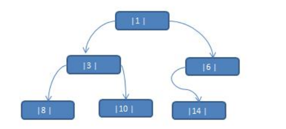
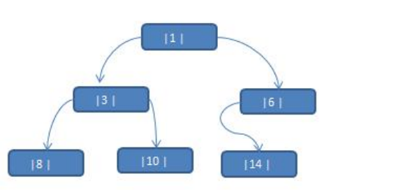
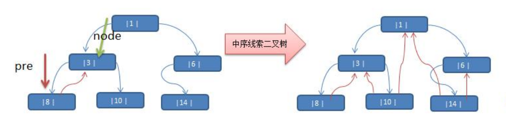

### 线索化二叉树

先看一个问题将数列 {1, 3, 6, 8, 10, 14 } 构建成一颗二叉树.  n+1=7



问题分析: 

1) 当我们对上面的二叉树进行中序遍历时，数列为{8, 3, 10, 1, 14, 6} 

2) 但是 6, 8, 10, 14 这几个节点的 左右指针，并没有完全的利用上. 

3) 如果我们希望充分的利用 各个节点的左右指针， 让各个节点可以指向自己的前后节点,怎么办? 

4) 解决方案-**线索二叉**树

#### 线索二叉树基本介绍

1) n 个结点的二叉链表中含有 n+1 【公式 2n-(n-1)=n+1】 个空指针域。利用二叉链表中的空指针域，存放指向该结点在某种遍历次序下的前驱和后继结点的指针（这种附加的指针称为"线索"） 

2) 这种加上了线索的二叉链表称为线索链表，相应的二叉树称为线索二叉树(Threaded BinaryTree)。根据线索性质的不同，线索二叉树可分为前序线索二叉树、中序线索二叉树和后序线索二叉树三种 

3) 一个结点的前一个结点，称为**前驱**结点 

4) 一个结点的后一个结点，称为**后继**结点

#### 线索二叉树应用案例

应用案例说明：将下面的二叉树，进行中序线索二叉树。中序遍历的数列为 {8, 3, 10, 1, 14, 6}



**思路分析:** 中序遍历的结果：{8, 3, 10, 1, 14, 6}



说明: 当线索化二叉树后，Node 节点的 属性 left 和 right ，有如下情况: 

1) left 指向的是左子树，也可能是指向的前驱节点. 比如 ① 节点 left 指向的左子树, 而 ⑩ 节点的 left 指向的就是前驱节点. 

2) right 指向的是右子树，也可能是指向后继节点，比如 ① 节点 right指向的是右子树，而⑩节点的 right 指向的是后继节点.

#### 代码展示

```java
package com.romanticlei.tree.threadedBinaryTree;

public class ThreadedBinaryTreeDemo {

    public static void main(String[] args) {
        HeroNode root = new HeroNode(1, "tom");
        HeroNode node2 = new HeroNode(3, "jack");
        HeroNode node3 = new HeroNode(6, "smith");
        HeroNode node4 = new HeroNode(8, "mary");
        HeroNode node5 = new HeroNode(10, "king");
        HeroNode node6 = new HeroNode(14, "jack");

        root.setLeft(node2);
        root.setRight(node3);
        node2.setLeft(node4);
        node2.setRight(node5);
        node3.setLeft(node6);

        // 测试线索化
        ThreadedBinaryTree threadedBinaryTree = new ThreadedBinaryTree();
        threadedBinaryTree.threadedNodes(root);

        // node5 节点的前驱结点是 = HeroNode{no=3, name='jack'}
        System.out.println("node5 节点的前驱结点是 = " + node5.getLeft());
        // node5 节点的后继结点是 = HeroNode{no=1, name='tom'}
        System.out.println("node5 节点的后继结点是 = " + node5.getRight());

    }
}

// 定义 ThreadedBinaryTree 实现了线索化功能的二叉树
class ThreadedBinaryTree {
    private HeroNode root;

    // 指向当前结点的父节点
    private HeroNode pre = null;

    public void setRoot(HeroNode root) {
        this.root = root;
    }

    /**
     * 编写对二叉树进行中序线索化的方法
     * @param node
     */
    public void threadedNodes(HeroNode node) {
        // 如果 node == null，不能线索化
        if (node == null) {
            return;
        }

        // 1.先线索化左子树
        threadedNodes(node.getLeft());

        // 2.在线索化当前节点
        // 处理当前结点的前继结点
        if (node.getLeft() == null) {
            // 让当前结点的左指针指向前驱结点
            node.setLeft(pre);
            // 修改当前结点的左指针类型为指向前驱结点
            node.setLeftType(1);
        }
        // 处理当前结点的后继节点
        if (pre != null && pre.getRight() == null) {
            // 让前驱结点的有指针指向当前结点
            pre.setRight(node);
            // 修改当前结点的右子针类型
            pre.setRightType(1);
        }

        // 每处理一个节点，计当前结点是下一个节点的前继结点
        pre = node;

        // 3.在线索化右子树
        threadedNodes(node.getRight());

    }


    // 前序遍历
    public void preOrder() {
        if (this.root == null) {
            System.out.println("二叉树为空，无法遍历");
            return;
        }

        this.root.preOrder();
    }

    // 中序遍历
    public void infixOrder() {
        if (this.root == null) {
            System.out.println("二叉树为空，无法遍历");
            return;
        }

        this.root.infixOrder();
    }

    // 后续遍历
    public void postOrder() {
        if (this.root == null) {
            System.out.println("二叉树为空，无法遍历");
            return;
        }

        this.root.postOrder();
    }

    // 前序遍历寻找目标值
    public HeroNode preOrderSearch(int no) {
        if (root != null) {
            return root.preOrderSeach(no);
        }
        return null;
    }

    // 中序遍历寻找目标值
    public HeroNode infixOrderSearch(int no) {
        if (root != null) {
            return root.infixOrderSearch(no);
        }
        return null;
    }

    // 后序遍历寻找目标值
    public HeroNode postOrderSearch(int no) {
        if (root != null) {
            return root.postOrderSearch(no);
        }
        return null;
    }

    public void delAllNode(int no) {
        if (root != null) {
            // 在这里判断root节点是不是要删除的节点
            if (root.getNo() == no) {
                root = null;
            } else {
                root.delAllNode(no);
            }
        } else {
            System.out.println("树不存在！");
        }
    }
}

class HeroNode {
    private int no;
    private String name;
    private HeroNode left;  // 默认为null
    private HeroNode right; // 默认为null

    // 1. 如果 leftType == 0 表示指向的是左子树，如果 1表示指向前驱结点
    // 2. 如果 rightType == 0 表示指向的是右子树，如果 1表示指向后继节点
    private int leftType;
    private int rightType;

    public HeroNode(int no, String name) {
        this.no = no;
        this.name = name;
    }

    public int getNo() {
        return no;
    }

    public void setNo(int no) {
        this.no = no;
    }

    public String getName() {
        return name;
    }

    public void setName(String name) {
        this.name = name;
    }

    public HeroNode getLeft() {
        return left;
    }

    public void setLeft(HeroNode left) {
        this.left = left;
    }

    public HeroNode getRight() {
        return right;
    }

    public void setRight(HeroNode right) {
        this.right = right;
    }

    public int getLeftType() {
        return leftType;
    }

    public void setLeftType(int leftType) {
        this.leftType = leftType;
    }

    public int getRightType() {
        return rightType;
    }

    public void setRightType(int rightType) {
        this.rightType = rightType;
    }

    @Override
    public String toString() {
        return "HeroNode{" +
                "no=" + no +
                ", name='" + name + '\'' +
                '}';
    }

    // 遍历前序遍历的方法
    public void preOrder() {
        System.out.println(this); // 先输出父节点
        // 递归向左子树前序遍历
        if (this.left != null) {
            this.left.preOrder();
        }
        // 递归向右子树前序遍历
        if (this.right != null) {
            this.right.preOrder();
        }
    }

    // 遍历中序遍历的方法
    public void infixOrder() {
        // 递归向左子树
        if (this.left != null) {
            this.left.infixOrder();
        }
        // 输出父节点
        System.out.println(this);
        // 递归向右子树
        if (this.right != null) {
            this.right.infixOrder();
        }
    }

    // 遍历后续遍历方法
    public void postOrder() {
        // 递归向左子树
        if (this.left != null) {
            this.left.postOrder();
        }

        // 递归向右子树
        if (this.right != null) {
            this.right.postOrder();
        }

        // 打印向父节点
        System.out.println(this);
    }

    // 前序遍历查找，如果没有就返回 null
    public HeroNode preOrderSeach(int no) {
        System.out.println("*********前序遍历查找*********");
        // 比较当前结点是不是需要查找的结点
        if (this.no == no) {
            return this;
        }

        // 判断当前结点的左子节点是否为空，如果不为空，则递归前序查找
        // 如果左递归前序查找，找到结点就返回
        HeroNode resNode = null;
        if (this.left != null) {
            resNode = this.left.preOrderSeach(no);
        }

        // 找到了直接返回结点
        if (resNode != null) {
            return resNode;
        }

        // 没有找到，继续判断当前结点的右结点是否为空，如果不空，继续右递归
        if (this.right != null) {
            resNode = this.right.preOrderSeach(no);
        }

        // 向右查找不管有没有找到都直接返回（有就是返回数据，没有就是返回 null）
        return resNode;
    }

    // 中序遍历查找
    public HeroNode infixOrderSearch(int no) {
        HeroNode resNode = null;
        if (this.left != null) {
            resNode = this.left.infixOrderSearch(no);
        }

        if (resNode != null) {
            return resNode;
        }

        System.out.println("*********中序遍历查找*********");
        if (this.no == no) {
            return this;
        }

        // 否则继续进行右递归
        if (this.right != null) {
            resNode = this.right.infixOrderSearch(no);
        }

        return resNode;
    }

    // 后序遍历
    public HeroNode postOrderSearch(int no) {
        HeroNode resNode = null;
        // 扫描左子节点
        if (this.left != null) {
            resNode = this.left.postOrderSearch(no);
        }

        if (resNode != null) {
            return resNode;
        }

        // 否则继续进行右递归
        if (this.right != null) {
            resNode = this.right.postOrderSearch(no);
        }

        if (resNode != null) {
            return resNode;
        }

        System.out.println("*********后序遍历查找*********");
        if (this.no == no) {
            return this;
        }

        // 如果都没有找到就返回 null
        return resNode;
    }

    // 递归删除节点
    // 1.如果删除的节点是叶子节点，则删除该节点
    // 2.如果删除的节点是非叶子结点，则删除该子树
    public void delAllNode(int no) {
        // 如果当前节点的左子节点不为空，并且左子节点就是要删除的节点，那么就将this.left = null，并且返回
        if (this.left != null && this.left.no == no) {
            this.left = null;
            return;
        }

        // 如果当前节点右子节点不为空，并且右子节点就是要删除节点，那么就将this.right = null，并且返回
        if (this.right != null && this.right.no == no) {
            this.right = null;
            return;
        }

        // 当前节点的左右节点都不是要删除的节点，需要向左子树进行递归
        if (this.left != null) {
            this.left.delAllNode(no);
        }

        // 当前节点的左右节点都不是要删除的节点，需要向右子树进行递归
        if (this.right != null) {
            this.right.delAllNode(no);
        }
    }
}
```


