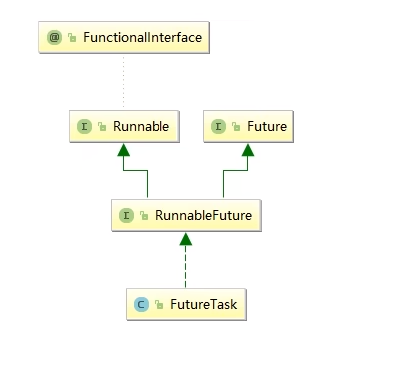

# Future接口理论知识复习

Future接口(FutureTask实现类)定义了操作<font color = 'red'>异步任务执行一些方法</font>，如获取异步任务的执行结果、取消任务的执行、判断任务是否被取消、判断任务执行是否完毕等

比如主线程让一个子线程去执行任务，子线程可能比较耗时，启动子线程开始执行任务后，主线程就去做其他事情了，忙其它事情或者先执行完，过了一会才去获取子任务的执行结果或变更的任务状态。

一句话：Future接口可以为主线程开一个分支任务，专门为主线程处理耗时和费力的复杂业务

# Future接口常用实现类FutureTask异步任务

### Future接口能干什么

Future是Java5新加的一个接口，<font color = 'red'>它提供了一种异步并行计算的功能。</font>

如果主线程需要执行一个很耗时的计算任务，我们就可以通过future把这个任务放到异步线程中执行。

主线程继续处理其他任务或者先行结束，再通过Future获取计算结果。

代码说话:

Runnable接口

Callable接口

Future接口和FutureTask实现类

<font color = 'red'>目的:异步多线程任务执行且返回有结果，三个特点:多线程/有返回/异步任务(班长为老师去买水作为新启动的异步多线程任务且买到水有结果返回)</font>

### 本源的Future接口相关架构



### Future编码实战和优缺点分析

优点：Future+线程池异步多线程任务配置，能显著提高程序的执行效率

上述案例case

```java
package com.juc.cf;

import java.util.concurrent.*;

public class FutureThreadPoolDemo {
    public static void main(String[] args) throws ExecutionException, InterruptedException {
        ExecutorService threadPool = Executors.newFixedThreadPool(3);

        long startTime = System.currentTimeMillis();
        FutureTask<String> futureTask1 = new FutureTask<String>(() -> {
            TimeUnit.MICROSECONDS.sleep(500);
            return "task1 over";
        });
        threadPool.submit(futureTask1);

        FutureTask<String> futureTask2 = new FutureTask<String>(() -> {
            TimeUnit.MICROSECONDS.sleep(300);
            return "task2 over";
        });
        threadPool.submit(futureTask2);
        // 加上下面这两个获取异步线程的结果，会比不获取结果要耗时一点但是也比完全同步执行耗时强很多
        System.out.println(futureTask1.get());
        System.out.println(futureTask2.get());

        FutureTask<String> futureTask3 = new FutureTask<String>(() -> {
            TimeUnit.MICROSECONDS.sleep(300);
            return "task3 over";
        });
        threadPool.submit(futureTask3);
        long endTime = System.currentTimeMillis();
        System.out.println("-------costTime: " + (endTime - startTime) + "毫秒");

        threadPool.shutdown();
    }
}
```

缺点：

get()阻塞：

一旦调用get()方法求结果，如果计算没有完成容易导致程序阻塞，他会一直等待异步结果的返回。所以在get()方法里面我们一般会设置等待超时时间。到了指定时间还未获取到结果，直接抛出 java.util.concurrent.TimeoutException。

isDone()轮询：

轮询的方式会耗费无谓的CPU资源，而且也不见得能及时地得到计算结果

如果想要异步获取结果,通常都会以轮询的方式去获取结果尽量不要阻塞

```java
	public static void FutureDone() throws ExecutionException, InterruptedException {
        ExecutorService threadPool = Executors.newFixedThreadPool(3);
        FutureTask<String> futureTask = new FutureTask<String>(() -> {
            TimeUnit.SECONDS.sleep(5);
            return "task over";
        });
        threadPool.submit(futureTask);
        System.out.println("-----执行其他任务");
        while (true) {
            if (futureTask.isDone()) {
                System.out.println(futureTask.get());
                break;
            } else {
                TimeUnit.MILLISECONDS.sleep(500);
                System.out.println("异步线程暂未执行完毕");
            }
        }
        threadPool.shutdown();
    }

    public static void FutureBlock() throws InterruptedException, ExecutionException, TimeoutException {
        ExecutorService threadPool = Executors.newFixedThreadPool(3);
        FutureTask<String> futureTask = new FutureTask<String>(() -> {
            TimeUnit.SECONDS.sleep(5);
            return "task over";
        });
        threadPool.submit(futureTask);
        System.out.println("-----执行其他任务");
        futureTask.get(3, TimeUnit.SECONDS);
        threadPool.shutdown();

    }
```

### 结论

Future对于结果的获取不是很友好，只能通过阻塞或轮询的方式得到任务的结果。

# 对于想完成一些复杂的业务

<font color = 'gren'>对于简单的业务场景使用Future完全OK</font>

回到通知：对应Future的完成时间，完成了可以告诉我，也就是我们的回调通知，通过轮询的方式去判断任务是否完成这样非常占用CPU并且代码也不优雅

创建异步任务：Future+线程池配合

多个任务前后依赖可以组合处理：

- 想要将多个异步任务的计算结果组合起来，后一个异步任务的计算结果需要前一个异步任务的值。

- 将两个或多个异步计算合成一个异步计算，这几个异步计算互相独立，同时后面这个又依赖前一个处理的结果。

使用Future之前提供的那点API就囊中羞涩，处理起来不够优雅，这时候还是让CompletableFuture声明式的方式优雅的处理这些需求

Future能干的，CompletableFuture都能干


