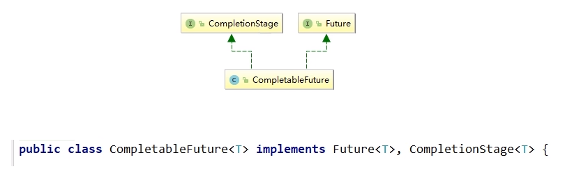
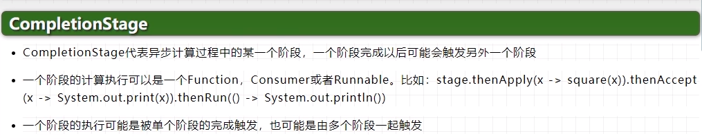
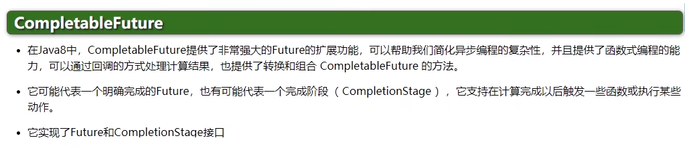

# CompletableFuture为什么出现

get()方法在Future 计算完成之前会一直处在<font color = 'red'>阻塞状态</font>下，

isDone()方法容易耗费CPU资源，

对于真正的异步处理我们希望是可以通过传入回调函数，在Future结束时自动调用该回调函数，这样，我们就不用等待结果。

<font color = 'red'>阻塞的方式和异步编程的设计理念相违背，而轮询的方式会耗费无谓的CPU资源。</font>因此，JDK8设计出CompletableFuture。

CompletableFuture提供了一种观察者模式类似的机制，可以让任务执行完成后通知监听的一方。

# CompletableFuture和CompletionStage源码介绍

### 架构说明



### <font color = 'red'>接口</font>CompletionStage



代表异步计算过程中的某一个阶段，一个阶段完成以后可能会触发另外一个阶段，有些类似Linux系统的管道分隔符传参数。

### <font color = 'red'>类</font>CompletableFuture



# 核心的四个静态方法，来创建一个异步任务

### <font color = 'red'>runAsync</font> 无返回值

public static CompletableFuture<Void> runAsync(Runnable runnable)

public static CompletableFuture<Void> runAsync(Runnable runnable,  <font color = 'red'>Executor executor</font>)

### <font color = 'red'>supplyAsync</font> 有返回值

public static <U> CompletableFuture<U> supplyAsync(Supplier<U> supplier)
public static <U> CompletableFuture<U> supplyAsync(Supplier<U> supplier,   <font color = 'red'>Executor executor</font>r)

### 上述Executor executor参数说明

没有指定Executor的方法，直接使用默认的ForkJoinPool.commonPool()作为它的线程池执行异步代码。
如果指定线程池，则使用我们自定义的或者特别指定的线程池执行异步代码

代码展示：

```java
package com.juc.cf;

import java.util.concurrent.*;

public class CompletableFutureDemo {
    public static void main(String[] args) throws ExecutionException, InterruptedException {
        runAsyncNoExecutor();
        runAsync();
        supplyAsyncNoExecutor();
        supplyAsync();
    }

    public static void supplyAsync() throws ExecutionException, InterruptedException {
        ExecutorService executorService = Executors.newFixedThreadPool(3);
        CompletableFuture<String> completableFuture = CompletableFuture.supplyAsync(() -> {
            // pool-1-thread-1
            System.out.println(Thread.currentThread().getName());
            try {
                TimeUnit.SECONDS.sleep(1);
            } catch (InterruptedException e) {
                e.printStackTrace();
            }
            return "hello supplyAsyncNoExecutor";
        }, executorService);
        // hello supplyAsyncNoExecutor
        System.out.println(completableFuture.get());
        executorService.shutdown();
    }

    public static void supplyAsyncNoExecutor() throws ExecutionException, InterruptedException {
        CompletableFuture<String> completableFuture = CompletableFuture.supplyAsync(() -> {
            // ForkJoinPool.commonPool-worker-1
            System.out.println(Thread.currentThread().getName());
            try {
                TimeUnit.SECONDS.sleep(1);
            } catch (InterruptedException e) {
                e.printStackTrace();
            }
            return "hello supplyAsyncNoExecutor";
        });
        // hello supplyAsyncNoExecutor
        System.out.println(completableFuture.get());
    }

    public static void runAsync() throws ExecutionException, InterruptedException {
        ExecutorService executorService = Executors.newFixedThreadPool(3);
        CompletableFuture<Void> completableFuture = CompletableFuture.runAsync(() -> {
            // pool-1-thread-1
            System.out.println(Thread.currentThread().getName());
            try {
                TimeUnit.SECONDS.sleep(1);
            } catch (InterruptedException e) {
                e.printStackTrace();
            }
        }, executorService);
        // null
        System.out.println(completableFuture.get());
        executorService.shutdown();
    }

    public static void runAsyncNoExecutor() throws ExecutionException, InterruptedException {
        CompletableFuture<Void> completableFuture = CompletableFuture.runAsync(() -> {
            // ForkJoinPool.commonPool-worker-1
            System.out.println(Thread.currentThread().getName());
            try {
                TimeUnit.SECONDS.sleep(1);
            } catch (InterruptedException e) {
                e.printStackTrace();
            }
        });

        // null
        System.out.println(completableFuture.get());
    }
}
```

### code之通用演示，减少阻塞和轮询

从Java8开始引入了CompletableFuture，<font color = 'red'>它是Future的功能增强版，减少阻塞和轮询</font>，可以传入回调对象，当异步任务完成或者发生异常时，自动调用回调对象的回调方法

```java
public static void supplyAsync1() {
    ExecutorService executorService = Executors.newFixedThreadPool(3);
    CompletableFuture<Integer> completableFuture = CompletableFuture.supplyAsync(() -> {
        // pool-1-thread-1
        System.out.println(Thread.currentThread().getName() + "come in");
        int result = ThreadLocalRandom.current().nextInt(10);
        try {
            TimeUnit.SECONDS.sleep(1);
        } catch (InterruptedException e) {
            e.printStackTrace();
        }
        return result;
    }, executorService).whenComplete((v, e) -> {
        if (null == e) {
            System.out.println("------计算完成，未发生异常，结果为：" + v);
        }
    }).exceptionally(e -> {
        e.printStackTrace();
        System.out.println("系统发生异常" + e.getCause() + "\t" + e.getMessage());
        return null;
    });

    System.out.println("main主线程执行自己的其他逻辑");
    executorService.shutdown();
}
```

### CompletableFuture的优点

- 异步任务结束时，会自动回调某个对象的方法；
- 主线程设置好回调后，不再关心异步任务的执行，异步任务之间可以顺序执行
- 异步任务出错时，会自动回调某个对象的方法


