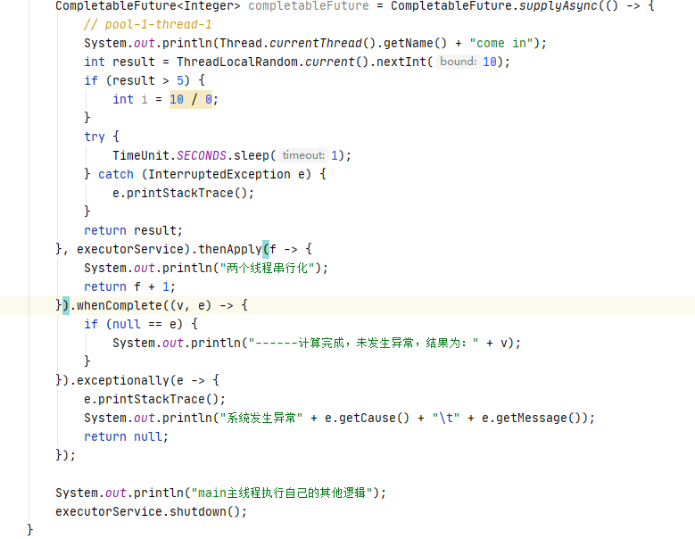
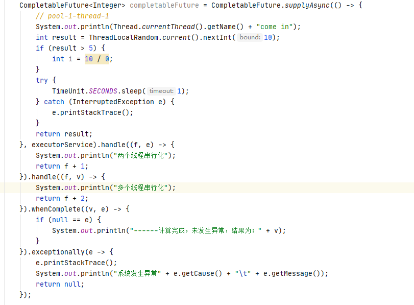
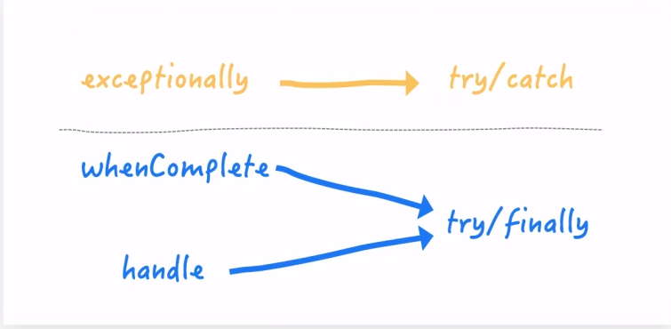
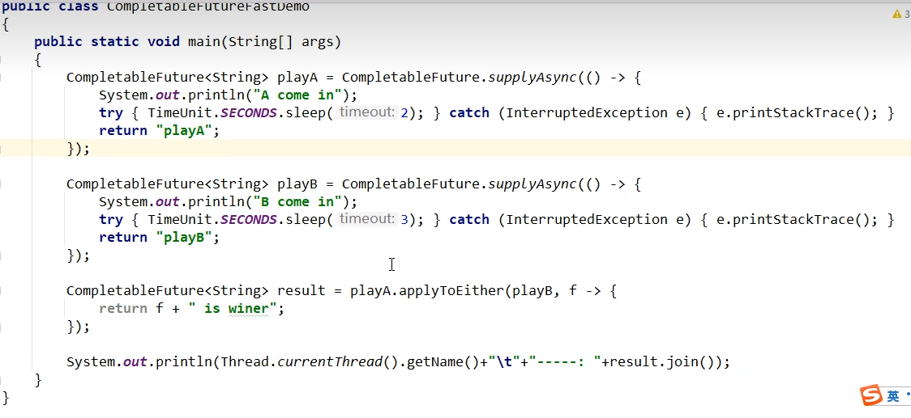
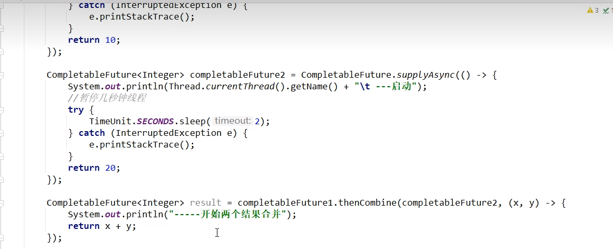

# 1.获得结果和触发计算

### 获得结果

#### public T get()

不见不散，一直等到结果才返回，会一直阻塞

#### public T get(long timeout, TimeUnit unit)

过时不候，在指定的timeout时间范围内可以正常返回，超过timeout时间，会报异常

#### public T join()

作用和get()方法一致，只是不抛出异常

#### public T getNow(T valueIfAbsent)

在异步线程计算还未完成的情况下，直接将入参返回，即：

计算完，返回计算完成后的结果；没算完，返回设定的valueIfAbsent值

### 主动触发计算

#### public boolean complete(T value) 

是否打断get方法立即返回括号中的值，返回true表示打断了获取异步线程结果的操作，直接返回value值

# 2.对计算结果进行处理

#### public <U> CompletableFuture<U> thenApply(Function<? super T,? extends U> fn)

计算结果存在依赖关系，将这两个线程串行化

**异常相关：**由于存在依赖关系（当前步错，不走下一步），当前步骤有异常的话就叫停。

#### public <U> CompletableFuture<U> handle(BiFunction<? super T, Throwable, ? extends U> fn)

计算结果存在依赖关系，将这两个线程串行化

**异常相关：**有异常也可以往下一步走，根据带的异常参数可以进一步处理

**总结**：

# 3.对计算结果进行消费

接收任务的处理结果，并消费处理，无返回结果

#### public CompletableFuture<Void> thenAccept(Consumer<? super T> action)

### 对比补充：Code之任务之间的顺序执行

- thenRun(Runnable runnable)：任务A执行完执行B，并且B不需要A的结果无返回值
- thenAccept(Consumer<? super T> action)：任务A执行完执行B，B需要A的结果，但是任务B无返回值
- thenApply(Function<? super T,? extends U> fn)：任务A执行完执行B，B需要A的结果，同时任务B有返回值

### CompletableFuture和线程池说明

1. 没有传入自定义线程池，都用默认线程池ForkJoinPoal;
2. 传入了一个自定义线程池，如果你执行第一个任务的时候，传入了一个自定义线程池:
   调用thenRun方法执行第二个任务时，则第二个任务和第一个任务是共用同一个线程池。
   调用thenRunAsync执行第二个任务时，则第一个任务使用的是你自己传入的线程池，第二个任务使用的是ForkJoin线程池
3. 备注
   有可能处理太快，系统优化切换原则，直接使用main线程处理
   其它如: thenAccept和thenAcceptAsync，thenApply和thenApplyAsync等，它们之间的区别也是同理

# 4.对计算速度进行选用

谁快用谁 applyToEither

#### public <U> CompletableFuture<U> applyToEither(CompletionStage<? extends T> other, Function<? super T, U> fn)

# 5.对计算结果进行合并

两个completionStage任务都完成后，最终能把两个任务的结果一起交给thenCombine来处理

先完成的先等着，等待其他分支任务

#### public <U,V> CompletableFuture<V> thenCombine(CompletionStage<? extends U> other, BiFunction<? super T,? super U,? extends V> fn)

