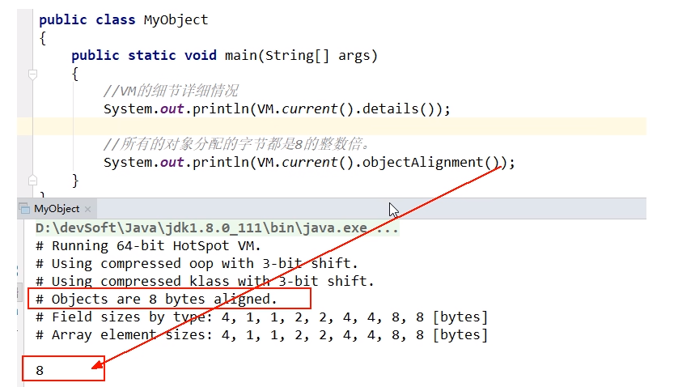
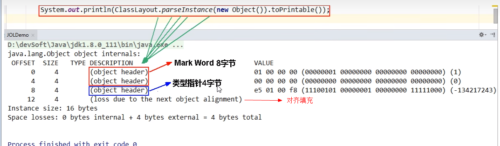
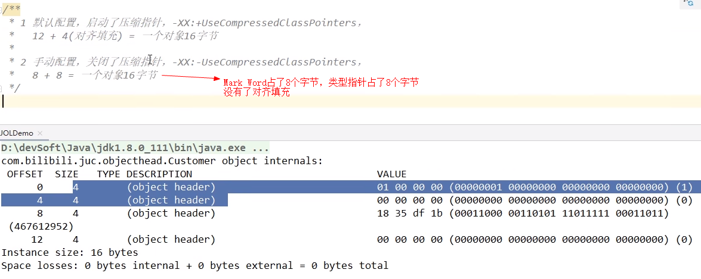

# 聊聊Object obj = new Object()

### JOL证明

JOL = Java Object Layout

引入的POM文件

```xml
<!--
官网: http://openjdk.java.net/projects/code-tools/jol/
定位：分析对象在JVM的大小和分布
-->
<dependency>
    <groupId>org.openjdk.jol</groupId>
	<artifactId>jol-core</artifactId>
	<version>0.9</version>
</dependency>
```



### 代码结果说明



### GC年龄采用4位bit存储，最大为15，如MaxTenuringThreshold参数默认值就是15


### 尾巴参数说明

压缩指针相关说明命令

- java -XX:+PrintCommandLineFlags -version

- <font color = 'green'>默认开启压缩说明</font>

  -XX:+UseCompressedClassPointers

- 手动关闭压缩再看看情况

  -XX:-UseCompressedClassPointers

  


